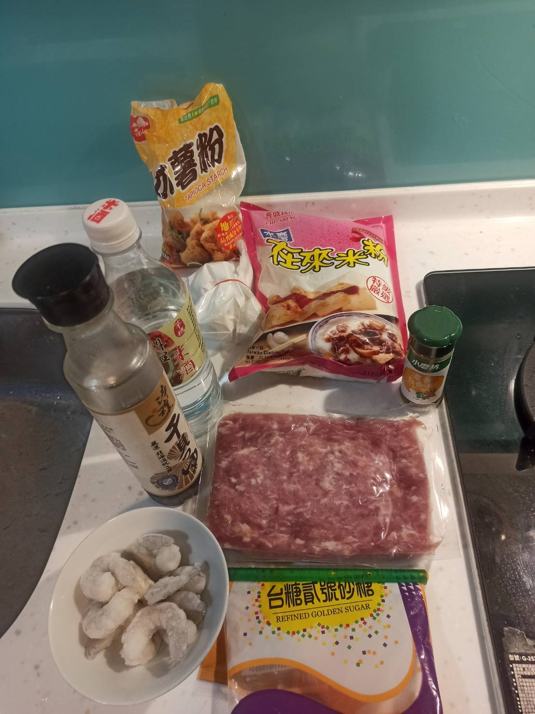
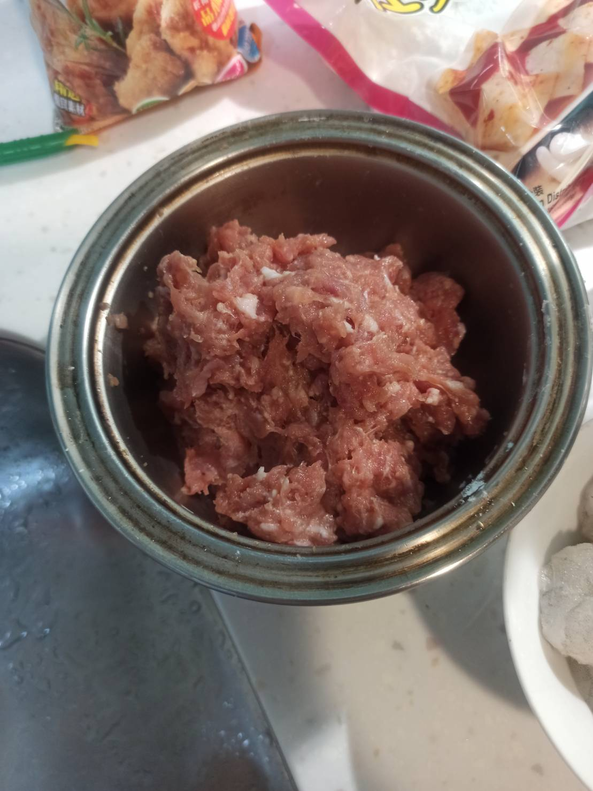
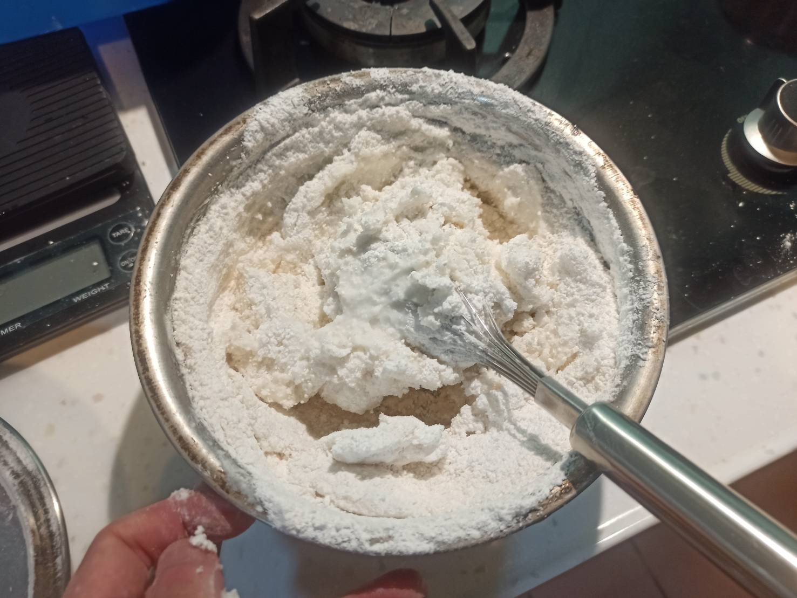
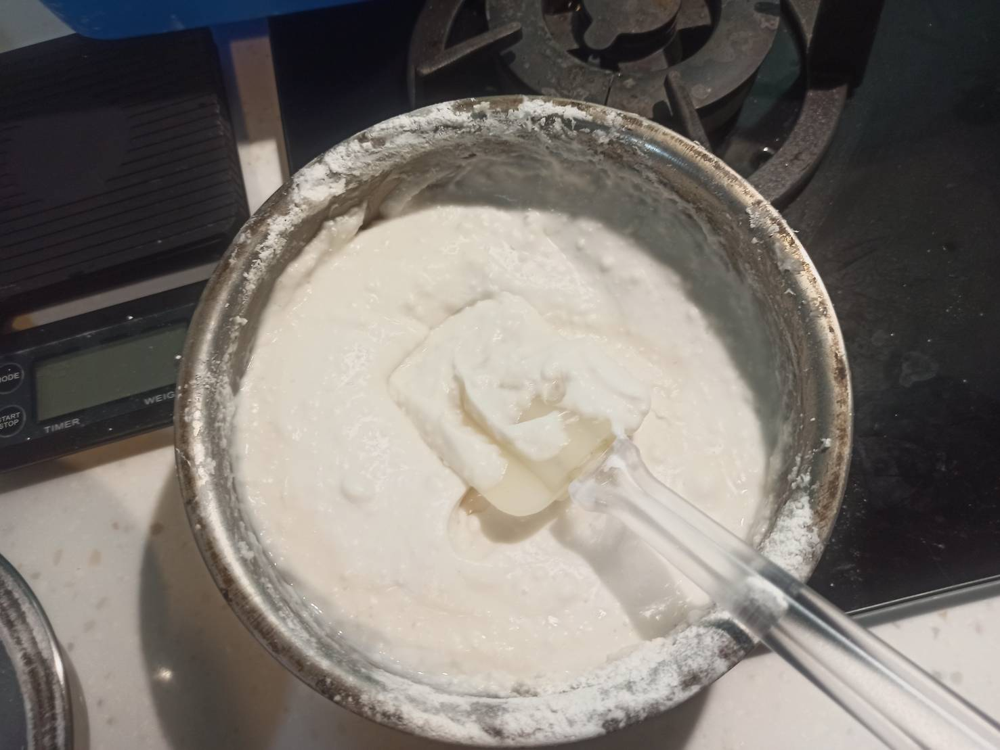
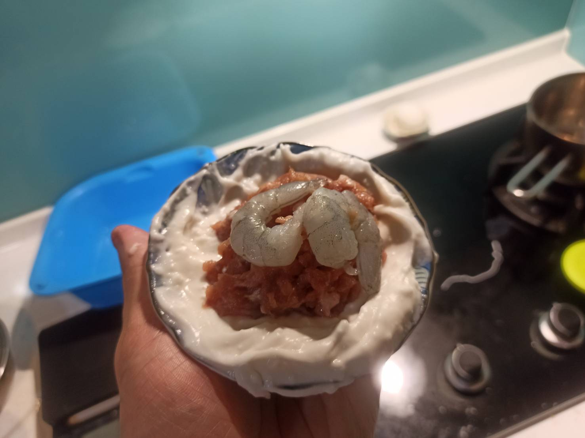
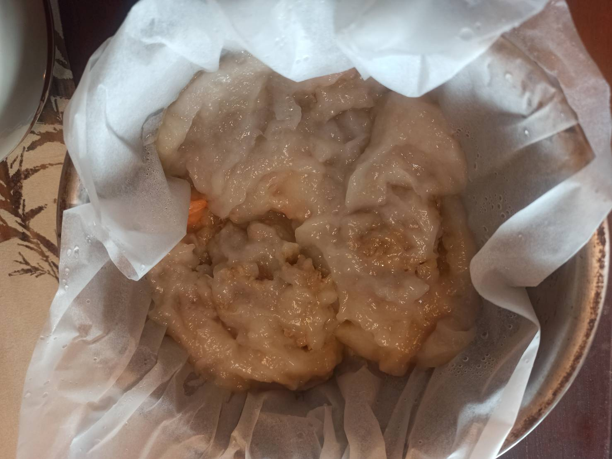

# 清蒸肉圓
---
+ ## 組成
  1. 麵糊+內餡

+ ## 20210711
  + ### 材料
    1. 在來米粉 130g
    2. 木薯粉 240g
    3. 滾水 超過420g
    4. 冷水 140g
    5. 絞肉 400g
    6. 蝦仁 數隻
    7. 糖 隨意
    8. 醬油 45g
    9.  米酒  隨意
    10. 五香粉  隨意
    11. 太白粉  隨意
  
  + ### 作法
    1. 絞肉加調味(醬油+糖+米酒+五香粉)拌勻
    2. 再加太白粉拌勻
    3. 準備麵糊
    4. 在來米粉混冷水攪拌柔順
    5. 用滾水衝下去再加入木薯粉拌勻
    6. 用麵糊包住內餡(絞肉+蝦仁)
    7. 蒸至熟透
  
  + ### 過程與成品
    
    
    
    
    
    
  
  + ### 檢討
    1. 這是我近期做過最失敗的料理
    2. 我在沖滾水下去再加入木薯粉攪拌均勻這步驟出了問題，還沒均勻整個變成一塊了
    3. 後來我又自己加了滾水再用電動攪拌機去攪拌
    4. 麵糊變成很黏稠
    5. 很難包裹住內餡就是，整個很失敗
    6. 下次可能再參考另外的食譜
  
  + ### 參考資料
    [參考影片](https://youtu.be/nVt51xewLC4)