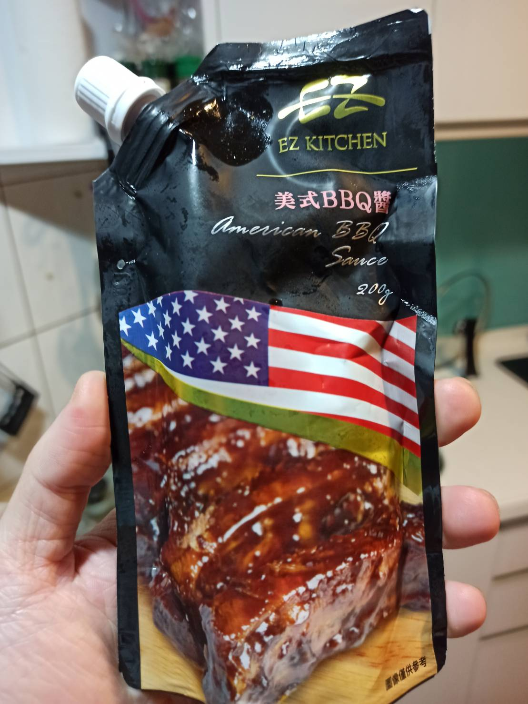
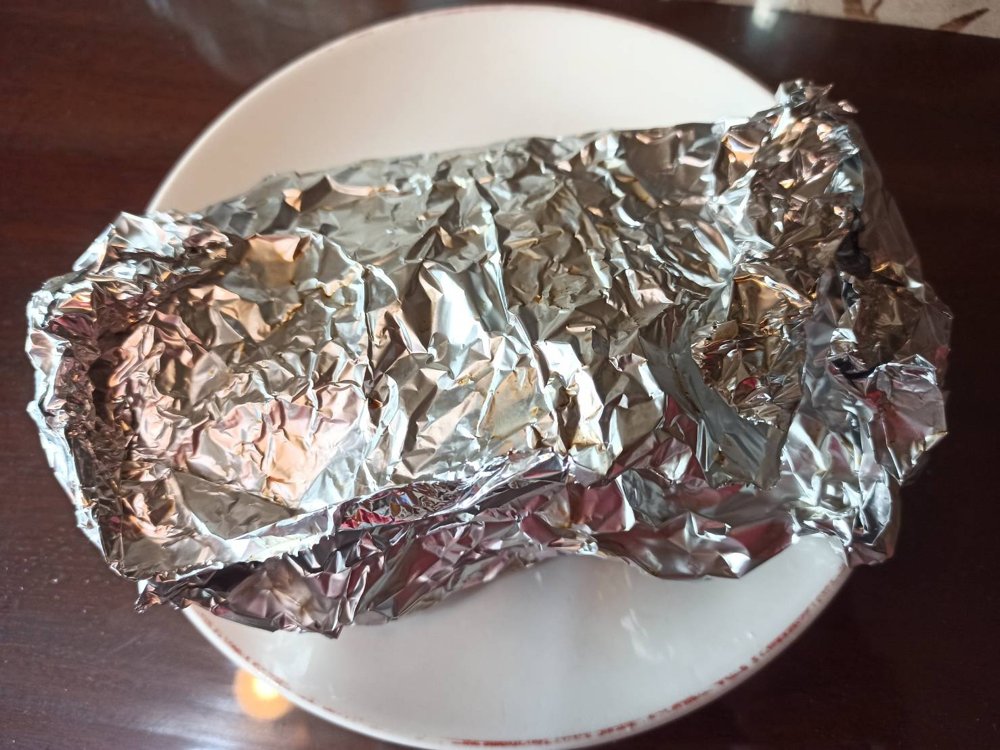
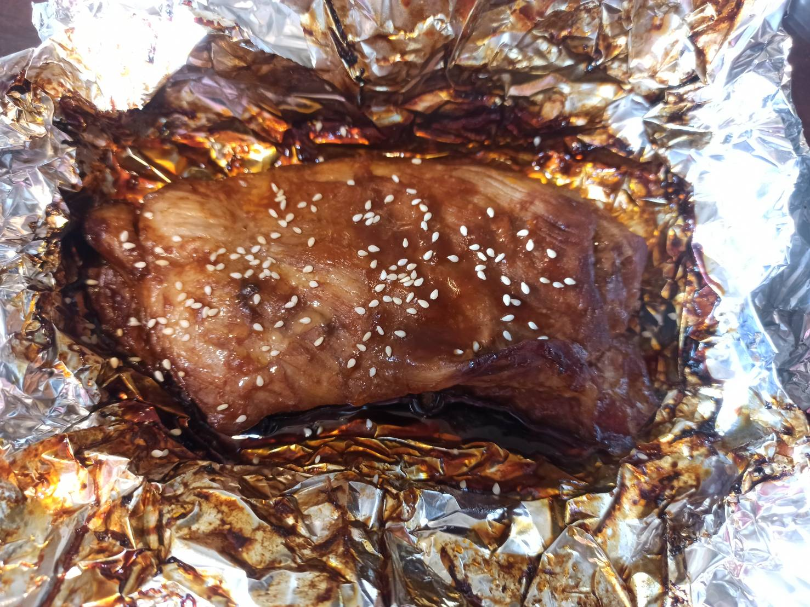
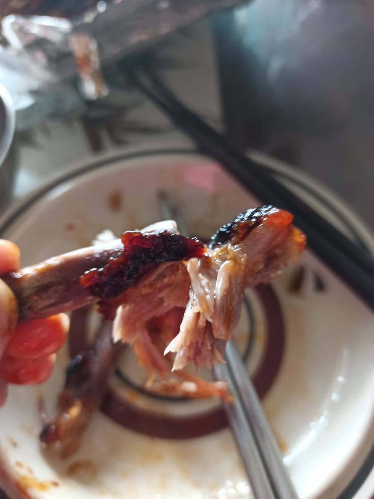

# 烤肋排
---
+ ## 組成
  1. 豬肋排
  2. 肋排醬

+ ## 20220120
  + ### 材料
    1. 豬肋排 適量
    2. 肋排醬 適量
  
  + ### 作法
    1. 將肋排退冰抹上肋排醬冷藏至少8小時
    2. 烤箱160度預熱10分後丟入肋排烤2小時
    3. 再以230度烤10分鐘
  
  + ### 過程與成品
    
    
    
    
  
  + ### 檢討
    1. 第一張圖是我去全聯買的BBQ醬，不要買台式的BBQ烤肉醬啦，那調味就不一樣，一定要買美式的調味那種，才會是像外面烤肋排的味道
    2. 至於烤的時間，我覺得230度大概烤5分鐘即可，160度烤個1.5H吧，不然我這次吃感覺稍乾了一些
    3. 基本上烤肋排都要小時起跳，幾乎都是低溫慢烤這樣，所以要做要提前一點時間製作
  
  + ### 參考資料
    [參考網站](https://ladymoko.com/simple-oven-baked-bbq-ribs/)