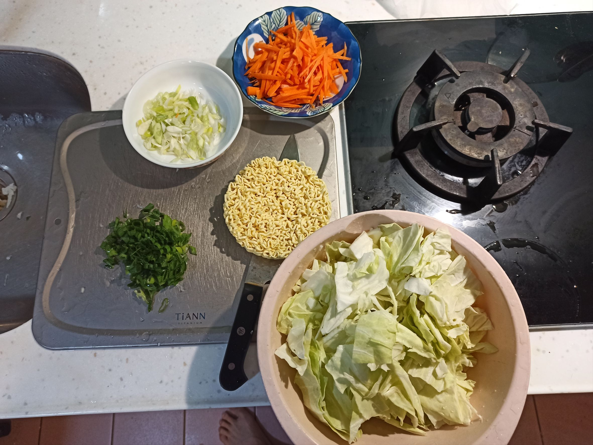
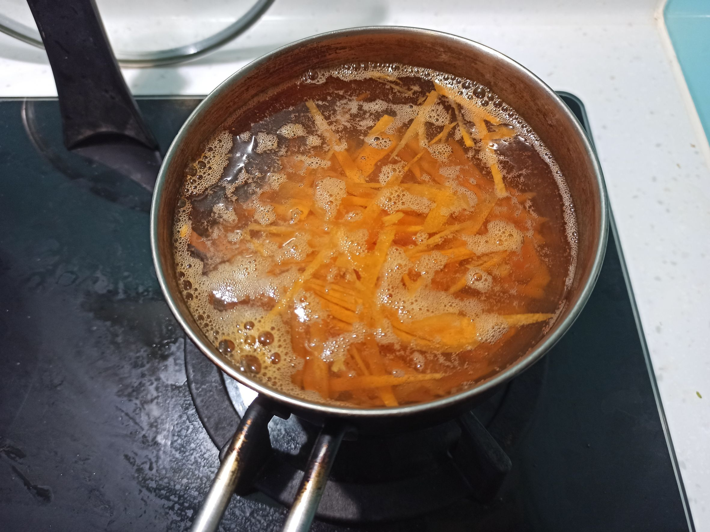
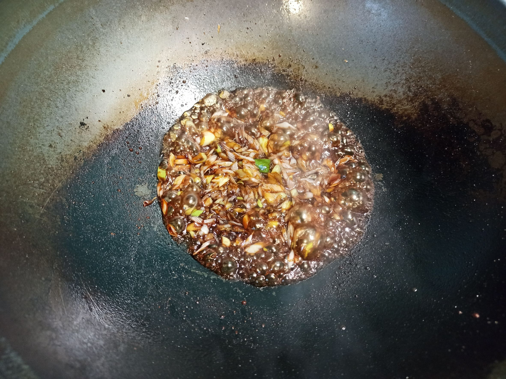
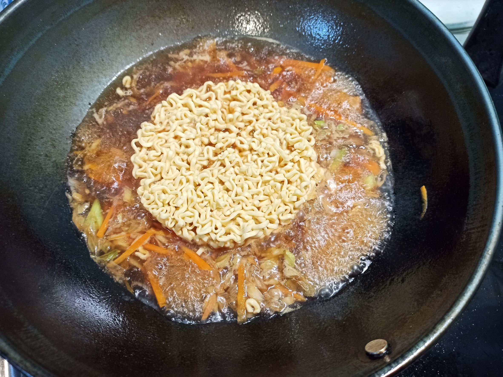
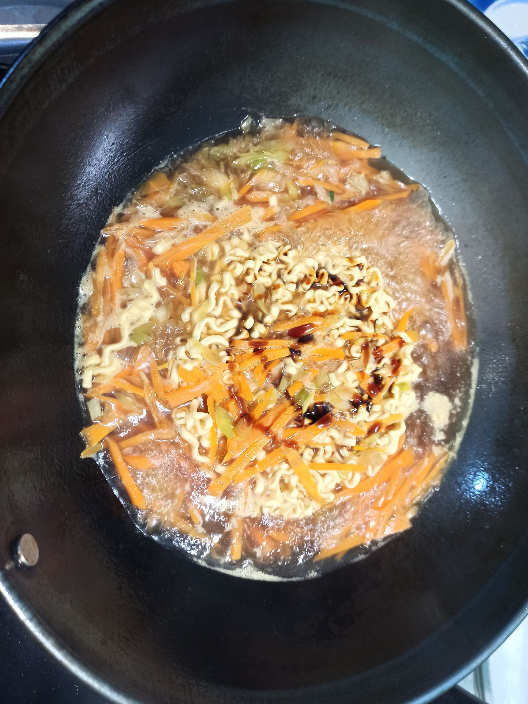
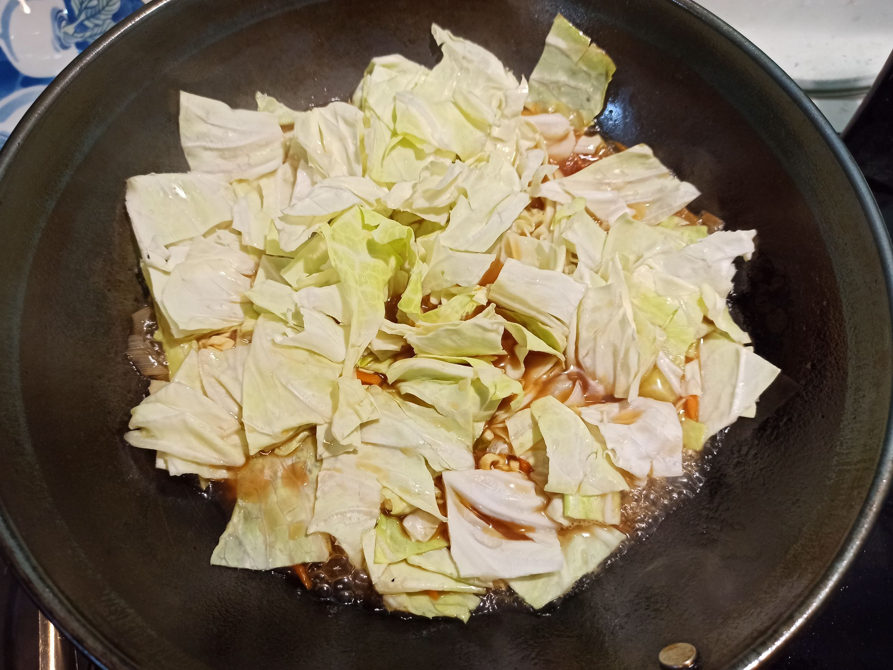
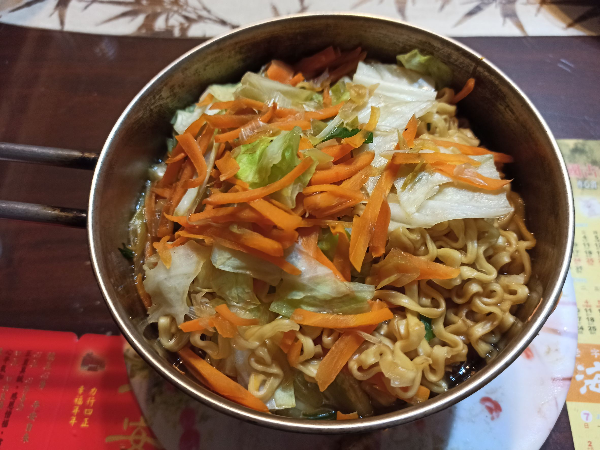

# 熗鍋麵
---
+ ## 組成
  1. 麵
  2. 青蔥
  3. 醬油
  4. 水

+ ## 20230330
  + ### 材料
    1. 泡麵 1塊
    2. 青蔥 3把
    3. 醬油 5圈
    4. 水 一碗
    5. 高麗菜 適量
    6. 紅蘿蔔 適量
    7. 蠔油 適量
  
  + ### 作法
    1. 熱鍋下油，大火炒蔥白，另一鍋把水煮開，下紅蘿蔔絲
    2. 把蔥白炒出香味後，醬油鍋邊淋入五圈，持續大火炒一下
    3. 把紅蘿蔔跟滾水下鍋煮開放入泡麵
    4. 下點蠔油增添味道
    5. 下高麗菜一起大火煮
    6. 最後下蔥綠煮一下即可出鍋
  
  + ### 過程與成品
    
    
    
    
    
    
    
  
  + ### 檢討
    1. 由於我想加紅蘿蔔，又不想讓紅蘿蔔炒焦，只好先拿去滾水燙軟一點
    2. 整體來說我覺得調味還是很不錯的，大火時我應該再把蔥白的味道跟醬油味在炒香一點的
  
  + ### 參考資料
    [你的炝锅面来了](https://www.bilibili.com/video/BV1ds4y1j7aN?t=429.7)