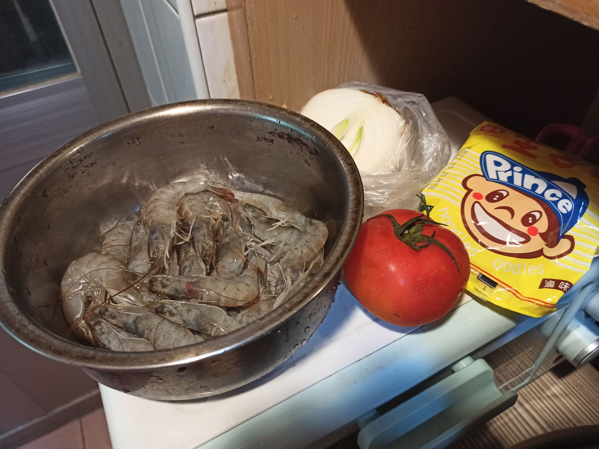
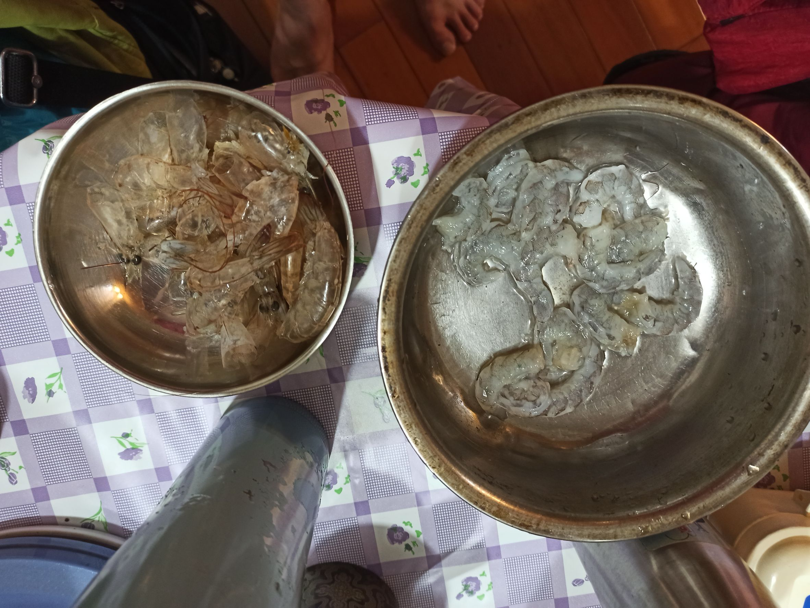
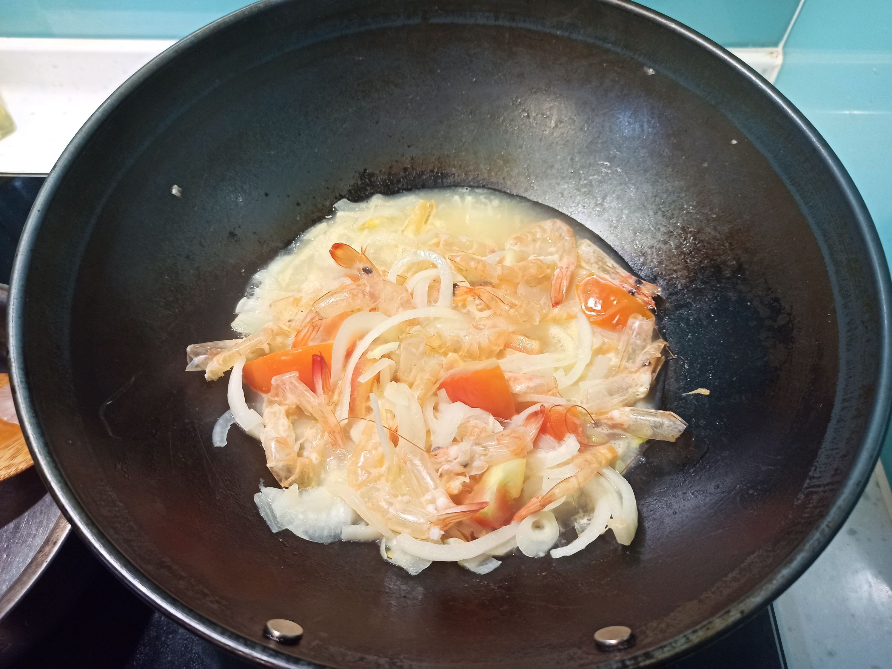
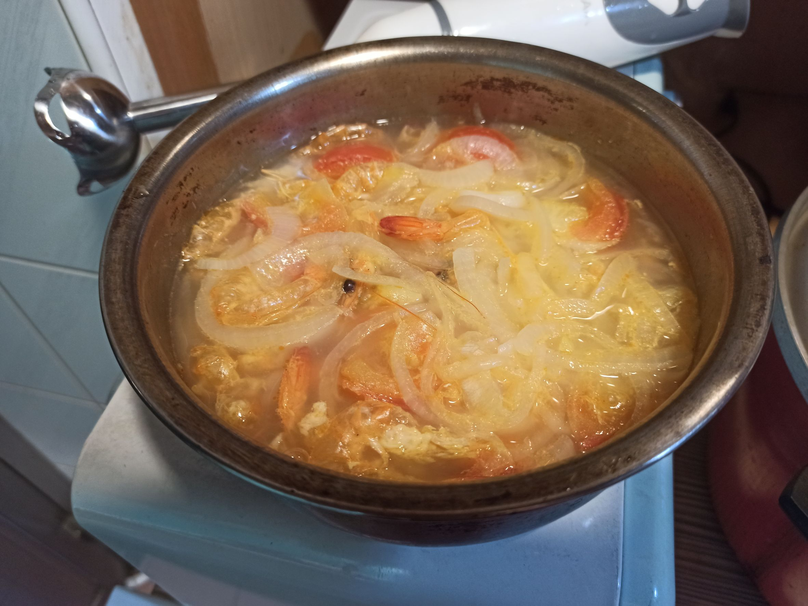
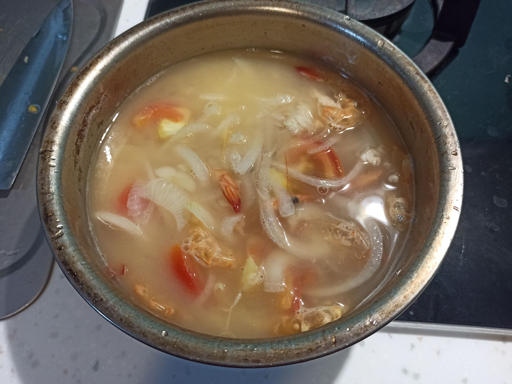
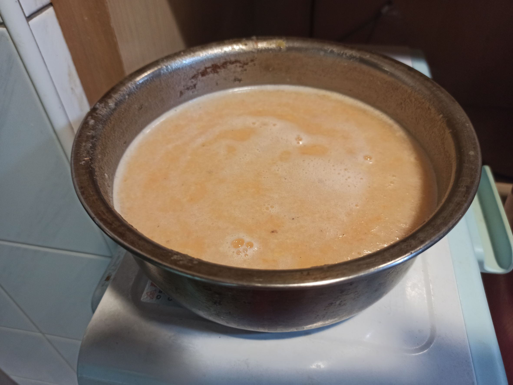
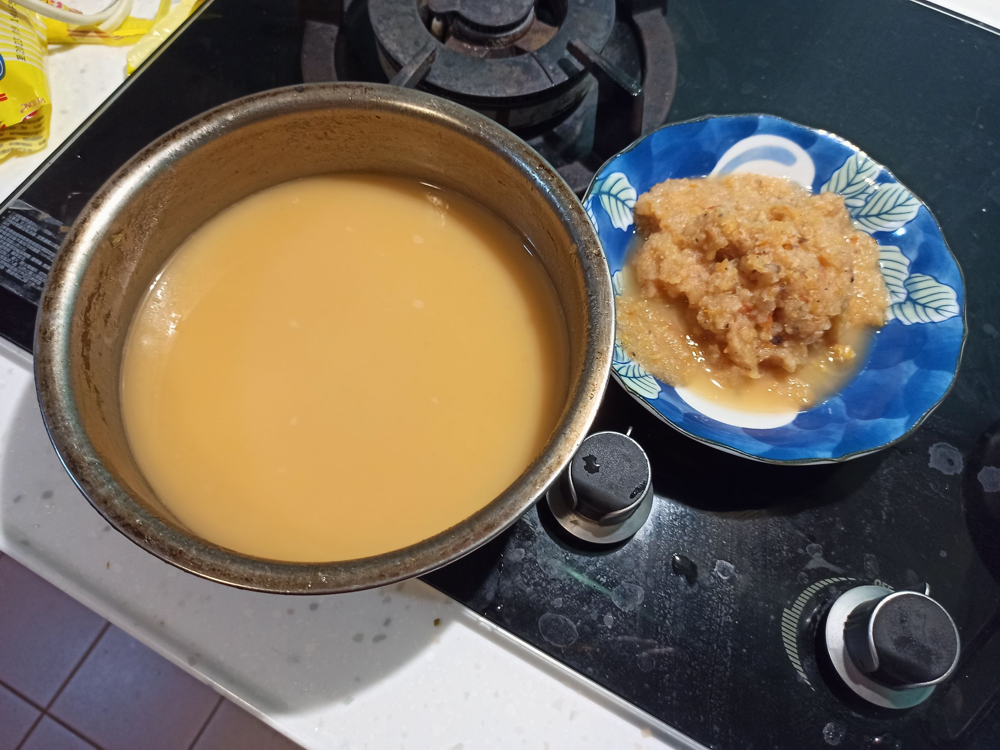
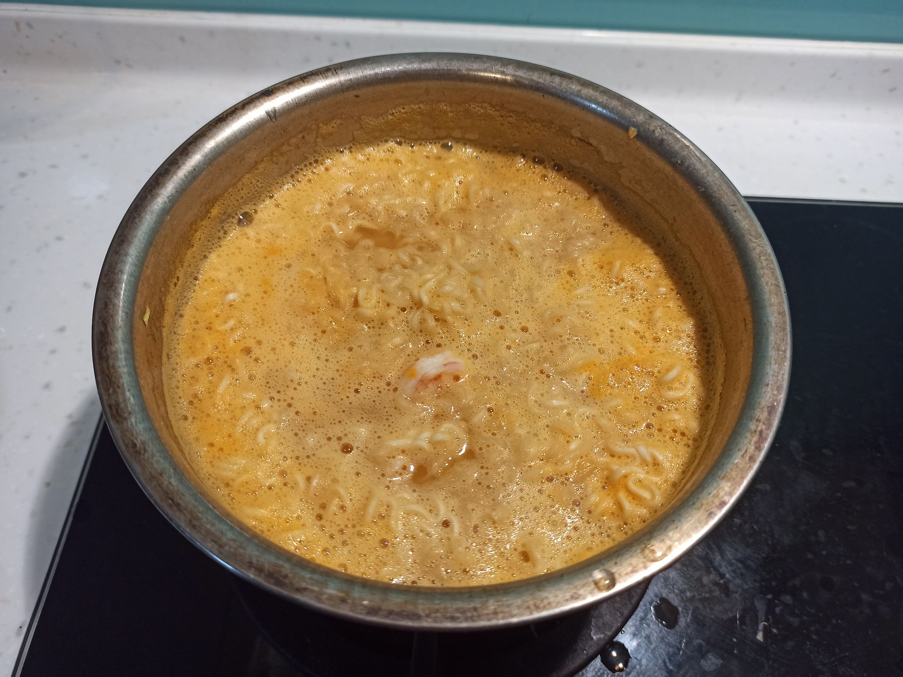
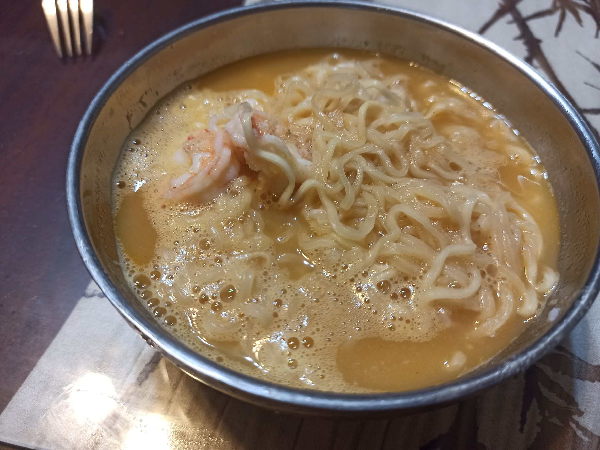

# 特濃蝦湯飯
---
+ ## 組成
  1. 蝦子
  2. 番茄
  3. 洋蔥

+ ## 20230413
  + ### 材料
    1. 洋蔥 半顆
    2. 番茄 1顆
    3. 蝦子 適量
    4. 王子麵 2.5包
    5. 水 適量
    6. 鹽 1.5匙
  
  + ### 作法
    1. 先將蝦子殼肉分離，去腦去腸泥
    2. 洋蔥切絲、番茄切塊，下鍋炒香
    3. 再加入蝦殼炒至變色
    4. 加點水煮一下
    5. 倒入另一個鍋子，加水蓋過蝦殼
    6. 蓋上鋁箔紙，外鍋兩杯水電鍋蒸
    7. 蒸好後拿調理棒打爛接著過濾
    8. 另一壺清水燙好蝦子
    9. 過濾好的濃湯上火煮，加入王子麵煮滾麵煮好
    10. 加鹽加蝦子攪拌一分鐘即可
  
  + ### 過程與成品
    
    
    
    
    
    
    
    
    
  
  + ### 檢討
    1. 感覺水加太多了，下次可能水加少一點
    2. 湯沒想要中的蝦味濃，不知道是不是打不夠爛或真是因為水加太多了，因為打下去感覺打到沒啥可以打了但就是蠻稀的
    3. 味道還是有，指是不是什麼濃蝦味濃番茄或濃洋蔥，就是感覺有喝到濃郁東西，但又不明顯
    4. 這道麻煩的就是蝦子的前處理，要不是因為姑姑有送一盒，不然我可能很難會想煮這個
  
  + ### 參考資料
    特濃蝦湯飯