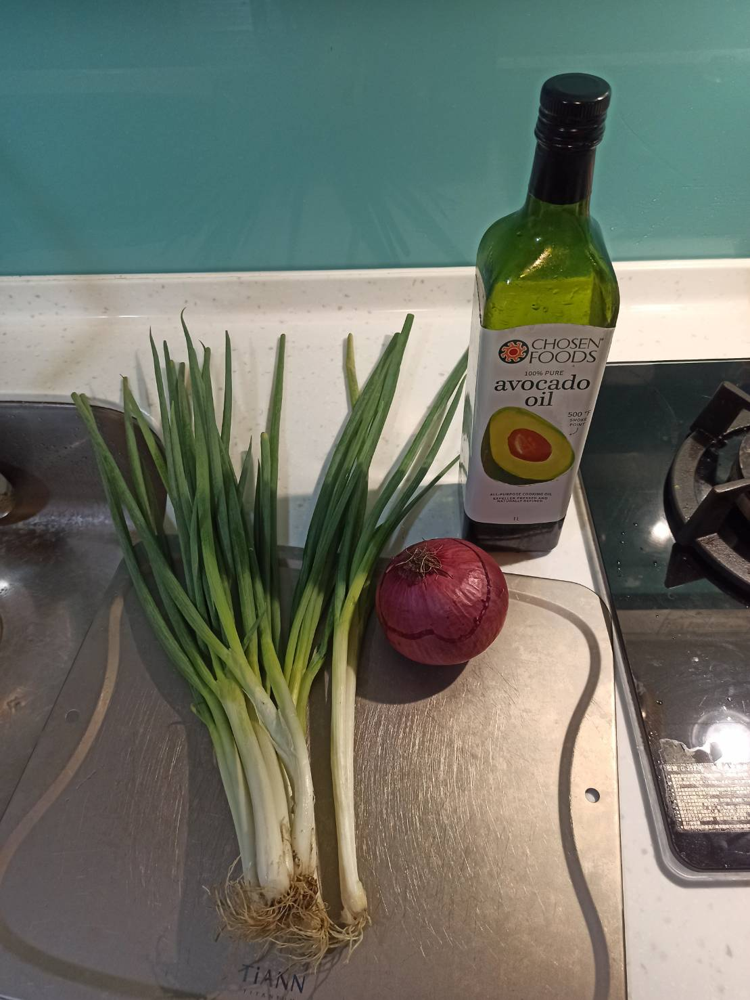
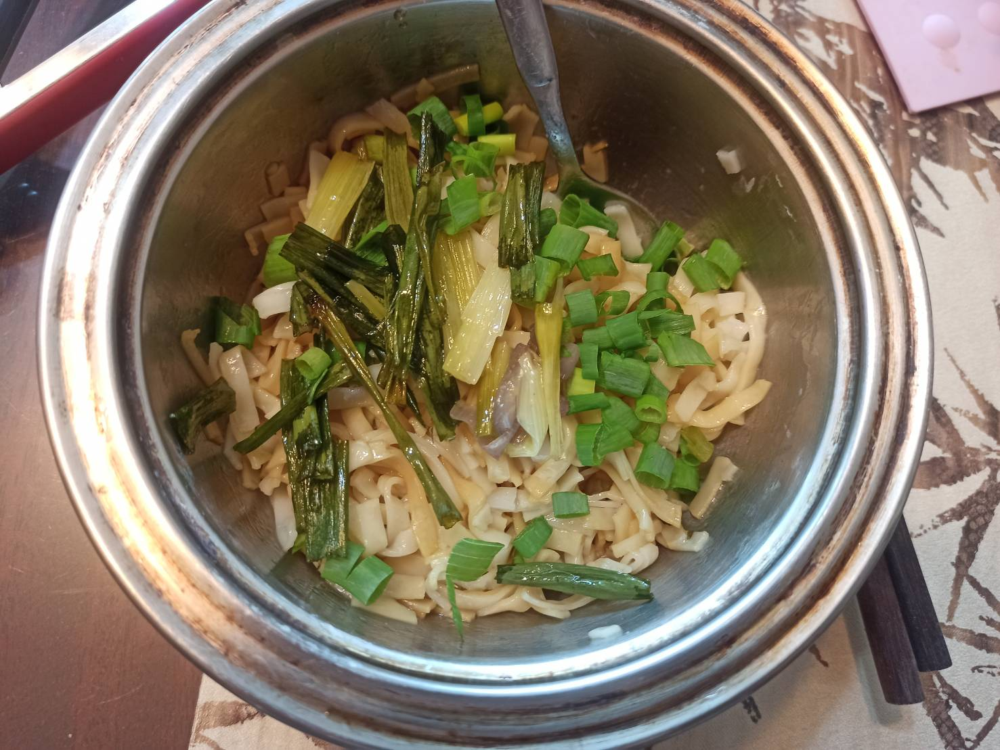

# 蔥油拌麵
---

+ ## 20020710
  + ### 材料
    1. 青蔥 120g
    2. 酪梨油 200g
    3. 紫洋蔥 半顆
    4. 香油 少許
    5. 醬油 少許
  
  + ### 作法
    1. 蔥白蔥綠分開
    2. 冷油冷鍋丟進蔥白+洋蔥
    3. 小火慢熬
    4. 熬到蔥白變黃撈出來，關火
    5. 停10分待油降溫
    6. 丟蔥綠小火續敖
    7. 蔥綠變硬就可以了
    8. 過篩使用
    9. 麵煮完丟蔥油+醬油+香油
  
  + ### 過程與成品
    
    
  
  + ### 檢討
    1. 感覺味道不夠香，猜測是我火太小了，溫度不夠達到梅納反應，所以導致香氣不夠吧
    2. 油:蔥 約 1 : 0.7
  
  + ### 參考資料
    [就憑這個【蔥油麪】配方](https://youtu.be/AJ9X_sQhRyI)