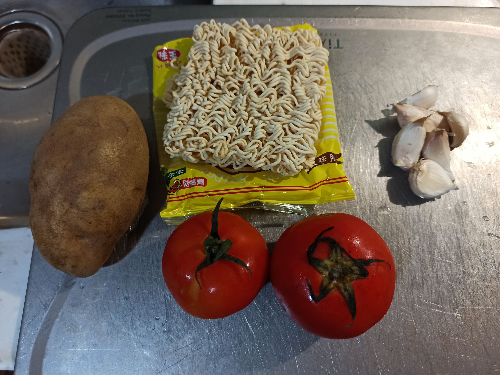

# 馬鈴薯番茄麵
---
+ ## 組成
  1. 馬鈴薯
  2. 番茄
  3. 麵

+ ## 20221201
  + ### 材料
    1. 馬鈴薯 1顆
    2. 番茄 2顆
    3. 麵 1份
    4. 蒜頭 適量
    5. 鹽 適量
    6. 醬油 適量
    7. 蠔油 適量
    8. 水 適量
  
  + ### 作法
    1. 將馬鈴薯、番茄切丁，蒜頭切末
    2. 煮一壺水，要燙王子麵用
    3. 馬鈴薯中小火煎至金黃
    4. 把王子麵丟入滾水中
    5. 把番茄、蒜頭都丟進鍋裡，然後加鹽、醬油、蠔油
    6. 拌炒一下後，將川燙好的王子麵丟入鍋內，加水蓋上蓋子收汁
  
  + ### 過程與成品
    
    
    
    
    
  
  + ### 檢討
    1. 應該用關廟麵比較好，但家裡沒了，只好用王子麵，先川燙
    2. 這是山西晉妹給的食譜，作起來感覺跟義大利醬麵差不多
  
  + ### 參考資料
    
    