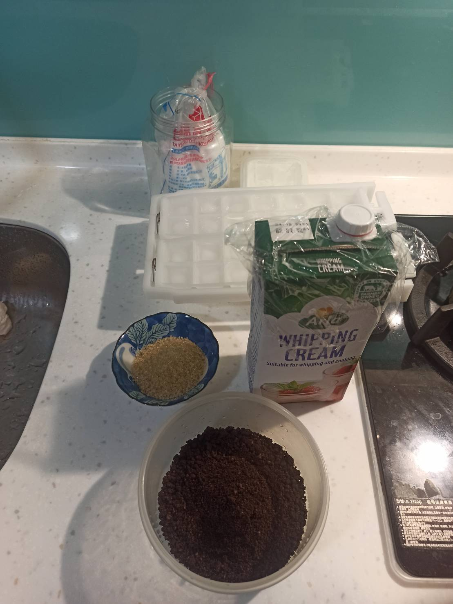

# 冰淇淋
---
+ ## 組成
 1. **打發鮮奶油 + 調味**

+ ## 20210703
  + ### 材料
    1. 鮮奶油   500g
    2. oreo巧克力碎片   100g
    3. 糖   50g
    4. 冰塊
    5. 鹽
  
  + ### 作法
    1. 將冰塊跟鹽用3:1的比例放到盆子內
    2. 再準備另一個盆子置入作法一盆子中
    3. 再倒入材料1~3打發
    4. 打到半發就好
    5. 改手動攪拌
    6. 拿去冷凍
  
  + ### 過程與成品
    
    
    
  
  + ### 檢討
    1. 要在冷的環境下打發，並在冷的環境下攪拌
    2. 冰塊跟鹽3:1是國中理化，可以迅速降溫，只不過很消耗冰塊跟鹽，用冷水放外頭也是可以打發
    3. 可以在外面打發後，拿去冷凍，每一小時拿出來攪拌，共攪拌3次即可
    4. 這次自己亂搞的配方有點甜，下次糖減半
  
  + ### 參考資料
    [參考影片](https://youtu.be/xBP-vcPn0AE)