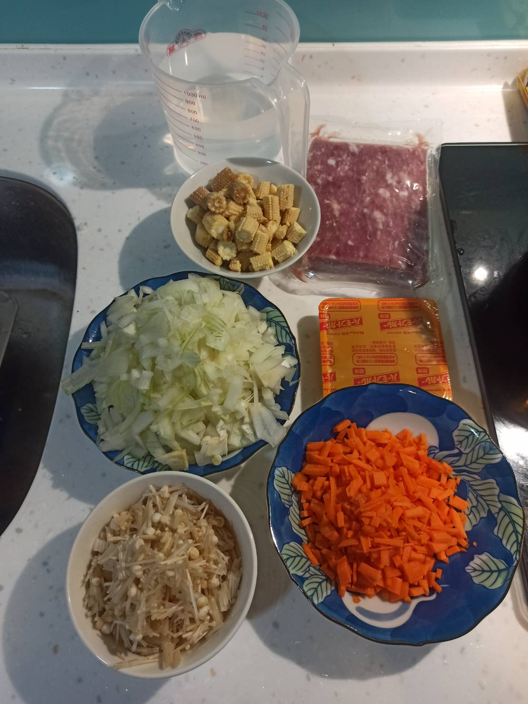
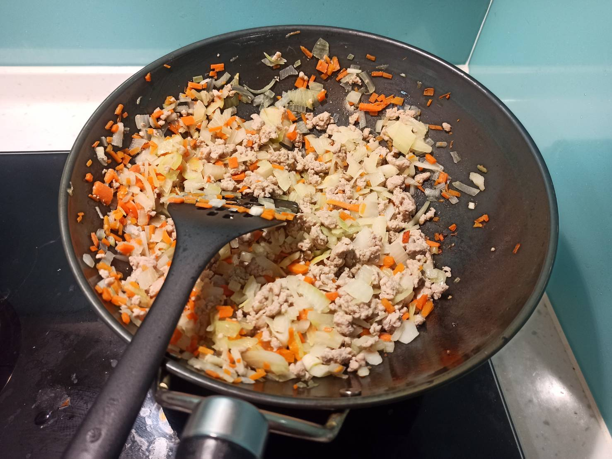
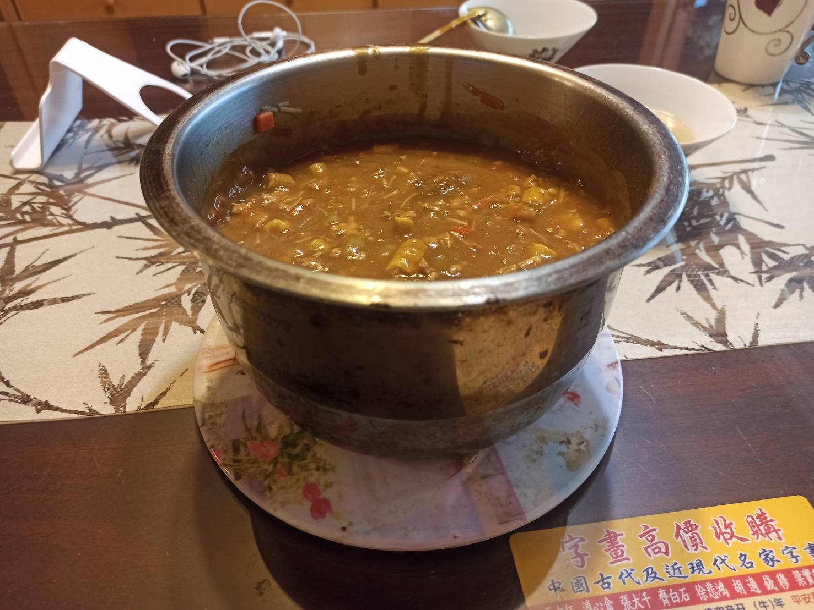

# 咖哩肉燥
---

+ ## 20210627
  + ### 材料
    1. 豬絞肉 400g
    2. 玉米筍 數根
    3. 咖哩塊 6塊
    4. 洋蔥 1顆多
    5. 金針菇 1把
    6. 紅蘿蔔 隨意
    7. 水 720cc
  
  + ### 作法
    1. 豬絞肉跟紅蘿蔔先炒
    2. 再丟入洋蔥
    3. 炒到絞肉熟了，洋蔥香了
    4. 把炒好的料丟進另一個鍋子，加水加玉米筍跟金針菇
    5. 開火煮滾
    6. 滾後轉小火煮15分鐘
    7. 關火，依序放入咖哩塊，要攪拌，不然蠻容易黏底的
    8. 待咖哩塊幾乎全部溶化後再開火煮10分鐘
  
  + ### 過程與成品
    
    
    
  
  + ### 檢討
    1. 融化咖哩塊最好攪拌久一點，不然開火變濃稠後還是很容易黏底
  
  + ### 參考資料
    無