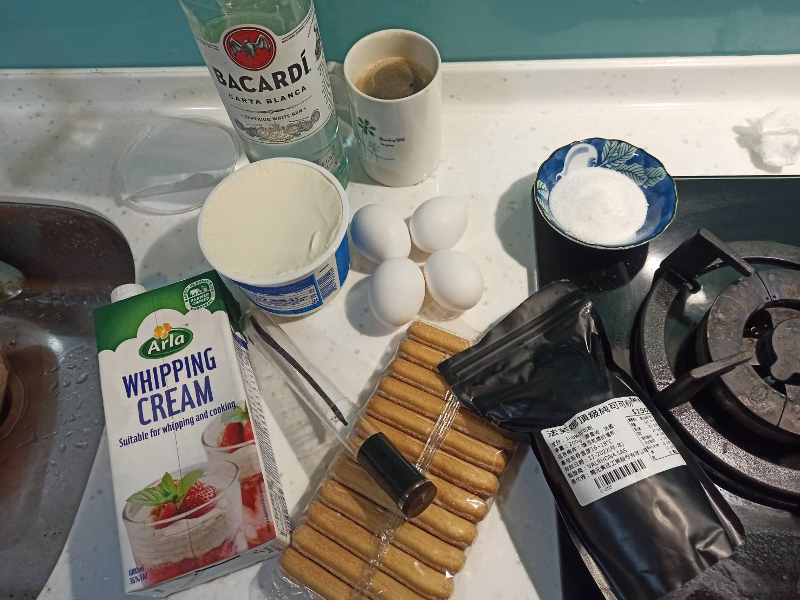
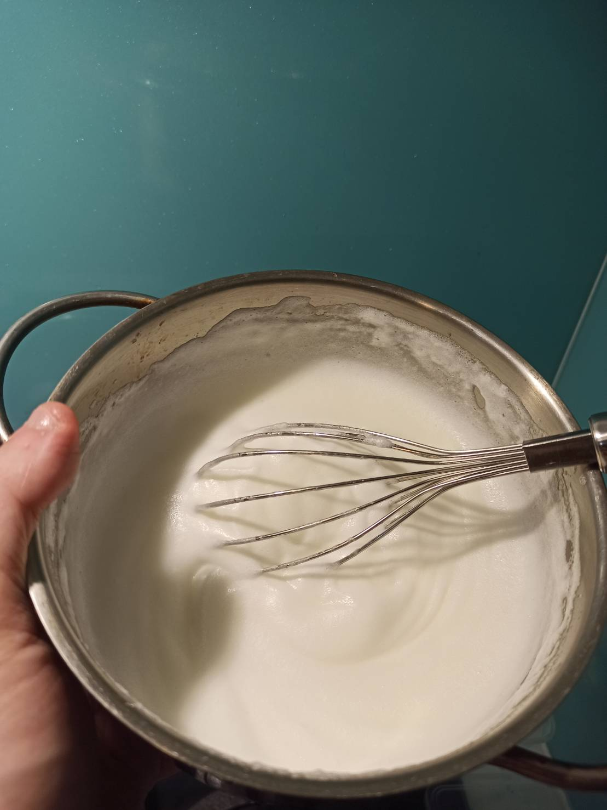
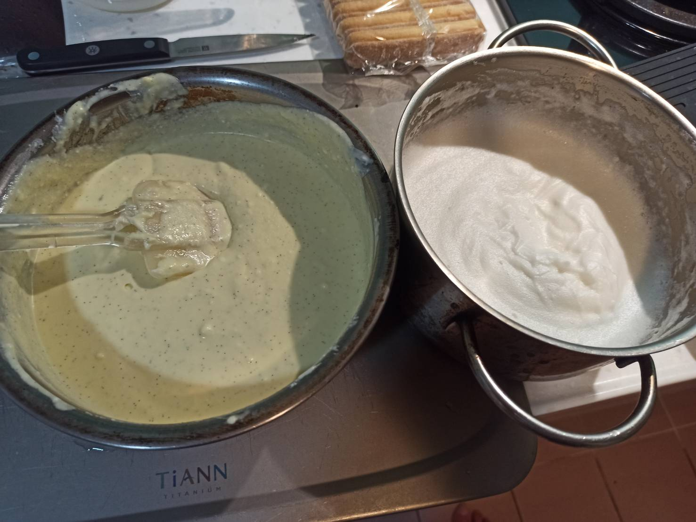
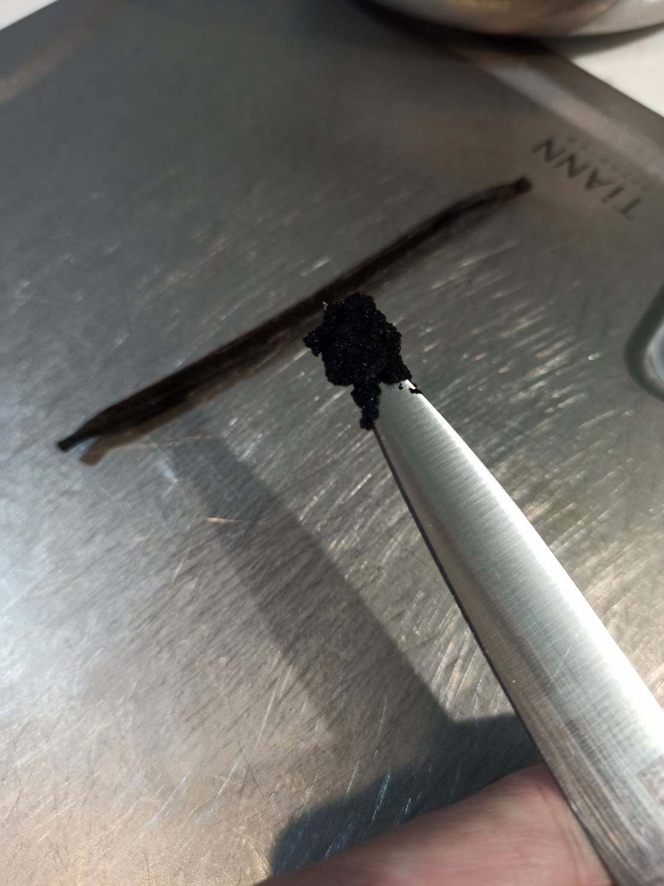
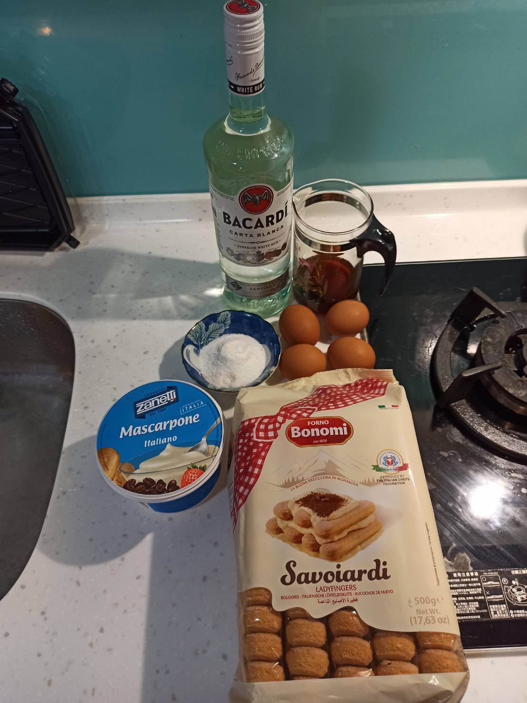
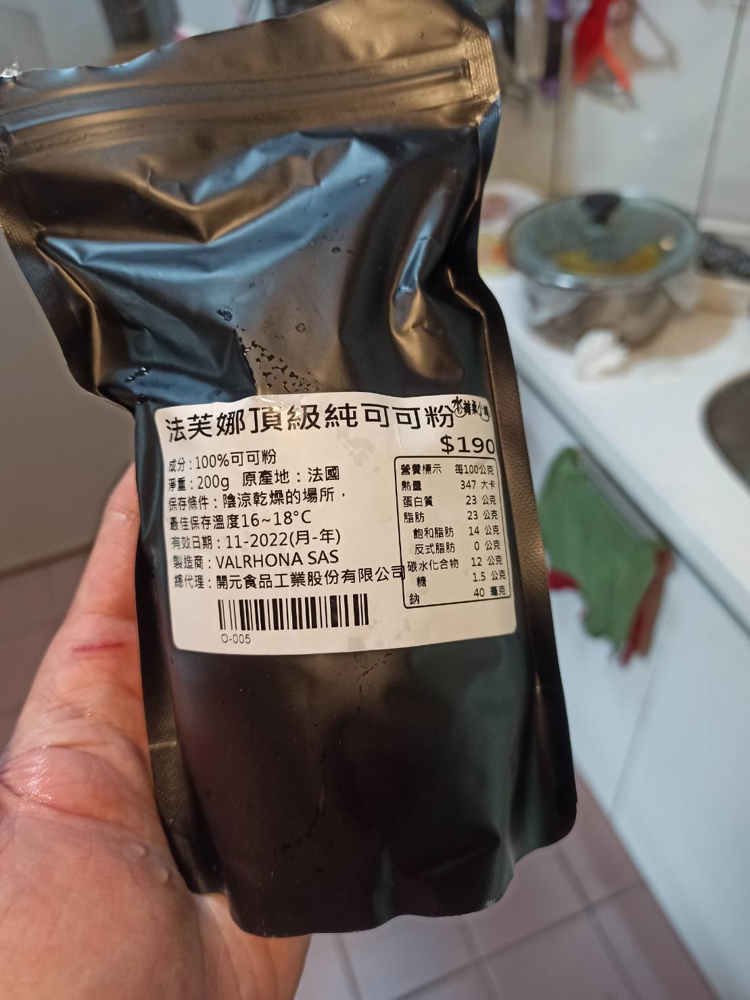
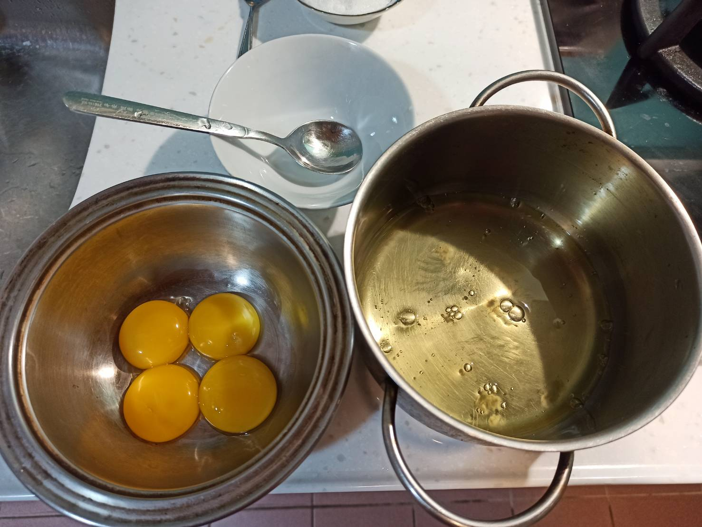
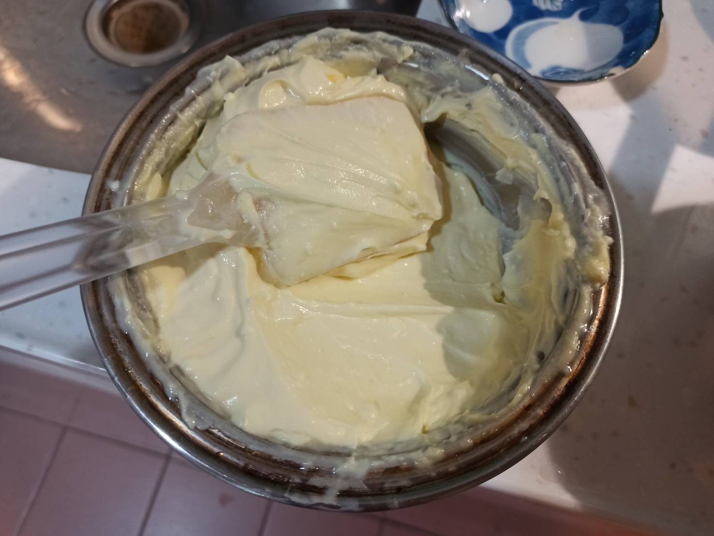
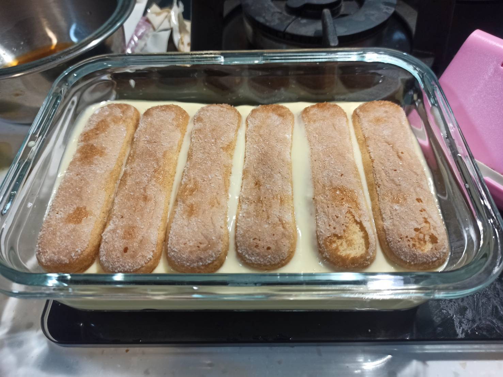
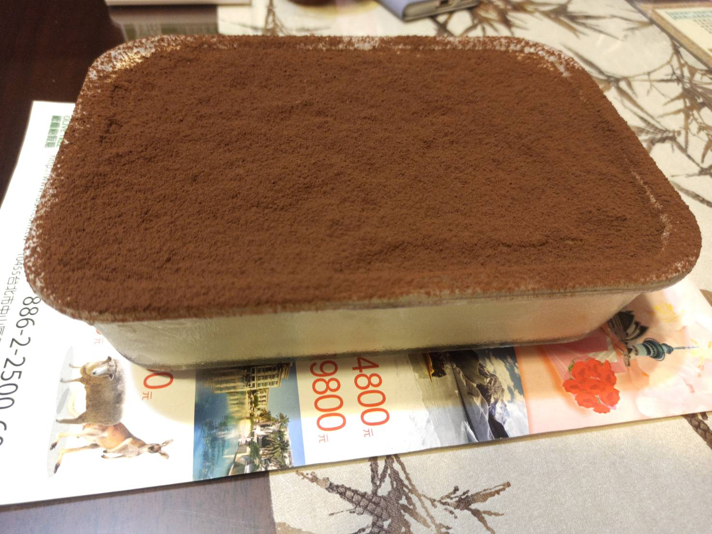

# 提拉米蘇
---
+ ## 20210629
  + ### 材料
    1. 雞蛋4顆
    2. Mascarpone 500g
    3. 手指餅乾 11根
    4. 糖  50g
    5. 咖啡 150g
    6. 蘭姆酒 45g
    7. 可可粉 適量
    8. 鮮奶油 100g
    9. 香草籽 1根
  
  + ### 作法
    1. 先將蛋黃分離出來
    2. 把蛋白先邊打發邊分多次加40糖
    3. 蛋黃加Mascarpone加香草籽加鮮奶油混合
    4. 把打發好的蛋白慢慢分次加入上敘混合物
    5. 在加10g的糖
    6. 咖啡與酒混合
    7. 手指餅乾兩面滾咖啡酒
    8. 容器底層先鋪一層作法4產物
    9. 上面再鋪上作法7產物
    10. 共鋪了3層作法4產物+2層作法7產物
    11. 拿去冰冷凍
    12. 吃之前在過篩可可粉
  
  + ### 過程與成品
    
    
    
    
  
  + ### 檢討
    1. 這次是因為電動的打蛋機還沒到，所以只好用手動，打得有夠累，而且即使加了糖也不容易維持泡泡狀，因為久了有一部分還會變回液體，可能是糖加的不夠多
    2. 會有作法5是因為，當初想說把糖全部挪去給蛋白，蛋黃就不用加了，但這樣弄下去好像不夠甜，後來再補了10g的糖，所以可能以後蛋黃還是要加點糖
    3. 鮮奶油可能也要先打發一下比較好，且可能不能加到100g，下次加個50g看看，不然感覺成品蠻液態狀的
    4. 香草籽只用一根感覺味道可能不構濃郁，下次還是用香草精好了，不過還在製作中就是
  
  + ### 參考資料
    [參考影片](https://youtu.be/vyg27_n0-bw)

+ ## 20210626
  + ### 材料
    1. 雞蛋4顆
    2. Mascarpone 500g
    3. 手指餅乾 12根
    4. 糖  40g
    5. 咖啡 100cc
    6. 蘭姆酒 30cc
    7. 可可粉 適量
  
  + ### 作法
    1. 先將蛋黃分離出來
    2. 把砂糖全部倒入蛋黃中打至糖溶解
    3. 再加入Mascarpone攪拌至柔順
    4. 酒跟咖啡混合
    5. 餅乾底部沾一下上步驟的混合液
    6. 放入容器裡
    7. 餅乾上面鋪一層作法3的混合體
    8. 重複做法，鋪第二層
    9. 拿去冷凍
    10. 要吃的時候在上面撒上過篩的可可粉
  
  + ### 過程與成品
    
    
    
    
    
    
  
  + ### 檢討
    1. 參考影片中其實有用到蛋白，但我蛋白一直打發不了，所以就沒用蛋白了，後來也買了一隻新的電動攪拌棒
    2. 這邊還有個問題就是，由於提拉米蘇是生蛋，並沒有經過加熱殺菌的過程，因此，想說細菌的問題，還有成品放置時間的長短
    3. 提拉米蘇的靈魂主要還是Mascarpone，裡面跟蛋黃混合，再來是泡過咖啡酒的手指餅乾，最後是可可粉
    4. 我參考了一些其他的影片跟做法，覺得下次蛋黃也要先打發，然後再混合Mascarpone，蛋白也打發，再混進去，蛋白就不要另外加糖了，我覺得整體Mascarpone+40g糖，甜度剛好
    5. 我看其他建議都是用濃縮咖啡，主要是一般的咖啡味道沒那麼濃郁，如果還加上酒的話，很容易被酒的味道蓋過去
    6. 下次我可能餅乾會兩面都沾一下
    7. 雞蛋建議用洗選蛋
    8. 下次可再加點香草精
  
  + ### 參考資料
    [參考影片](https://youtu.be/lElqsa9wryA?t=460)
    [下次製作參考影片](https://youtu.be/_PcOsIHXhWs)

