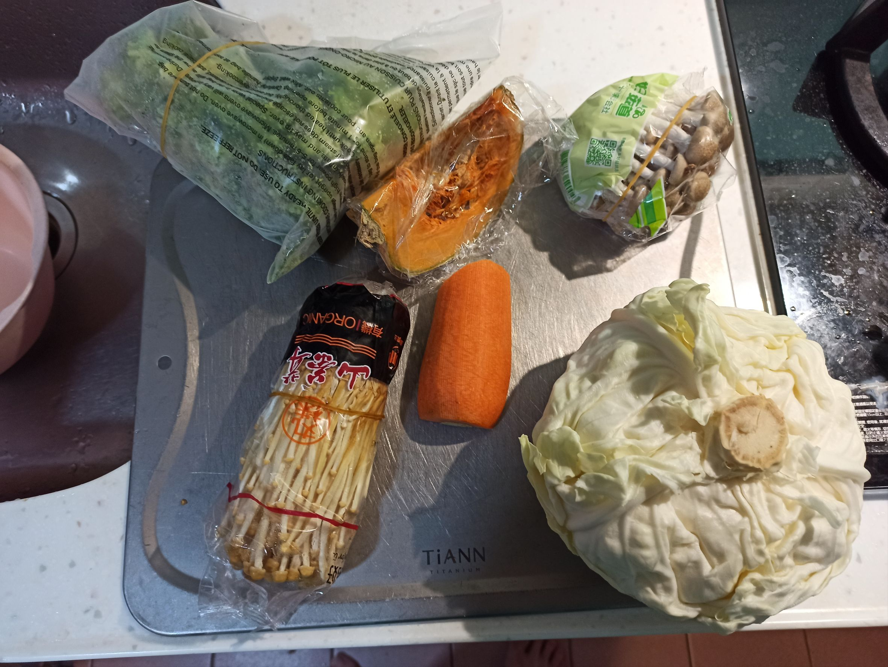
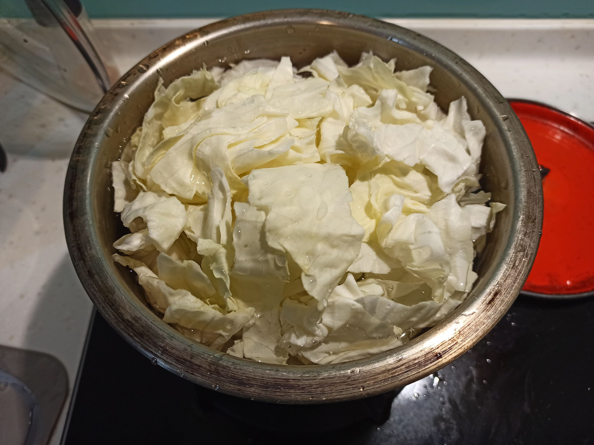
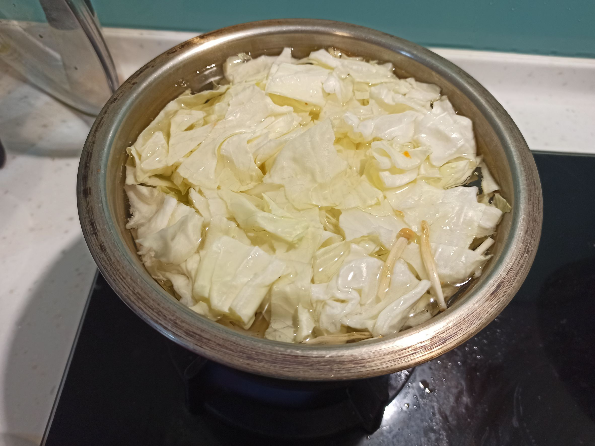
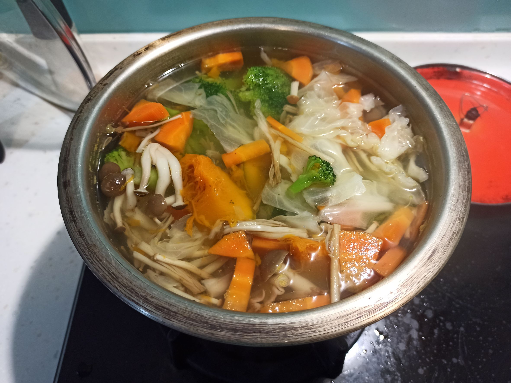
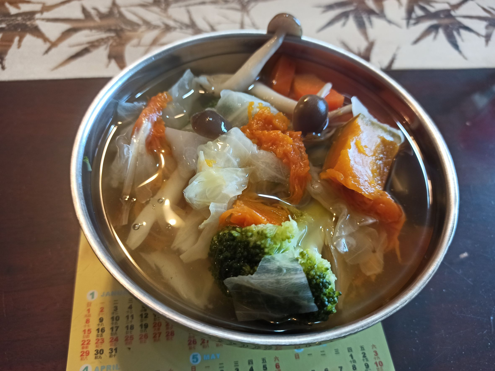

# 哈佛蔬菜湯
---
+ ## 組成
  1. 洋蔥
  2. 高麗菜
  3. 紅蘿蔔
  4. 南瓜

+ ## 20221223
  + ### 材料
    1. 紅蘿蔔 適量
    2. 高麗菜 適量
    3. 南瓜 適量
    4. 金針菇 適量
    5. 鴻喜菇 適量
    6. 花椰菜 適量
    7. 鹽 適量
  
  + ### 作法
    1. 將料都切成想吃的大小，隨意切，紅蘿蔔跟南瓜不用削皮
    2. 將除了花椰菜以外的材料都丟進鍋裡
    3. 加水淹過食材，大火煮滾
    4. 煮滾後轉小火悶25分左右
    5. 轉中火丟入花椰菜及鹽再煮5分鐘即可

  
  + ### 過程與成品
    
    
    
    
    
  
  + ### 檢討
    1. 正統的哈佛蔬菜湯是組成當中的4種材料，由於個人怕吃太多洋蔥會放太多屁，這次就沒加洋蔥了
    2. 可以加入自己喜歡的蔬菜類或菇類
    3. 建議高麗菜先擺下面一點，以免擺上面太膨比較難看到水位
  
  + ### 參考資料
    [4蔬菜煮成「哈佛式蔬菜湯](https://youtu.be/2EPmKlbwdII)