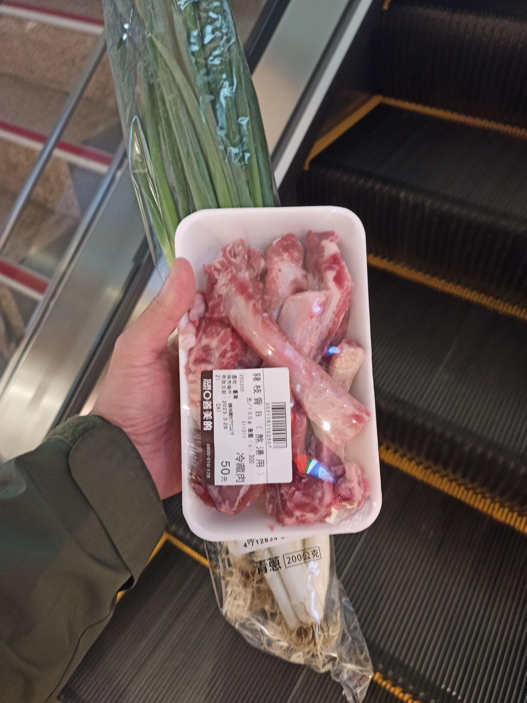
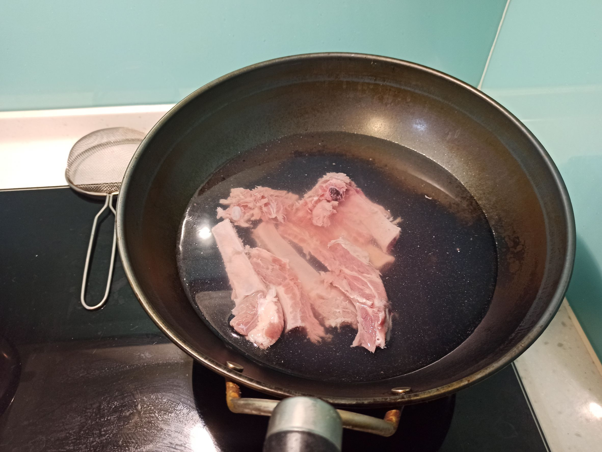
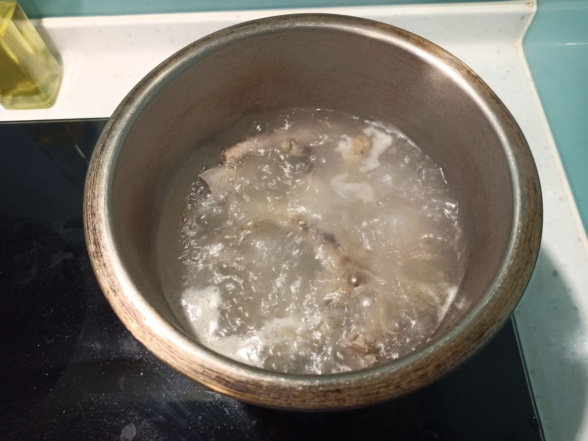
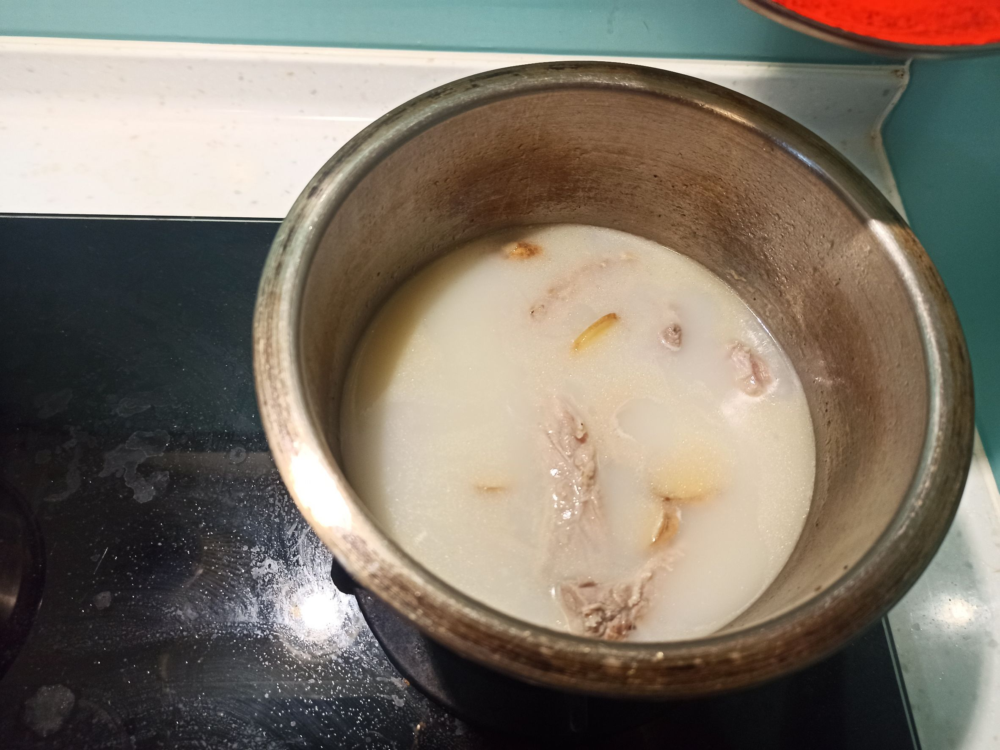

# 排骨濃湯
---
+ ## 組成
  1. 排骨

+ ## 20230326
  + ### 材料
    1. 排骨 一盒
    2. 鹽  適量
    3. 薑片 適量
  
  + ### 作法
    1. 先用麵粉裹排骨，裹完後溫水清洗
    2. 將排骨然後冷水川燙，水煮滾2分鐘後撈起，溫水清洗
    3. 鍋子放油，香煎排骨，然後丟薑片炒香
    4. 將料換鍋，加熱水淹過一些排骨，中大火煮滾15分
    5. 撈油撈浮沫，再加水下去，蓋鍋，中大火煮45分
    6. 煮好後加鹽即可
  
  + ### 過程與成品
    
    
    
    
  
  + ### 檢討
    1. 湯確實有變白，但是水真的少太多了，可能之後把火變為中火看看
    2. 排骨用此做法確實肉有嫩喔，讚
  
  + ### 參考資料
    [为什么饭店的大骨头汤那么白](https://youtu.be/D8ScelD4e2w)