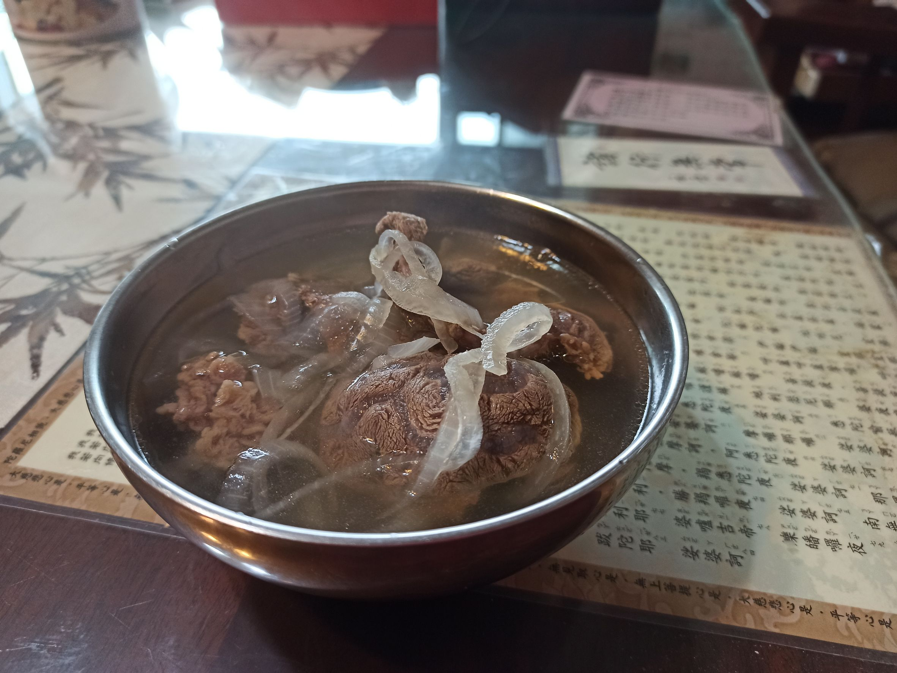
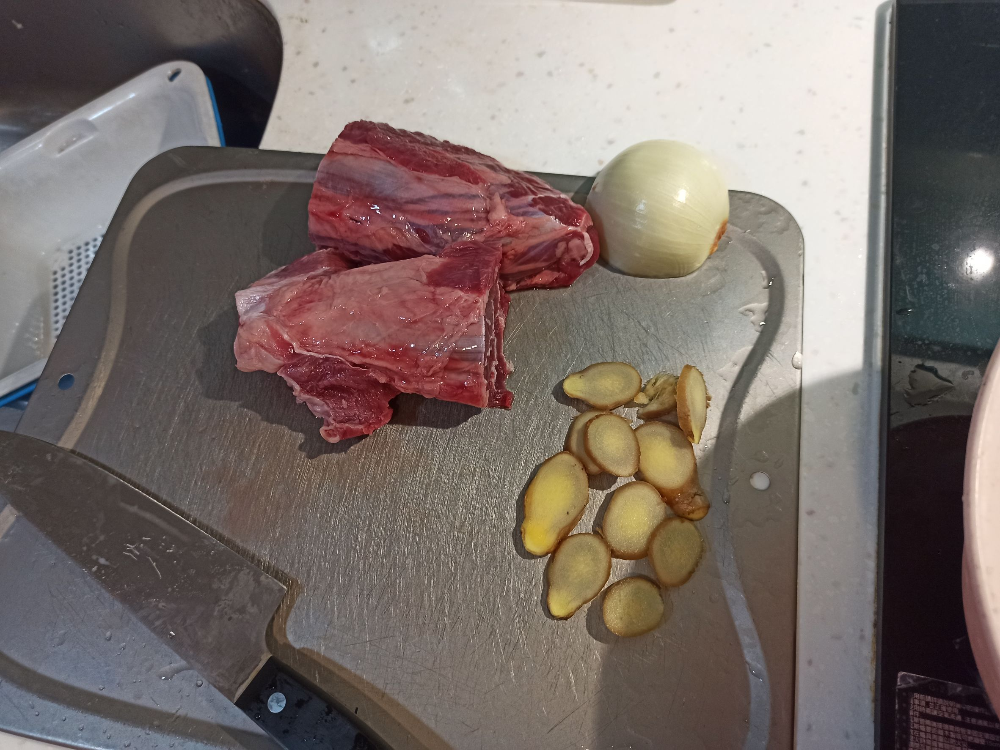
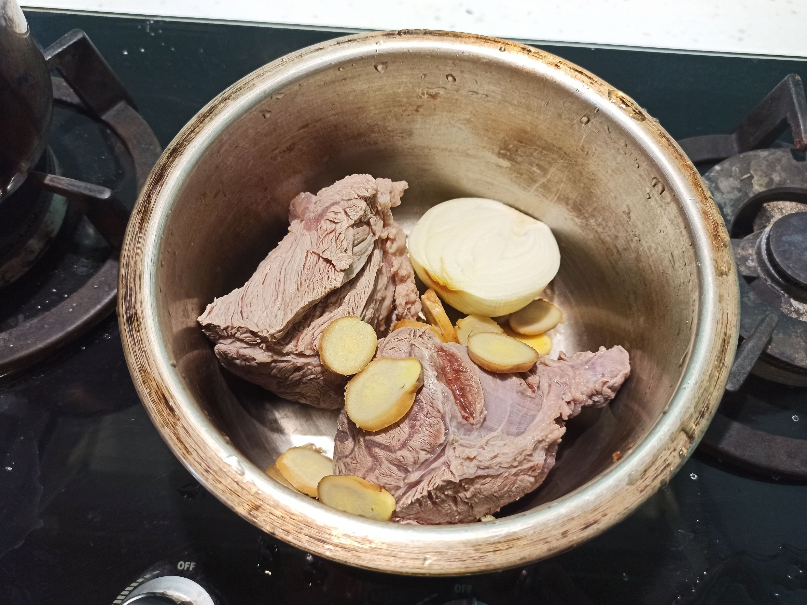
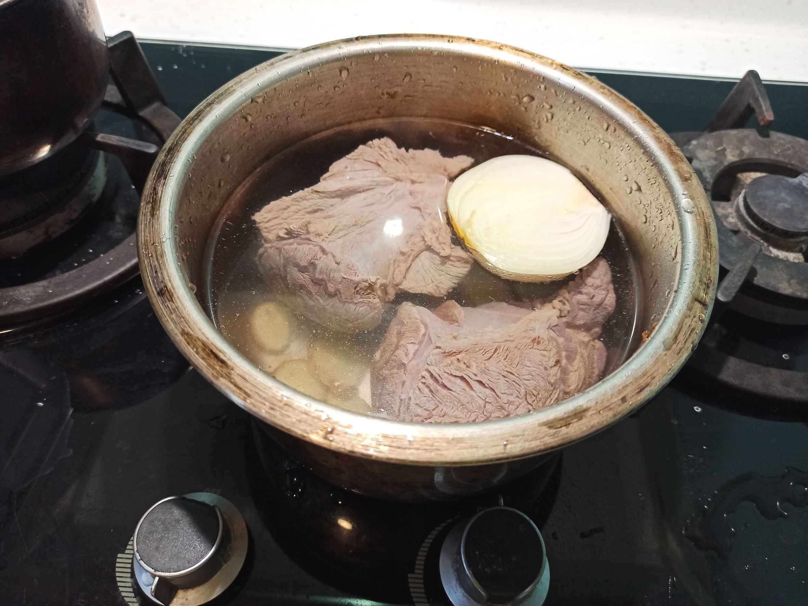
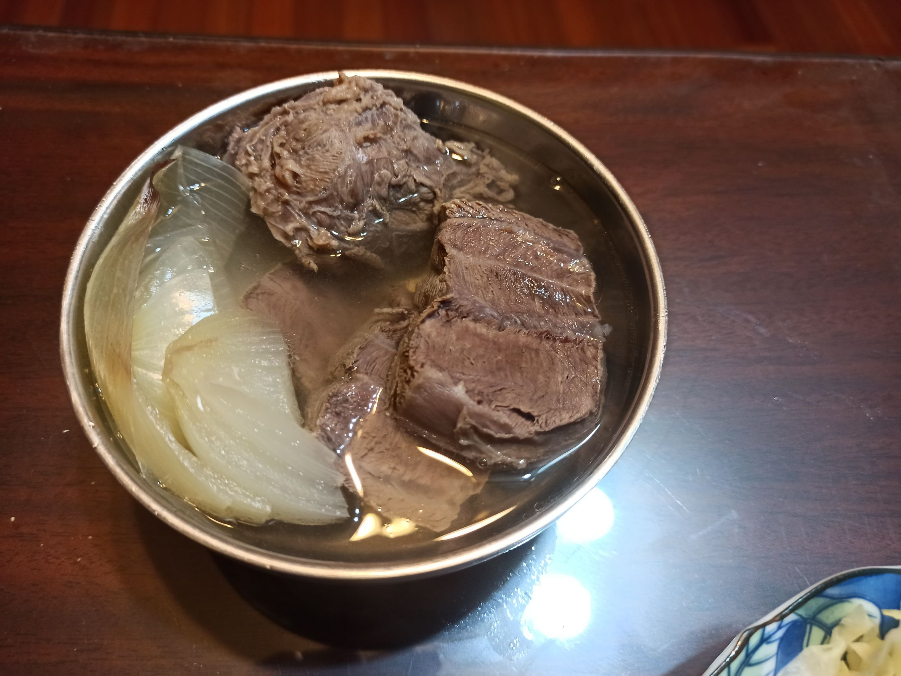

# 清燉牛肉湯
---
+ ## 組成
  1. 牛肉
  2. 洋蔥
  3. 薑

+ ## 20230219
  + ### 材料
    1. 牛腱心 適量
    2. 洋蔥 半顆
    3. 薑片 數片
    4. 鹽  適量
    5. 米酒 4格米杯
  
  + ### 作法
    1. 先將牛肉丟進滾水裡川燙3分鐘
    2. 拿出來冷水清洗
    3. 牛肉、薑片、洋蔥、米酒都丟入鍋裡
    4. 放水剛好淹過食材
    5. 放入電鍋，外鍋4杯水
    6. 出鍋加鹽即可
  
  + ### 過程與成品
    
  
  + ### 檢討
    1. 後來又做了幾次，感覺有幾個點注意
    2. 牛肉先切，這道我還是喜歡先切牛肉
    3. 滾水川燙，滾水下鍋川燙，一直維持中大火煮，大概2分多鐘就會開始再滾了，浮沫也會接著出來，所以，大概設定就是滾水下鍋大火川燙3分鐘左右
    4. 如果湯沒有很滿的時候，外鍋可以一次下滿4杯水，這樣就不會中途加了
    5. 也是可以先用瓦斯爐煮滾後再丟入電鍋
  
  + ### 參考資料
    [參考影片](https://youtu.be/_mFPPJGlx4M)

+ ## 20230211
  + ### 材料
    1. 牛腱心 適量
    2. 洋蔥 半顆
    3. 薑片 數片
    4. 鹽  適量
  
  + ### 作法
    1. 先將牛肉丟進滾水裡川燙2~3分鐘
    2. 拿出來冷水清洗
    3. 牛肉、薑片、洋蔥都丟入鍋裡
    4. 放水剛好淹過食材
    5. 放入電鍋，外鍋3杯水
    6. 蒸半小時後，外鍋再放1杯水
    7. 出鍋加鹽即可
  
  + ### 過程與成品
    
    
    
    
  
  + ### 檢討
    1. 覺得牛肉還是先切好比較好
    2. 水還是放太多了些
  
  + ### 參考資料
    [參考影片](https://youtu.be/_mFPPJGlx4M)