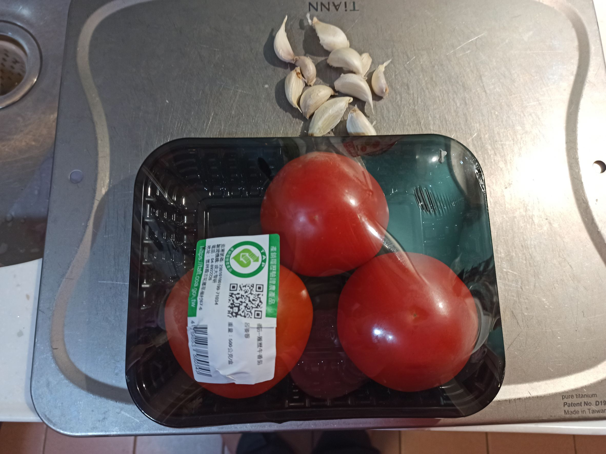
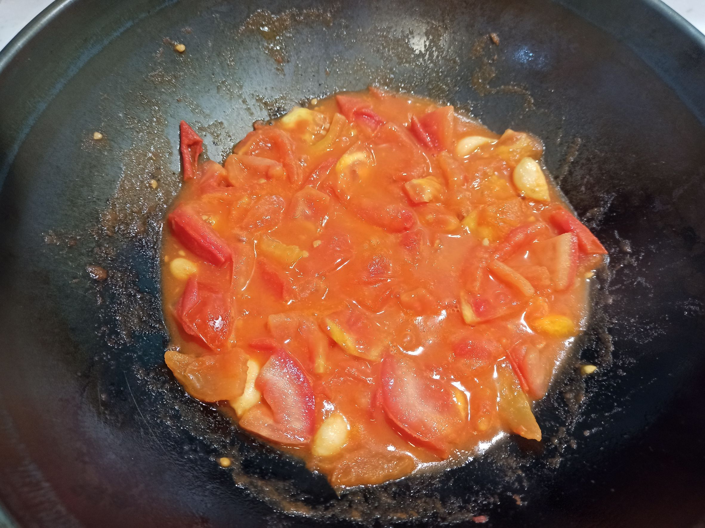
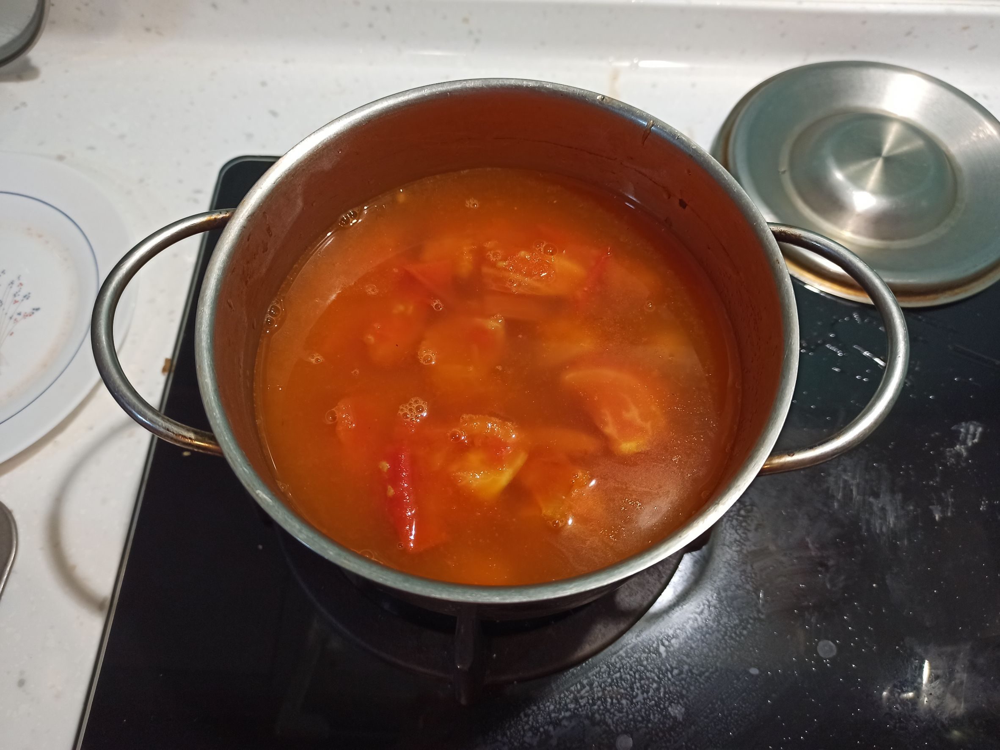
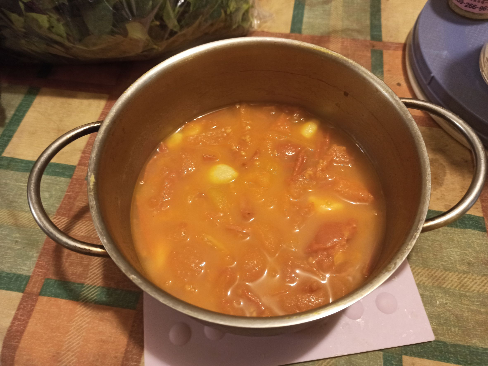
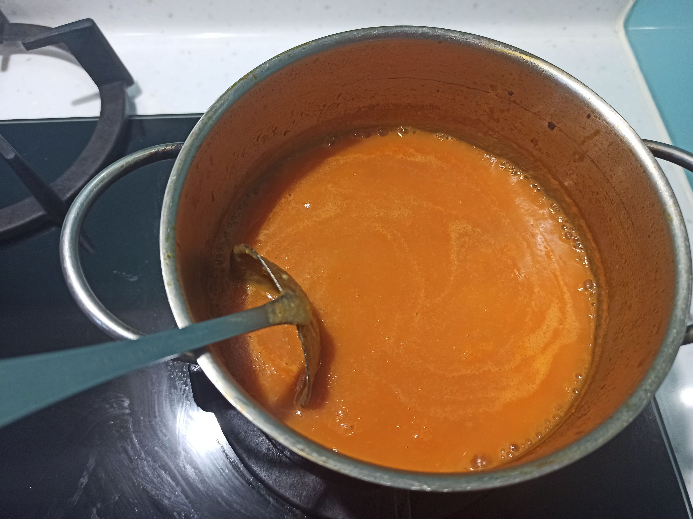
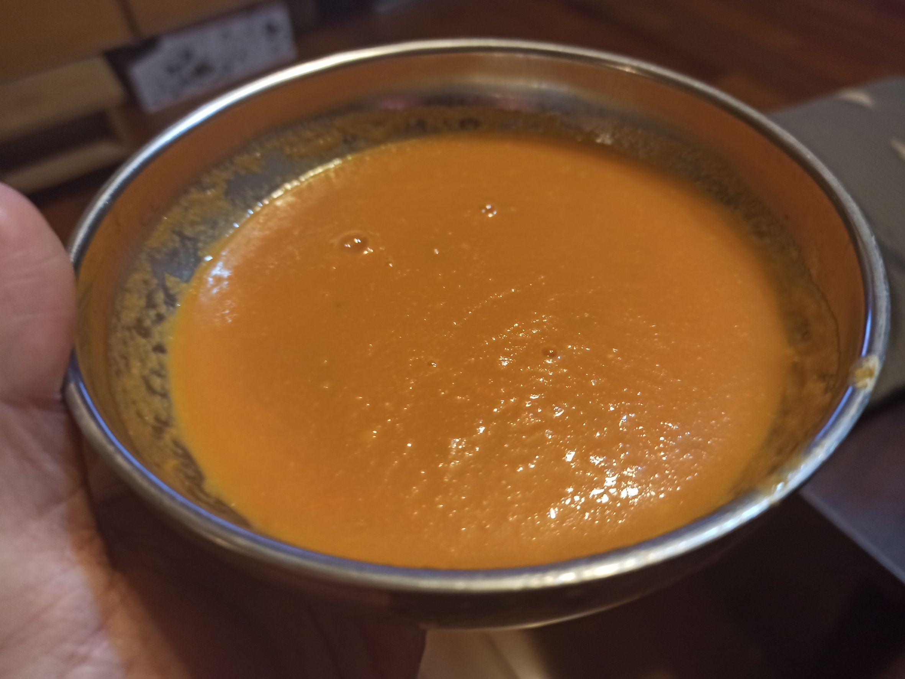

# 番茄濃湯
---
+ ## 組成
  1. 番茄

+ ## 20230103
  + ### 材料
    1. 番茄 3顆
    2. 大蒜 數顆
    3. 醬油 適量
    4. 鹽  適量
  
  + ### 作法
    1. 先將材料都切好準備好
    2. 熱鍋冷油，中小火爆蒜
    3. 等香味出來丟入番茄拌炒
    4. 炒至番茄整個糊掉為止
    5. 倒入另一個鍋子，放入水淹過食材
    6. 大火煮滾後轉小火，煮至少30分
    7. 放涼一下，用攪拌器打至泥狀
    8. 重新加熱並加入鹽與醬油調味即可
  
  + ### 過程與成品
    
    
    
    
    
    
  
  + ### 檢討
    1. 只能說可能以後水加多一些或者加點糖，不然真的酸，雖然口感很濃稠沒錯啦
    2. 而且這次沒去皮，喝的時候會覺得小皮很多，去皮還是口感好不少
  
  + ### 參考資料
    [日本產地流完熟蕃茄湯](https://icook.tw/recipes/407610)