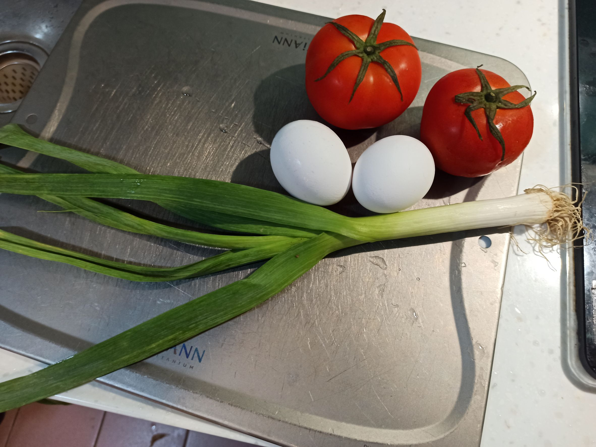
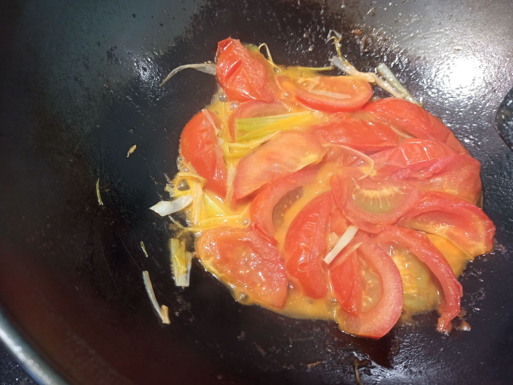

# 番茄蛋花湯
---
+ ## 組成
  1. 番茄
  2. 雞蛋

+ ## 20221216
  + ### 材料
    1. 番茄 2顆
    2. 雞蛋 2顆
    3. 鹽 適量
    4. 蔥 1根
  
  + ### 作法
    1. 一爐燒水
    2. 另一爐小火煎蔥白至變色
    3. 倒入切塊番茄後中小火煎至糊掉，偶爾拌炒就好
    4. 加入滾水轉大火煮
    5. 煮至湯變色後加鹽，轉小火倒入蛋液煮一下
    6. 加入蔥花即可起鍋
  
  + ### 過程與成品
    
    
    
  
  + ### 檢討
    1. 可能是我水加少了，蛋又加多了，搞起來好像番茄炒蛋不太像蛋花湯了
  
  + ### 參考資料
    [參考影片](https://youtu.be/8UwG-ml2vgo)