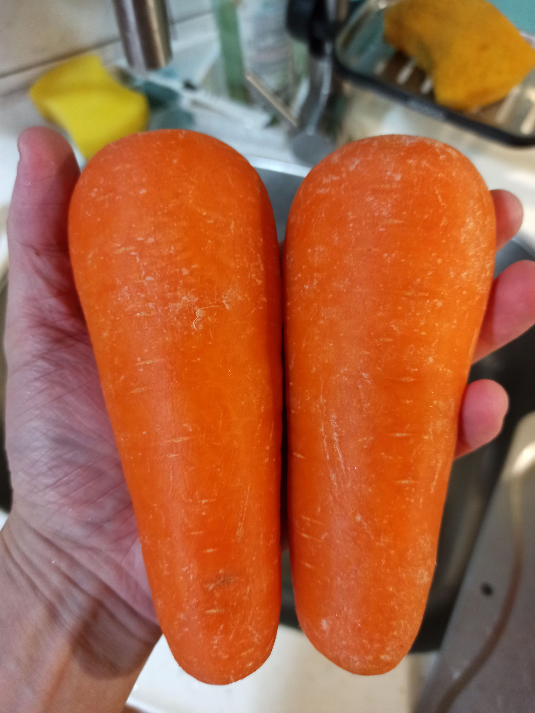
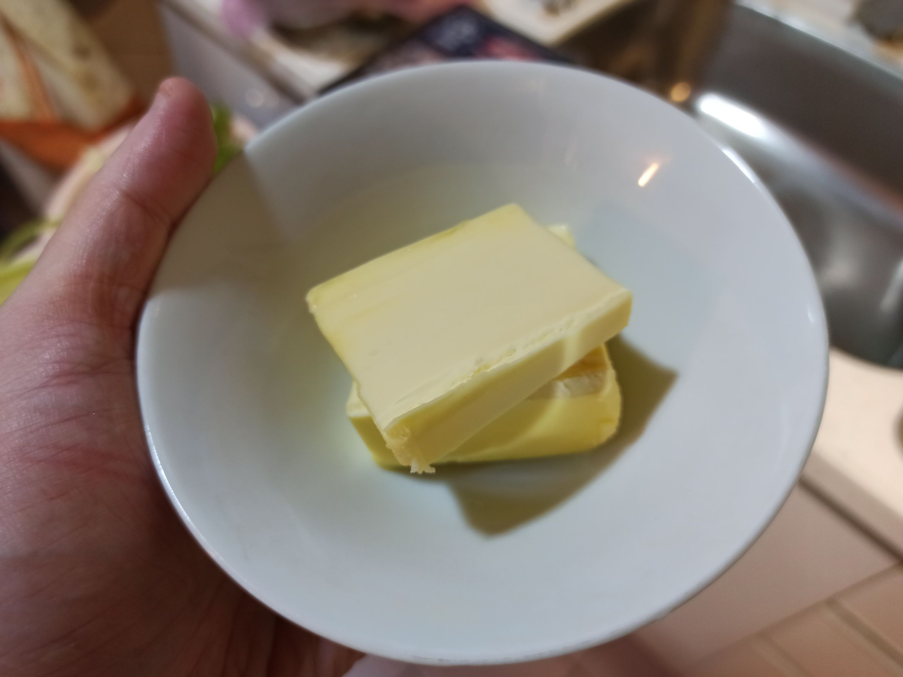
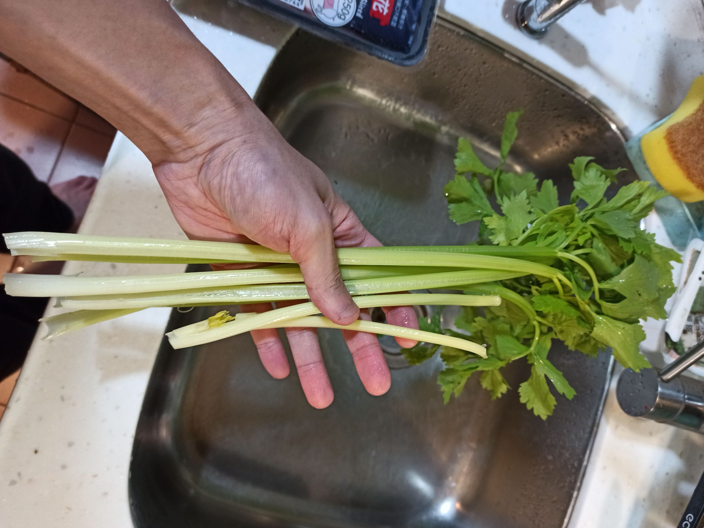
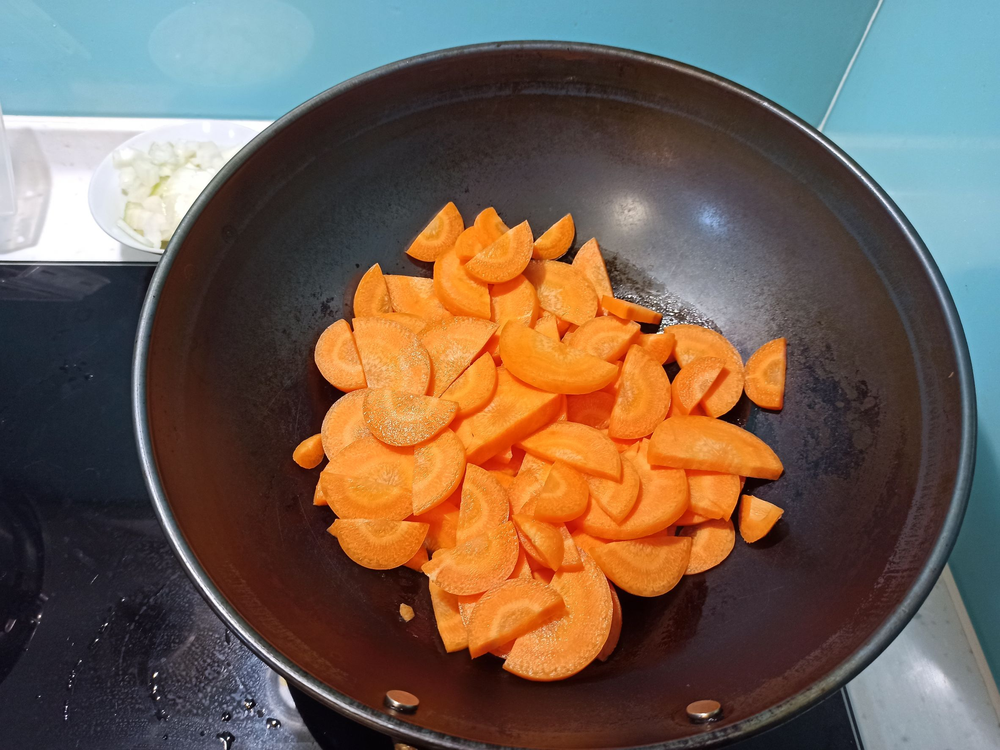
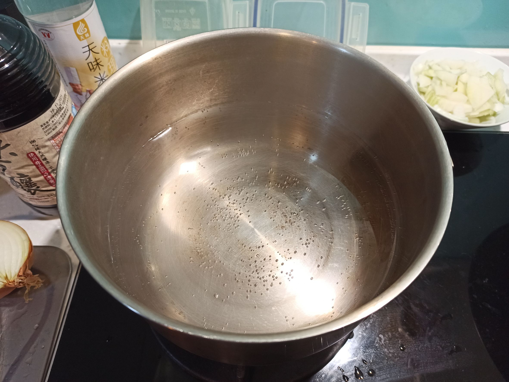
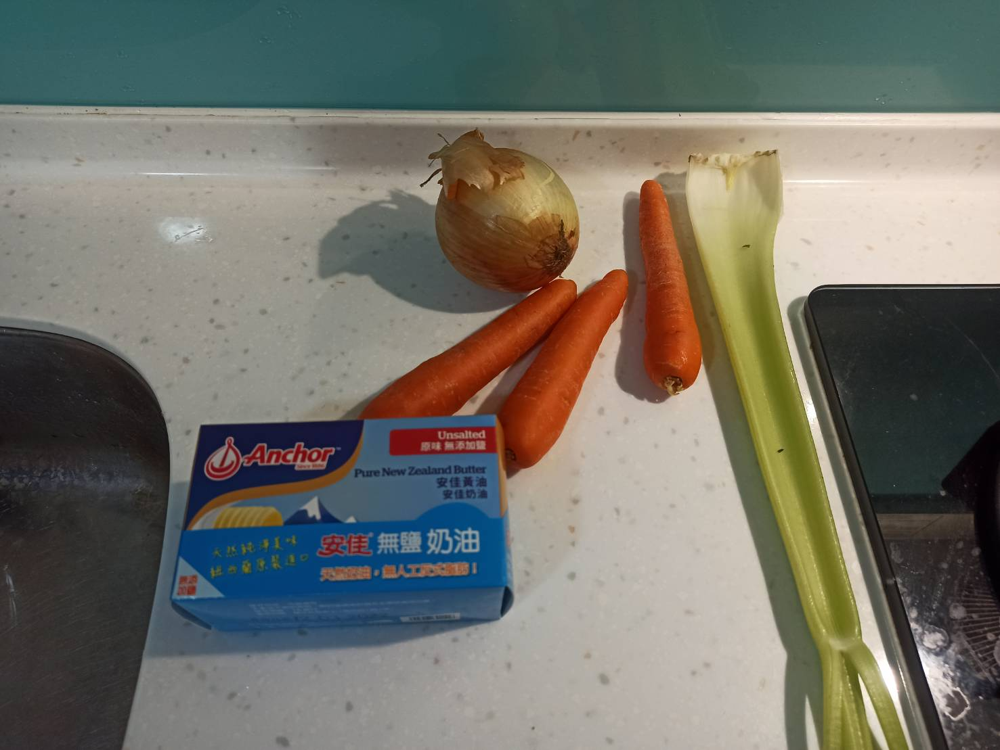
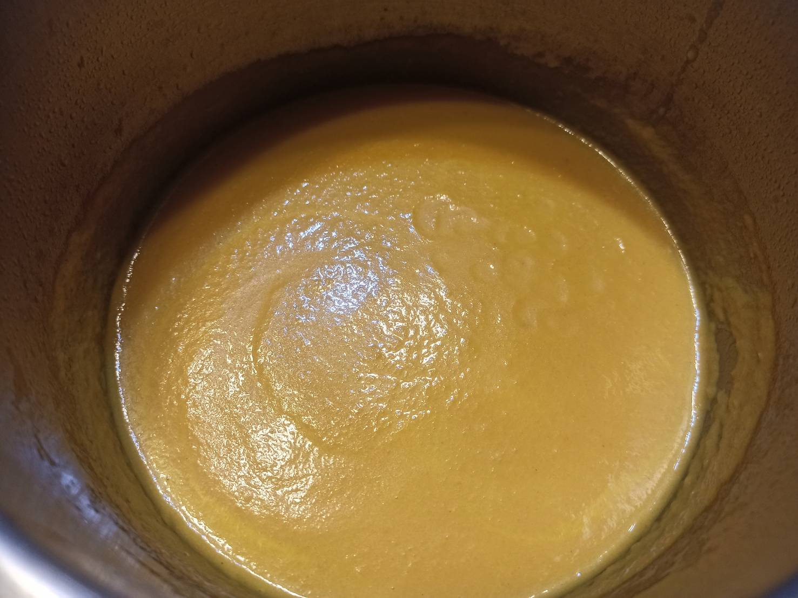

# 紅蘿蔔濃湯
---

+ ## 20221211
  + ### 材料
    1. 紅蘿蔔 2根
    2. 奶油 60g
    3. 西洋芹 數根
    4. 洋蔥 半顆
    5. 清水 切完食材(1+3+4)重量的兩倍
    6. 鹽 適量
    7. 糖 適量
  
  + ### 作法
    1. 先把紅蘿蔔切片約0.5cm厚度
    2. 一爐煮清水至滾，一爐冷鍋丟奶油再丟紅蘿蔔，中小火慢炒
    3. 炒到紅蘿蔔炒透後丟洋蔥繼續炒
    4. 炒到洋蔥顏色透進去，熟了即可
    5. 將炒物跟西洋芹丟進水裡，中小火繼續煮
    6. 撈出泡沫
    7. 紅蘿蔔煮軟後放涼10分鐘降溫
    8. 拿攪拌棒打成泥
    9. 加鹽、加糖，開火攪拌
  
  + ### 過程與成品
    
    
    
    
    
  
  + ### 檢討
    1. 這次一邊試味道一邊加鹽了，感覺好很多
    2. 鮮奶油是因為沒了才沒加的，不然加了比較香
  
  + ### 參考資料
    [讓你懷疑人生的紅蘿蔔濃湯](https://youtu.be/8iXlIutLbPk)

+ ## 20210710
  + ### 材料
    1. 紅蘿蔔 3小根
    2. 奶油 46g
    3. 西洋芹 1根
    4. 洋蔥 半顆
    5. 鮮奶油 一中湯匙
    6. 清水 切完食材(1+3+4)重量的兩倍
  
  
  + ### 作法
    1. 先把紅蘿蔔切片約0.5cm厚度
    2. 冷鍋丟奶油再丟紅蘿蔔，中小火慢炒
    3. 炒到紅蘿蔔炒透後丟洋蔥繼續炒
    4. 炒到洋蔥顏色透進去，熟了即可
    5. 煮清水，把料都倒入
    6. 紅蘿蔔煮軟後放涼10分鐘降溫
    7. 拿攪拌棒打成泥
    8. 開火加熱倒入鮮奶油
  
  + ### 過程與成品
    
    
  
  + ### 檢討
    1. 鮮奶油倒一中匙感覺有點少
    2. 再加點鹽跟糖會比較好
    3. 喝起來的確蠻像南瓜濃湯風味的，應該說是沒啥紅蘿蔔味道XD
  
  + ### 參考資料
    [讓你懷疑人生的紅蘿蔔濃湯](https://youtu.be/8iXlIutLbPk)