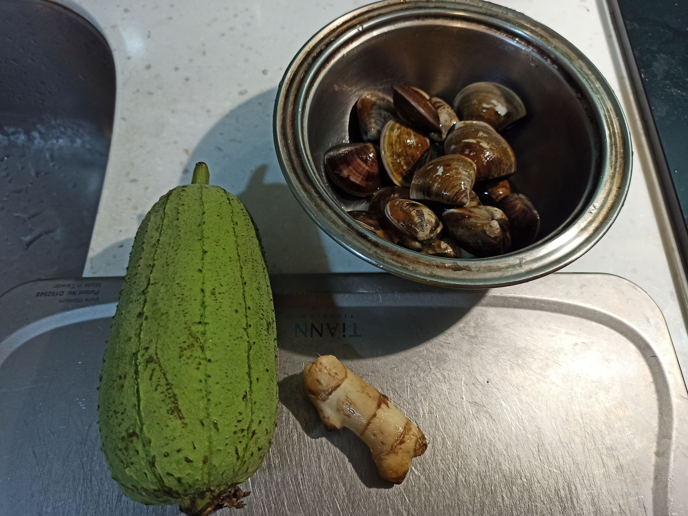
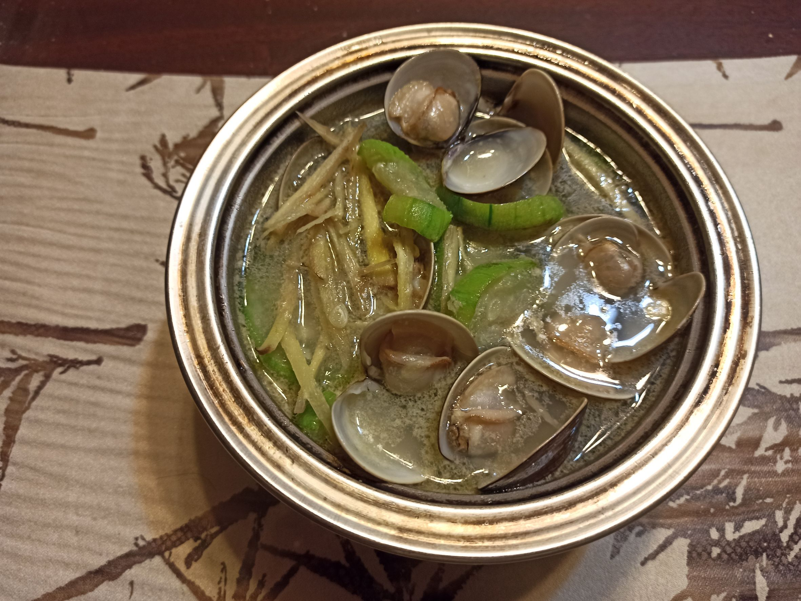

# 絲瓜蛤蜊湯
---
+ ## 組成
  1. 絲瓜
  2. 蛤蠣

+ ## 20221117
  + ### 材料
    1. 絲瓜 1條
    2. 蛤蠣 適量
    3. 薑絲 適量
  
  + ### 作法
    1. 先讓蛤蜊吐沙，鹽水比例3%，1~1.5小時
    2. 若泡完後，清洗完，蛤蜊嘴巴開開代表壞了，要拿掉
    3. 鍋燒熱，放油，絲瓜下去煎炒一下
    4. 接著放水、放蛤蜊，然後蓋上蓋子直到蛤蜊開開
    5. 開蓋下薑絲，再裝碗
  
  + ### 過程與成品
    
    
  
  + ### 檢討
    1. 原本想說薑絲後放會沒味道，後來味道還真有，可能泡一下就好了
  
  + ### 參考資料
    [參考影片](https://youtu.be/ns_7P4ts-Rs)