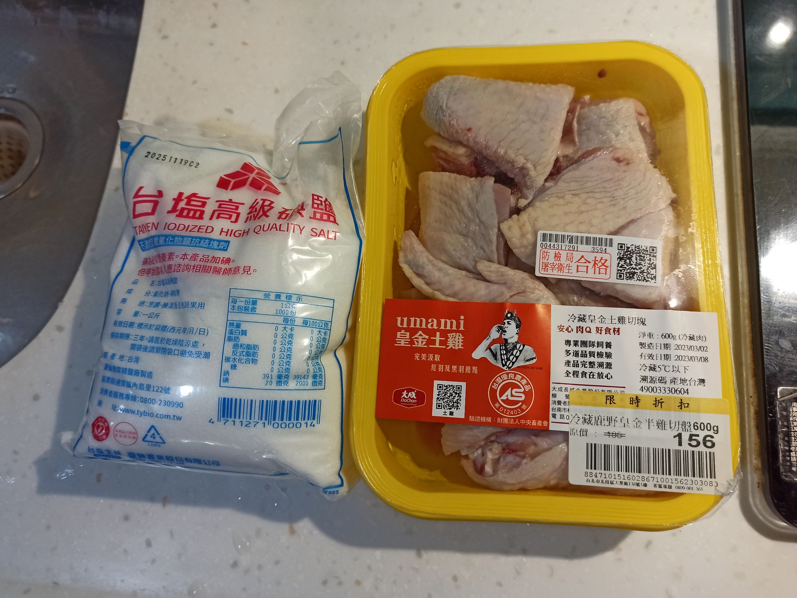
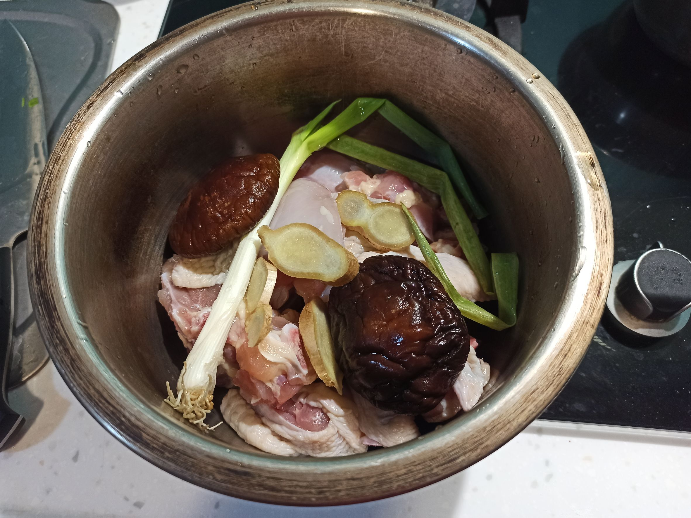
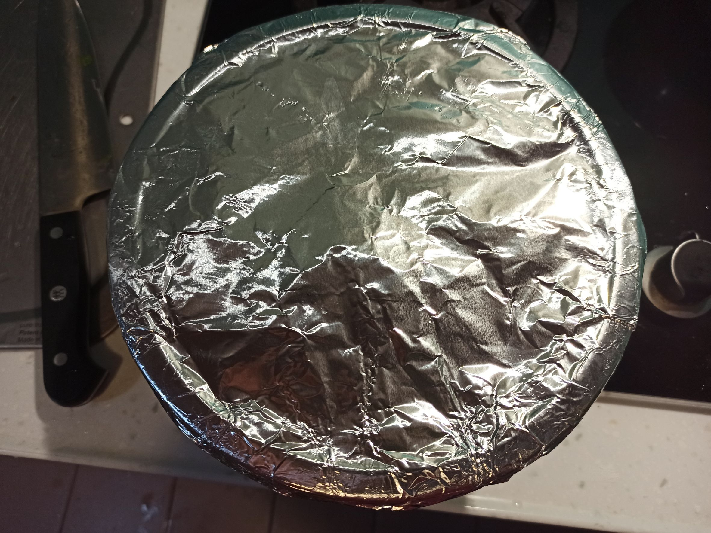
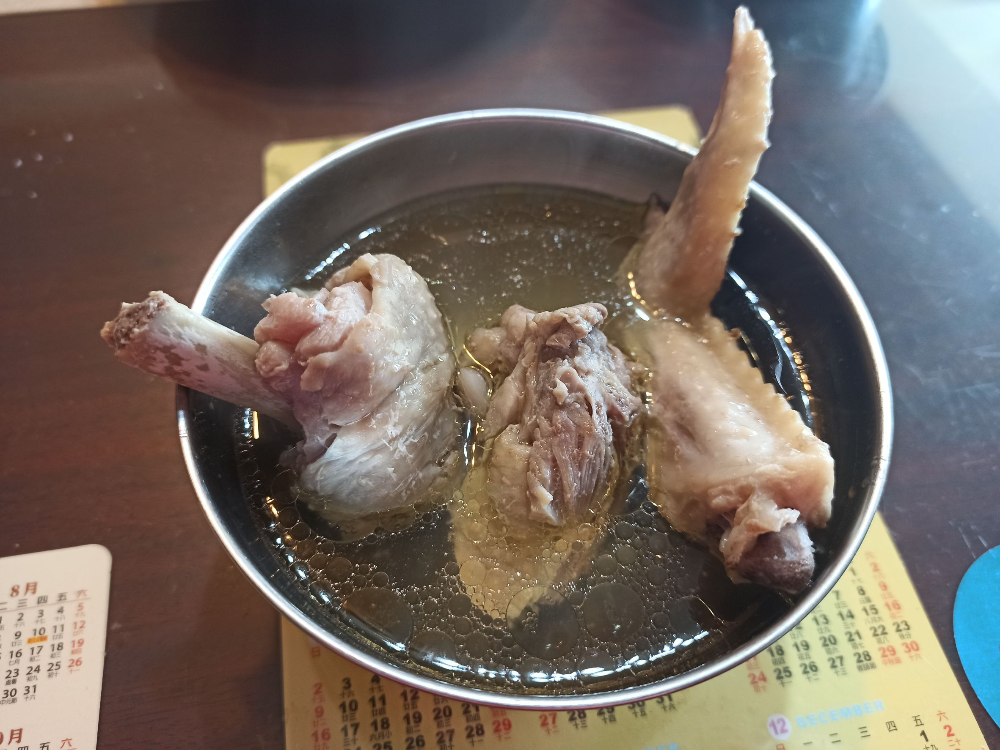

# 蒸雞湯
---
+ ## 組成
  1. 土雞腿肉
  2. 香菇
  3. 薑
  4. 青蔥

+ ## 20230307
  + ### 材料
    1. 土雞腿肉 600g
    2. 鹽 18g
    3. 青蔥 1把
    4. 薑片 適中
    5. 水 1000g
    6. 香菇 2朵
  
  + ### 作法
    1. 前一晚雞腿肉+3%的鹽乾式醃製
    2. 前一晚香菇泡水
    3. 清洗雞肉，盡量把鹽份洗掉
    4. 把雞腿肉放入鍋子內，青蔥、薑片、香菇、水
    5. 外鍋放4杯水，鍋子用蓋子蓋上或者用鋁箔紙包住
  
  + ### 過程與成品
    
    
    
    
  
  + ### 檢討
    1. 比想像中的鹹，可能以後把醃製%數下降至2看看，且清洗時多抓一下，把鹽份多沖掉點
    2. 沒想像中的油，這點不錯
    3. 味道整體除了鹹度過高以外是很不錯的
  
  + ### 參考資料
    [參考影片](https://youtu.be/JQoFQr-EPs8)