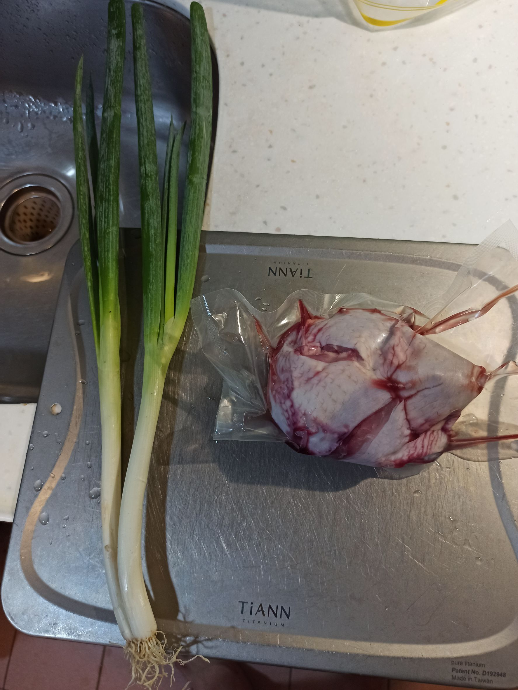
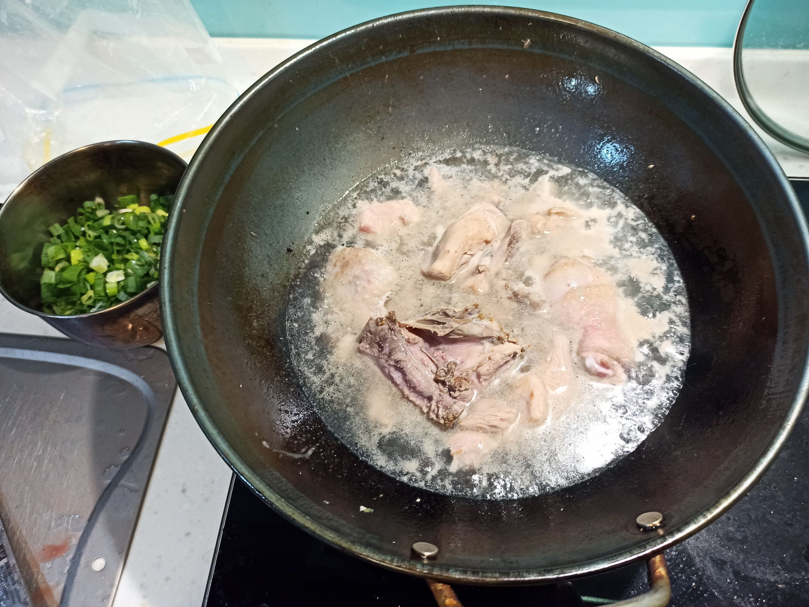
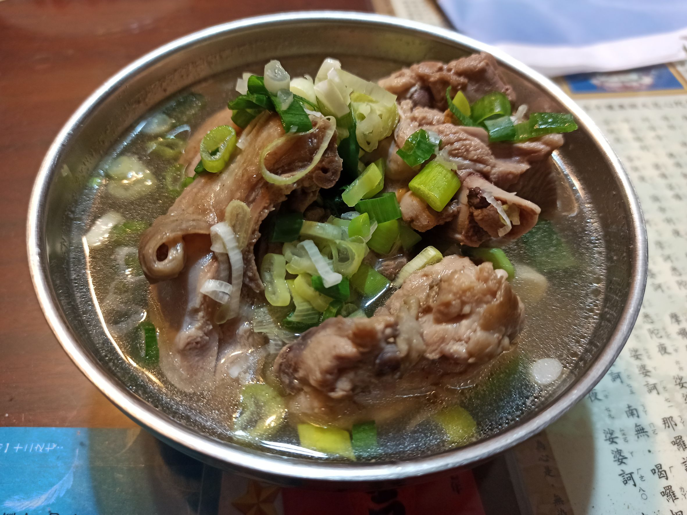

# 蔥雞湯
---
+ ## 組成
  1. 青蔥
  2. 雞腿肉

+ ## 20230329
  + ### 材料
    1. 青蔥 2把
    2. 雞腿肉 一隻
    3. 鹽  適量
  
  + ### 作法
    1. 先下點油，小火慢煎雞皮，煎至定型
    2. 拿出來切成小塊，再丟回去炒一炒
    3. 拿滾水沖下去，燉煮5分內
    4. 把青蔥放入容器中，將煮好的雞肉根湯沖下去即可
  
  + ### 過程與成品
    
    
    
  
  + ### 檢討
    1. 這次用帶骨的雞腿肉拿去煮，說實在有點浪費，也比較不好做，帶骨的還是熬湯比較好，這種蔥雞湯只是要有點煎雞皮的香味加上滿滿的青蔥就好了，沒要長時間燉煮的
  
  + ### 參考資料
    [蔥雞湯](https://youtu.be/pCRoiNVUX1c)