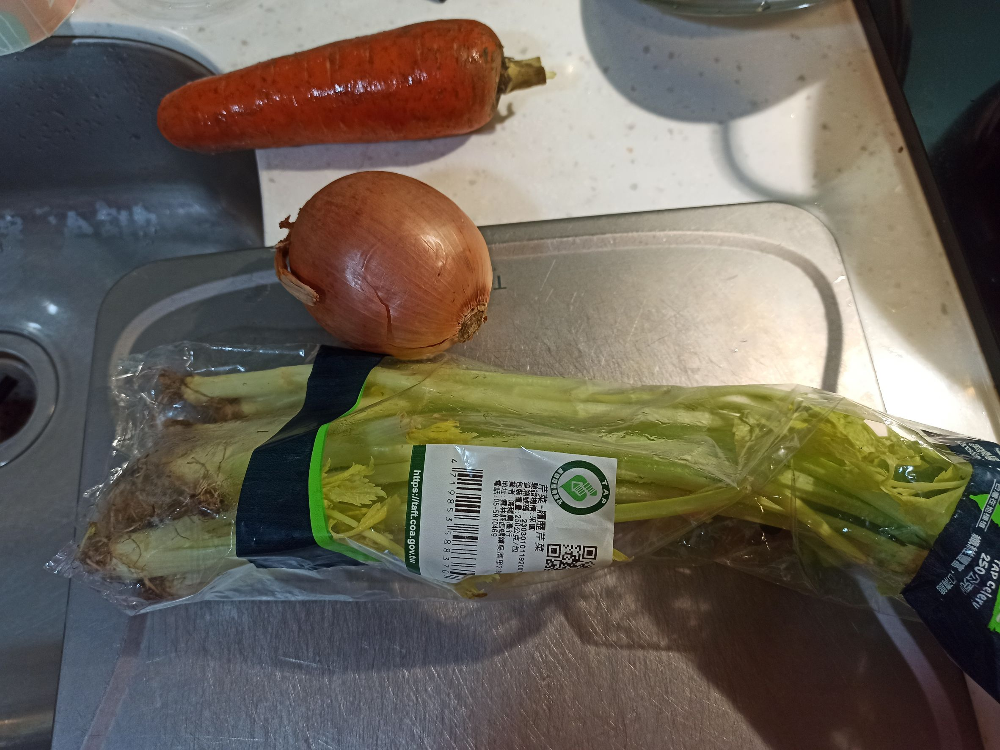
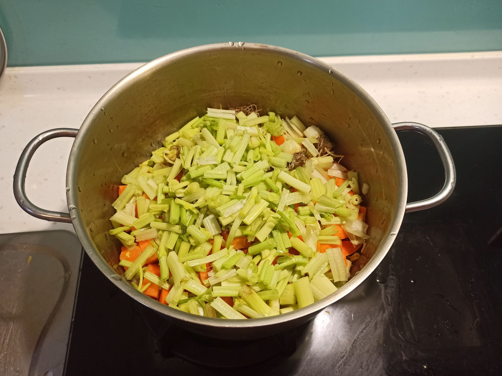
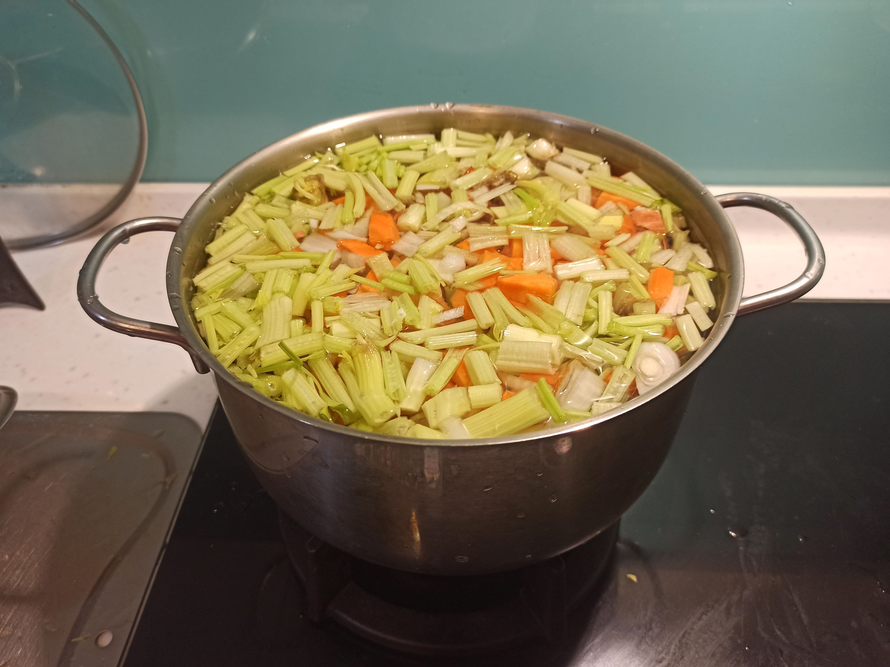
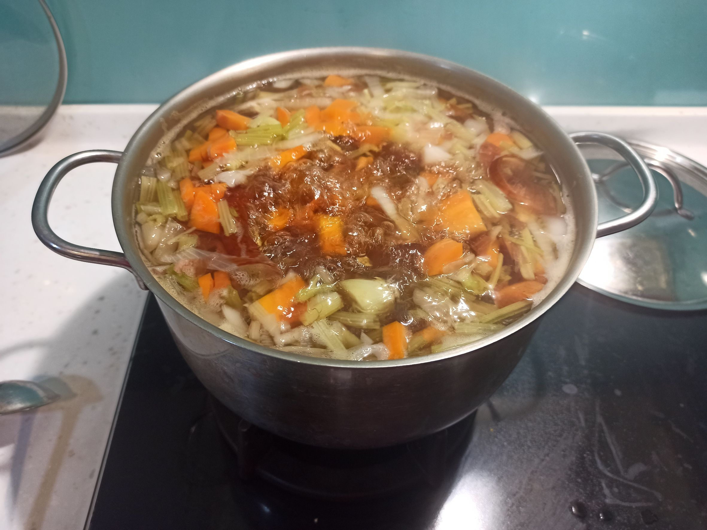
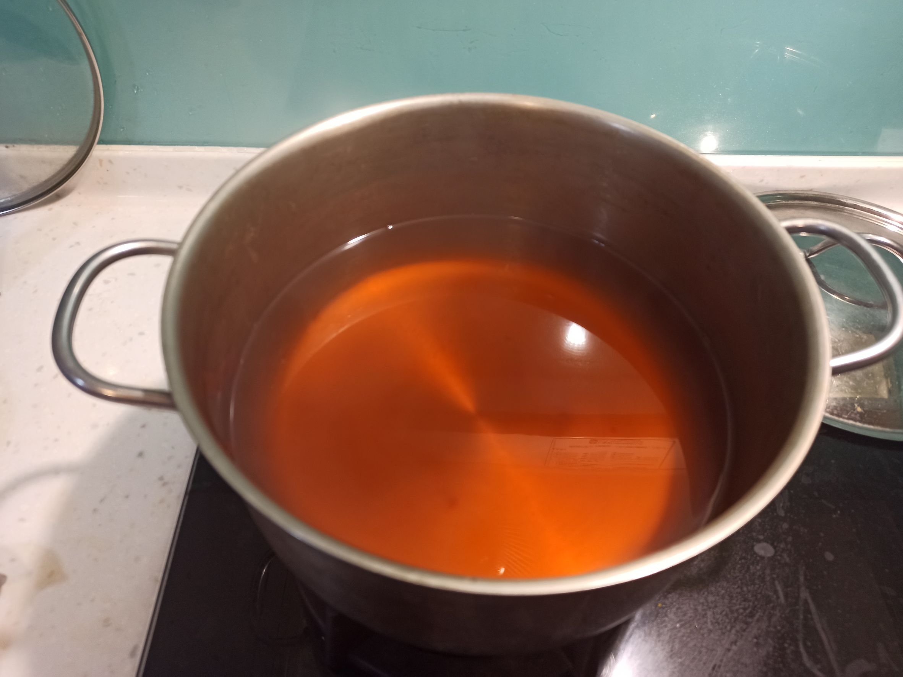

# 蔬菜湯底
---
+ ## 組成
  1. 紅蘿蔔
  2. 西洋芹
  3. 帶皮洋蔥

+ ## 20230308
  + ### 材料
    1. 紅蘿蔔 1根(約270g)
    2. 西洋芹 1包(約250g)
    3. 洋蔥 1顆(約285g)
    4. 水 2700cc
  
  + ### 作法
    1. 將食材都帶皮帶根洗淨後切小塊
    2. 全部丟鍋子加水，蓋上鍋蓋
    3. 大火煮滾後，開鍋蓋轉中火
    4. 中火滾約50分鐘，撈掉浮沫即可
  
  + ### 過程與成品
    
    
    
    
    
  
  + ### 檢討
    1. 影片中，食材是用300g搭5000cc的水啦，但我食材大多都250~300之間，而且我鍋子真的放不下5000cc的水了，放了2700cc就頂限了，下次會選擇比例性上把料放少一點的
    2. 浮沫感覺最後再一次撈就好了，而且撈浮沫有個小心得就是，要讓浮沫有個新的家，所以準備一碗水，把撈起來的浮沫放在那碗水上，不然浮沫會一直卡在網子上下不去
    3. 整體來說這湯真的很萬用，不用加鹽味道就很棒了，拿來煮燕麥也剛剛好
  
  + ### 參考資料
    [參考影片](https://youtu.be/Gmcut39Nx2c)