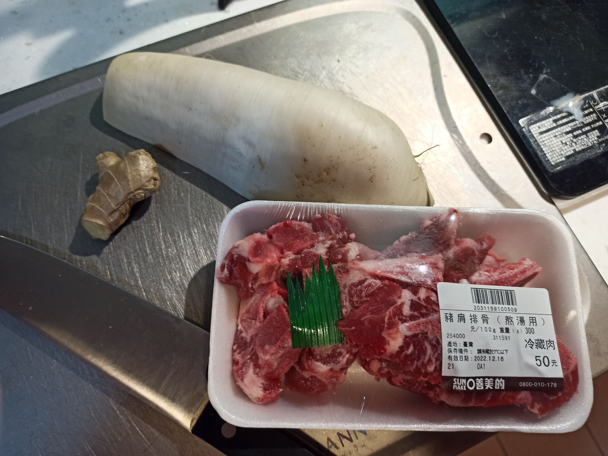
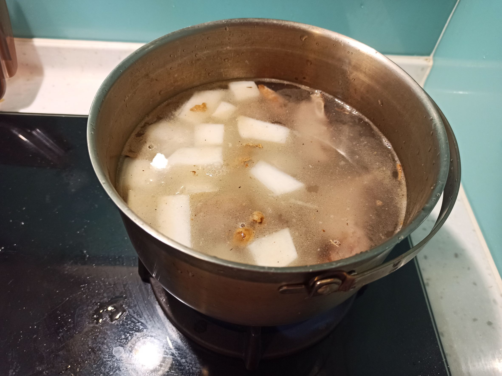
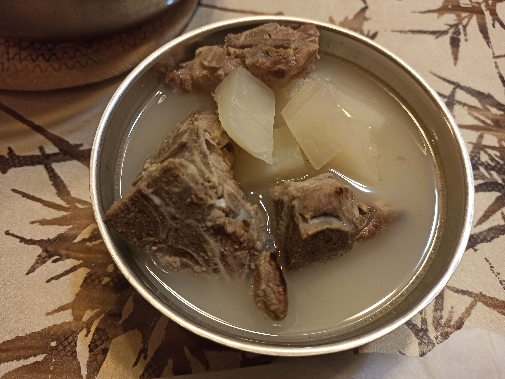

# 蘿蔔排骨湯
---
+ ## 組成
  1. 蘿蔔
  2. 排骨

+ ## 20221215
  + ### 材料
    1. 白蘿蔔 半根
    2. 豬軟骨 一盒
    3. 鹽 適量
    4. 薑 適量
    5. 清水 適量
  
  + ### 作法
    1. 排骨冷水下鍋，煮至水滾，水滾煮1分鐘後撈起泡冷水清洗
    2. 將薑切片，熱鍋冷油，薑片丟下去，炒幾秒
    3. 排骨丟下去，煎至金黃
    4. 蘿蔔丟下去拌炒一下
    5. 水加下去淹過食材，蓋上蓋子煮至滾轉小火
    6. 小火燉煮45分鐘後，加鹽調味
  
  + ### 過程與成品
    
    
    
  
  + ### 檢討
    1. 這次煎的沒很金黃，感覺是油放少了
    2. 鹽我也加的有點少，不過還能喝就是
  
  + ### 參考資料
    [參考影片](https://youtu.be/X15eOIixFPg)