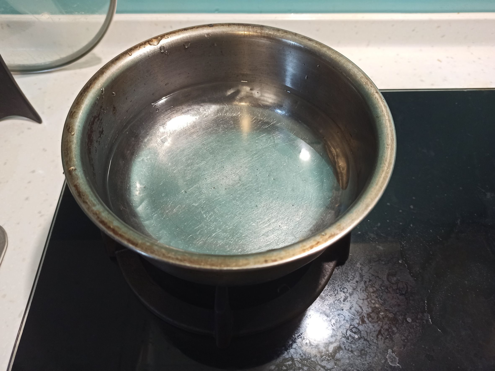
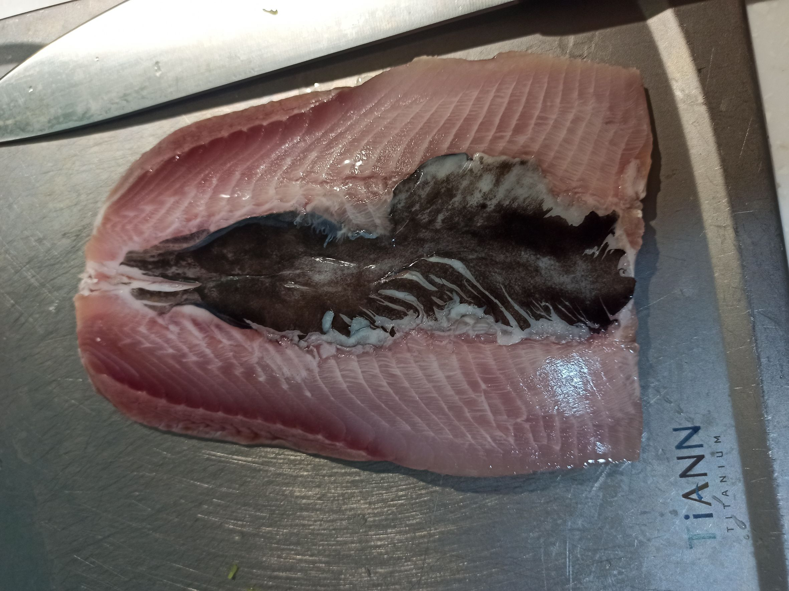
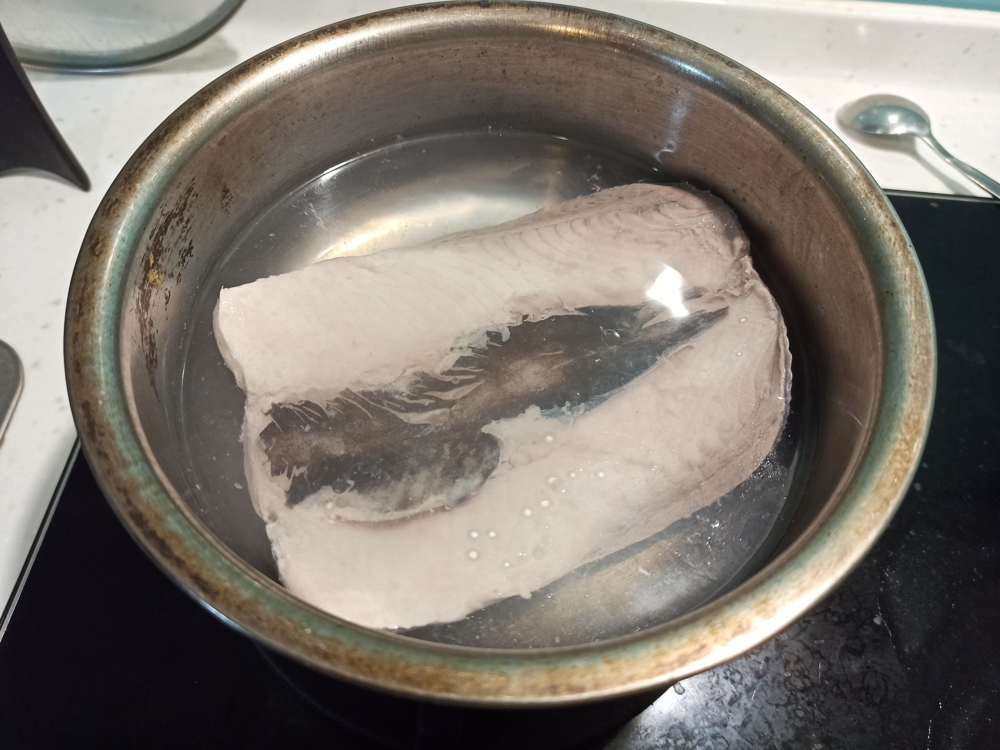
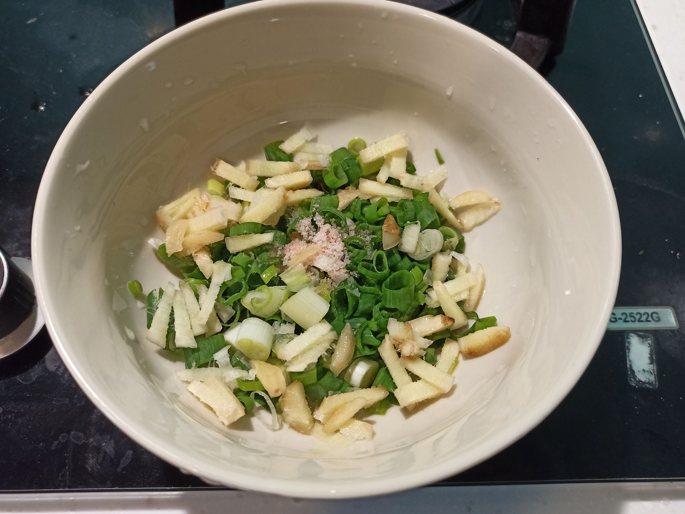
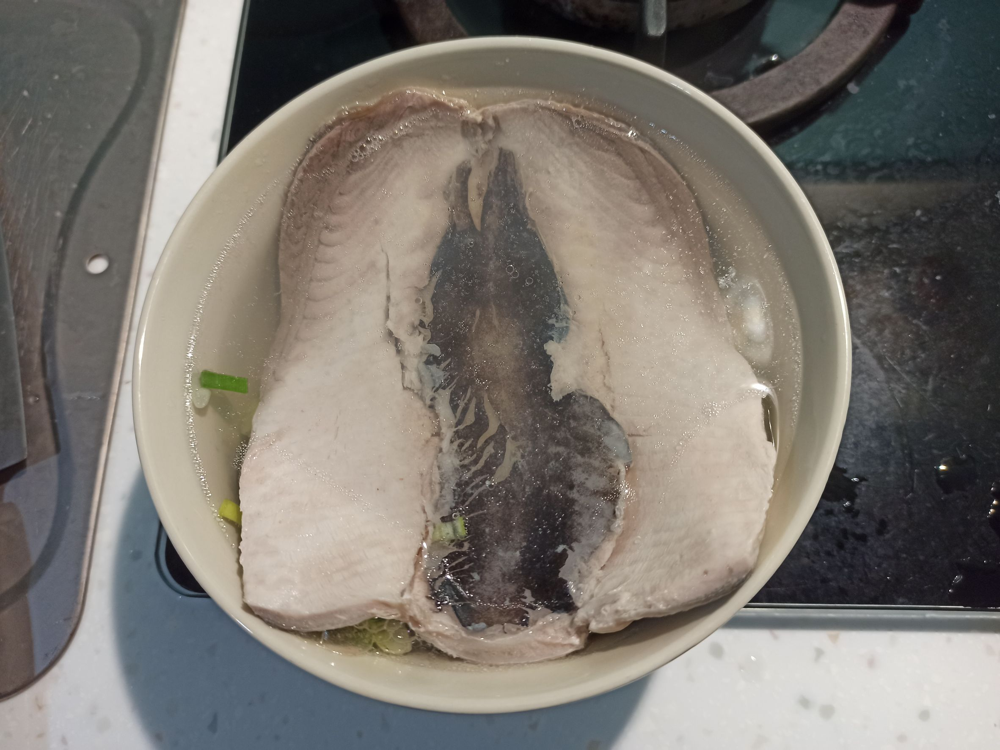
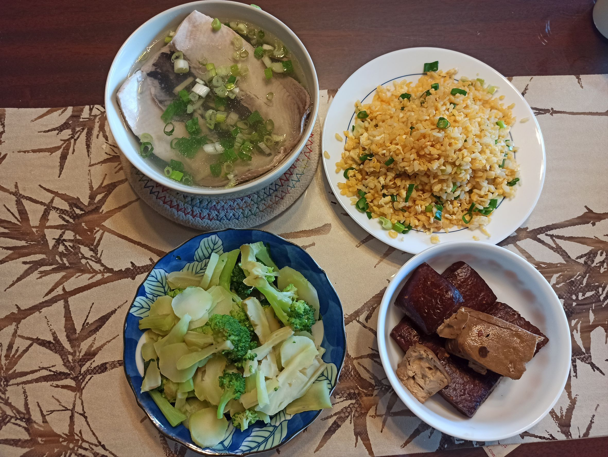

# 虱目魚肚湯
---
+ ## 組成
  1. 虱目魚肚

+ ## 20221114
  + ### 材料
    1. 虱目魚肚 一片
    2. 米酒 3杯蓋
    3. 薑 適量
    4. 青蔥 適量
    5. 鹽 少許
  
  + ### 作法
    1. 虱目魚肚擦乾並兩面撒鹽
    2. 燒開一碗水
    3. 魚肚放進去轉小火，等3分鐘
    4. 薑絲、青蔥、鹽、米酒放入碗內
    5. 將泡好的魚肚拿出來放碗內
    6. 湯衝下去
  
  + ### 過程與成品
    
    
    
    
    
    
  
  + ### 檢討
    1. 覺得米酒跟薑還是先下去大火煮過一下比較好
  
  + ### 參考資料
    [【姆士流】虱目魚肚湯](https://youtu.be/LMXh9eHV-AQ)