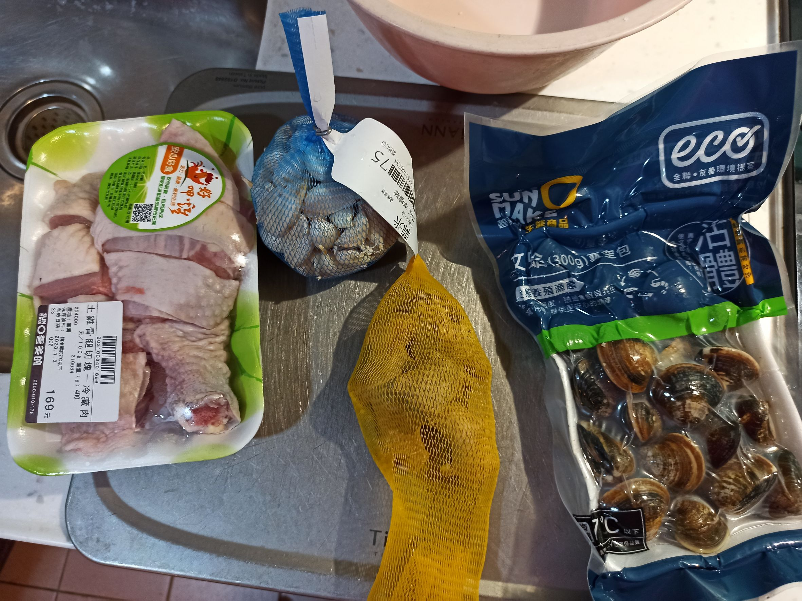
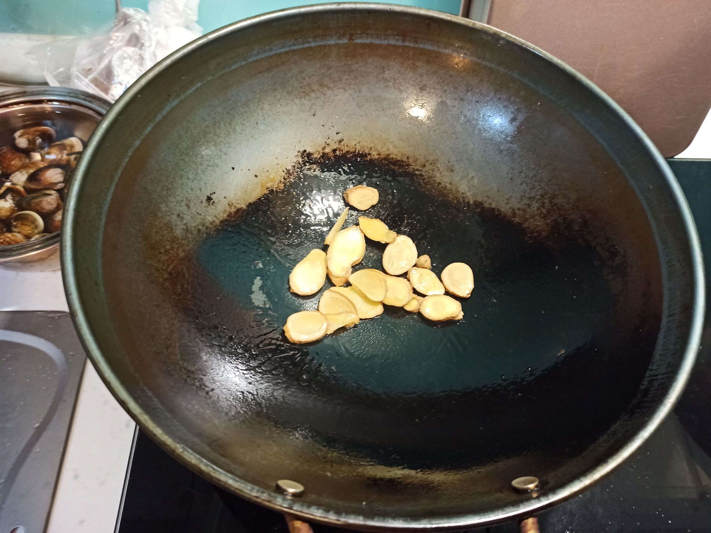
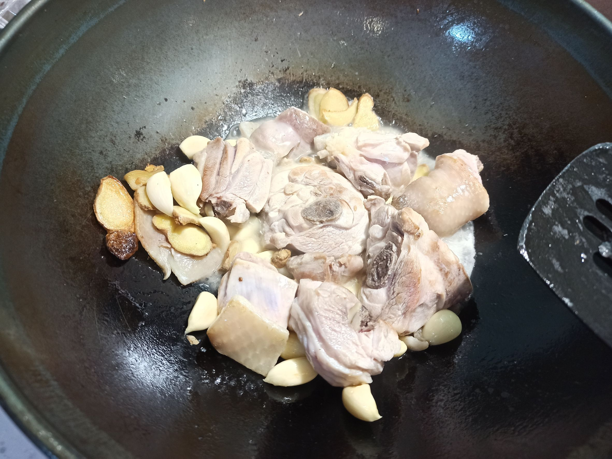
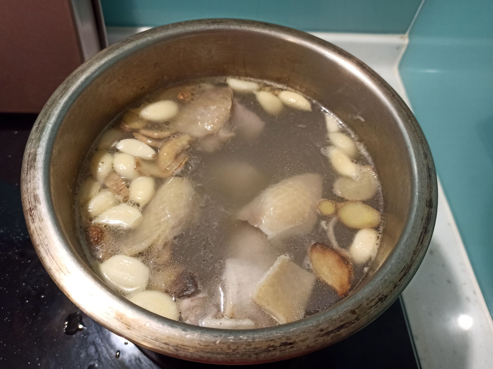
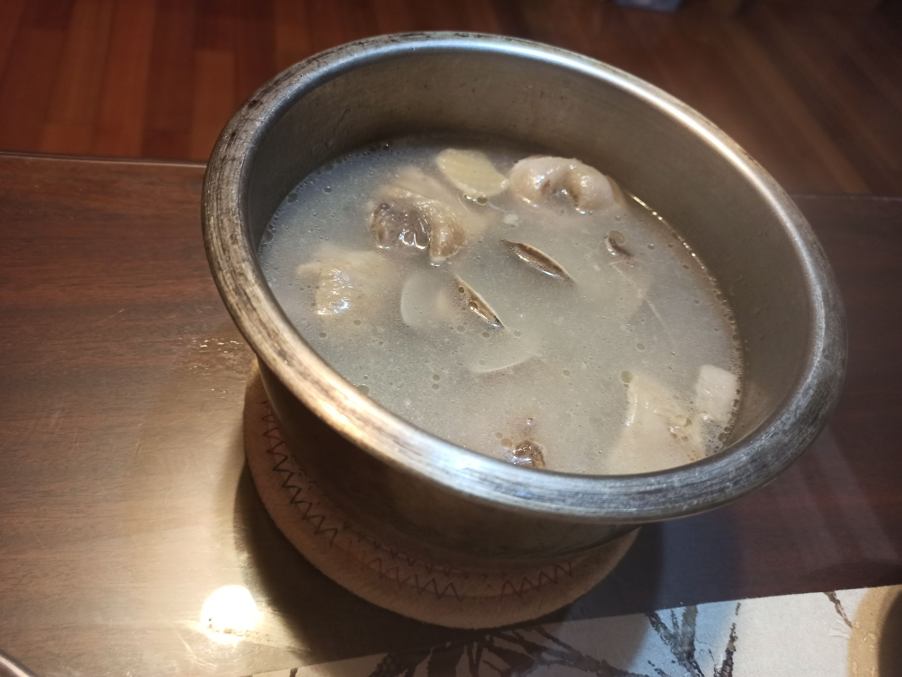
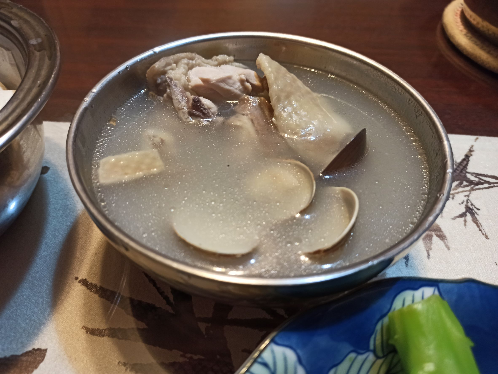

# 蛤蠣雞湯
---
+ ## 組成
  1. 蛤蠣
  2. 雞腿肉

+ ## 20230101
  + ### 材料
    1. 土雞腿肉 1盒
    2. 蛤蠣 1盒
    3. 薑片 適量
    4. 大蒜 適量
    5. 鹽 適量
    6. 米酒 適量
    7. 水 適量
  
  + ### 作法
    1. 將蛤蜊泡鹽水吐沙
    2. 先將雞腿肉川燙後，用冷水洗淨濾乾
    3. 熱鍋下油下薑片，中小火編炒
    4. 待香味出來後，下雞腿肉炒一下
    5. 再下大蒜與米酒，待米酒收乾
    6. 倒入另一隻鍋中，加水淹過食材
    7. 大火煮開，轉小火蓋上蓋子煮至少30分
    8. 把浮沫撈掉，將吐沙的蛤蠣洗淨丟入小火煮，並加入適量的鹽
    9. 煮3~5分鐘即可
  
  + ### 過程與成品
    
    
    
    
    
    
  
  + ### 檢討
    1. 整體來說，此次蠻成功的，不錯喝
  
  + ### 參考資料
    [【肥大叔】暖心又暖胃](https://www.youtube.com/watch?v=9XutWshitPk)