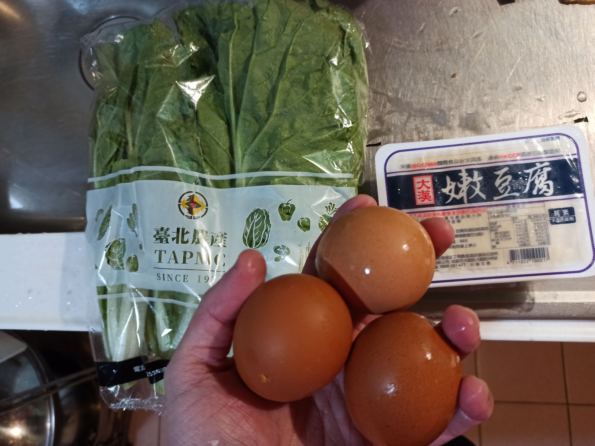
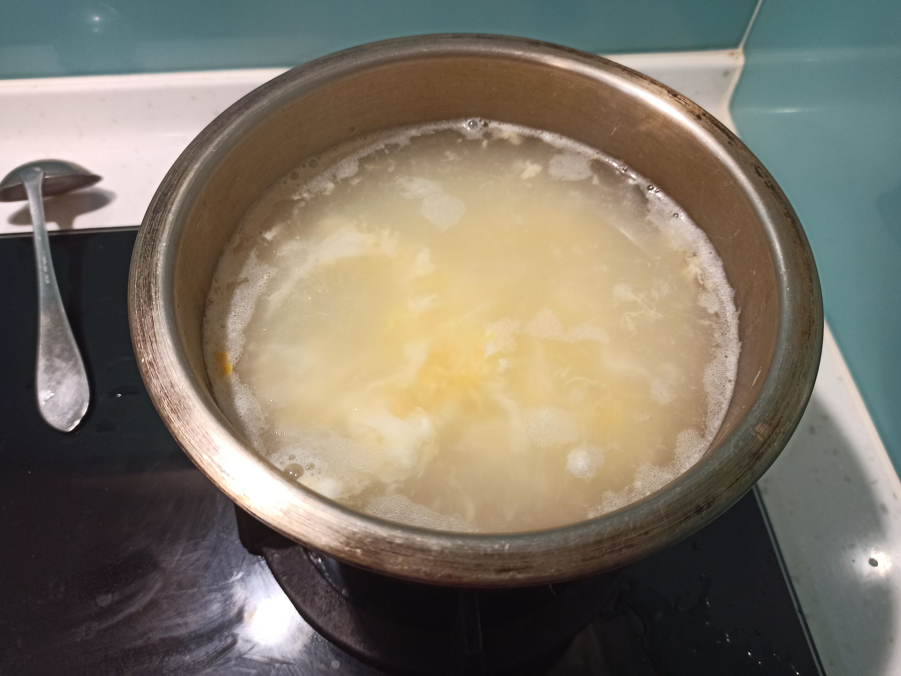
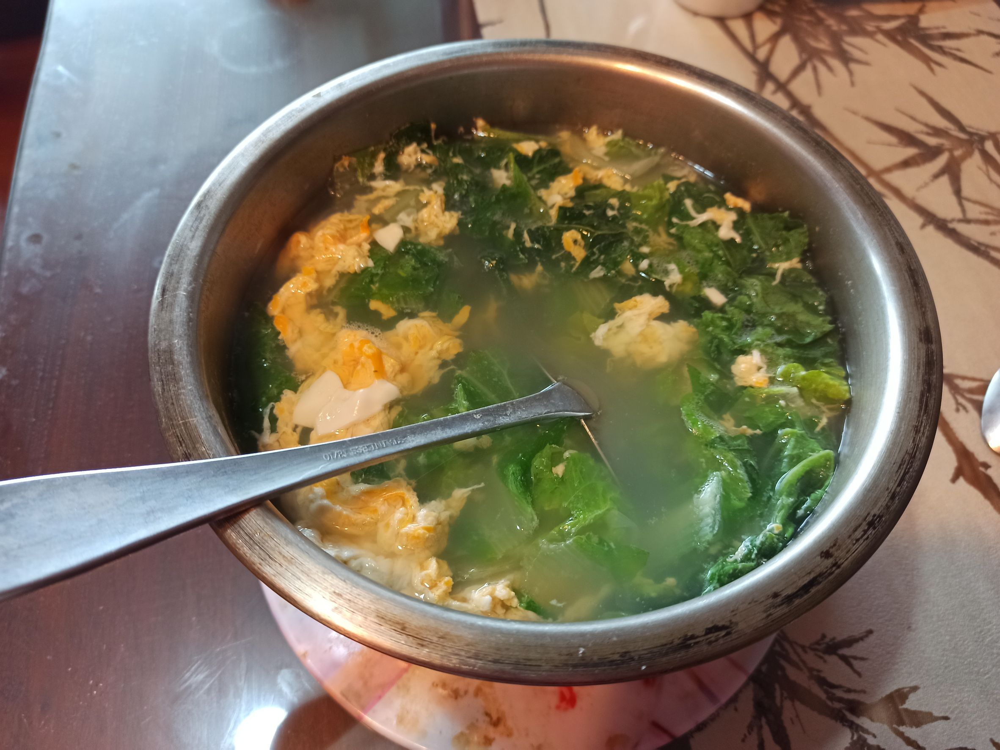
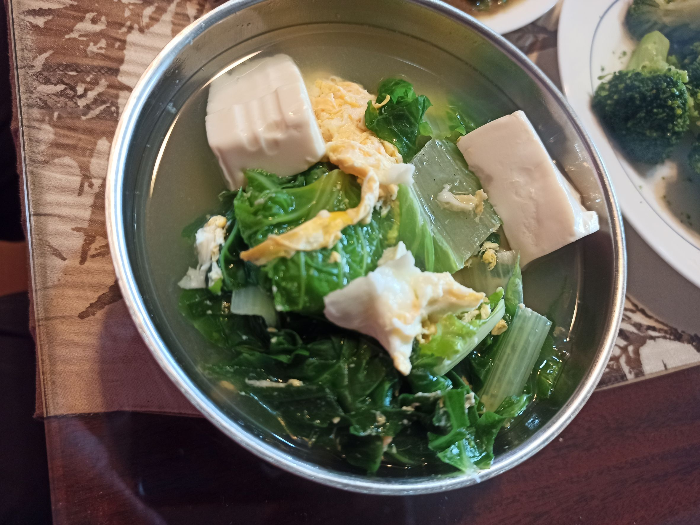

# 青菜豆腐蛋花湯
---
+ ## 組成
  1. 小白菜
  2. 豆腐
  3. 雞蛋

+ ## 20221229
  + ### 材料
    1. 雞蛋 3顆
    2. 嫩豆腐 1盒
    3. 小白菜 1包
    4. 鹽 適量
  
  + ### 作法
    1. 滾水下豆腐，煮個2~3分鐘
    2. 倒入雞蛋液，煮至定型
    3. 放入小白菜煮熟
    4. 加鹽調味起鍋
  
  + ### 過程與成品
    
    
    
    
  
  + ### 檢討
    1. 雞蛋液可能過濾一下比較好
  
  + ### 參考資料
    [青菜豆腐蛋花湯](https://icook.tw/recipes/260146)