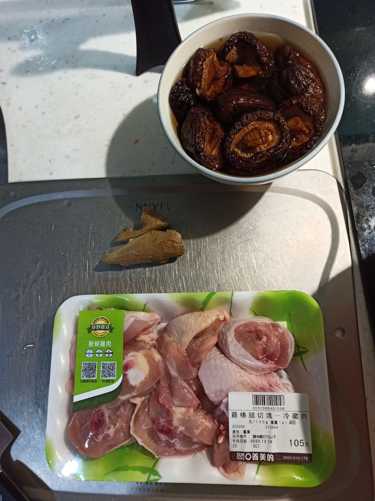
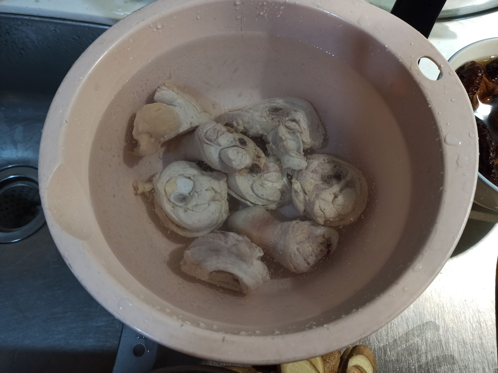
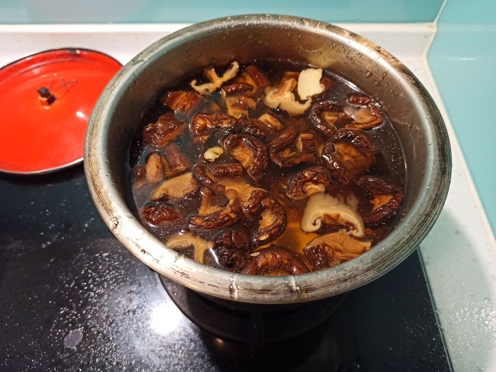

# 香菇雞湯
---
+ ## 組成
  1. 香菇
  2. 帶骨雞腿

+ ## 20221216
  + ### 材料
    1. 帶骨雞腿 1盒
    2. 香菇 數朵
    3. 鹽 適量
    4. 米酒 5瓶蓋
    5. 薑片 適量
  
  + ### 作法
    1. 將香菇泡水1小時以上
    2. 泡完後把香菇拿出來切一切
    3. 雞腿川燙後洗淨
    4. 鍋子丟入洗淨好的雞腿、切丁香菇、薑片、倒入香菇水、米酒
    5. 再將水加至至少淹過食材
    6. 大火煮滾後轉小火悶煮至少30分鐘即可
  
  + ### 過程與成品
    
    
    
  
  + ### 檢討
    1. 喝起來有薑味跟香菇味，喝不太到雞的感覺，雞腿變成只有口感了
    2. 還是要紅棗啦
    3. 東西還是炒香過比較好
    4. 下次參考簡單哥的版本好惹
  
  + ### 參考資料
    [參考影片](https://youtu.be/GOa40DMbBtA)