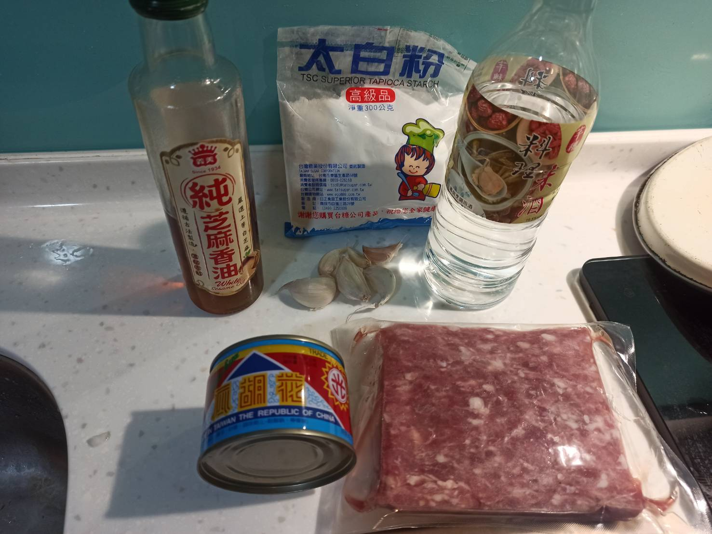
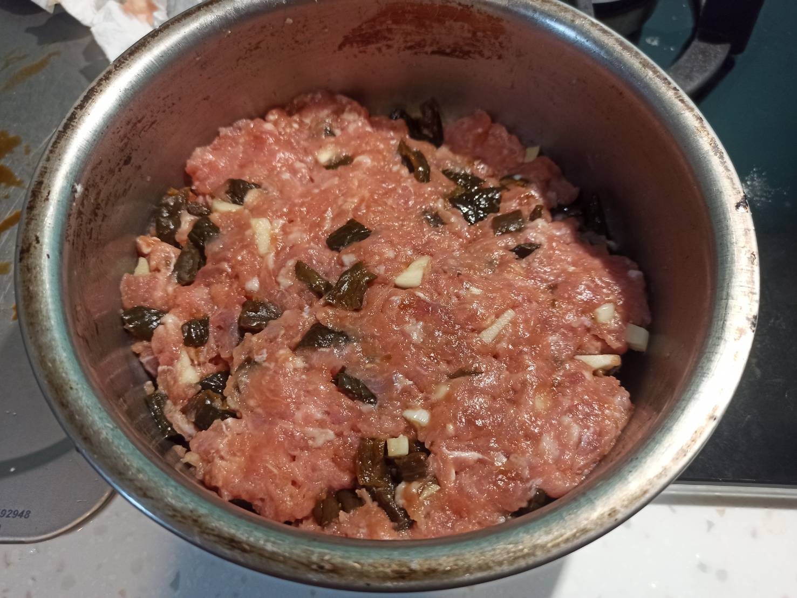

# 瓜仔肉
---

+ ## 日期
  + ### 材料
    1. 豬絞肉 400g
    2. 米酒 3大匙
    3. 花胡瓜汁 3大匙
    4. 芝麻香油 1大匙
    5. 花胡瓜 1罐
    6. 太白粉 1大匙
    7. 蒜頭 數顆
  
  + ### 作法
    1. 調味(材料2~4)加入絞肉裡手攪拌
    2. 再加入太白粉攪拌至粉完全吸收
    3. 最後加入蒜頭攪拌即可
    4. 拿去蒸
  
  + ### 過程與成品
    
    
  
  + ### 檢討
    1. 米酒下次量可以再多一點
    2. 蒜頭可以再多一點
    3. 香油也可以再多一點
    4. 其實整體來說味道可以了
    5. 下次再加點青蔥
  
  + ### 參考資料
    [參考影片](https://youtu.be/25OH8_1NBic)