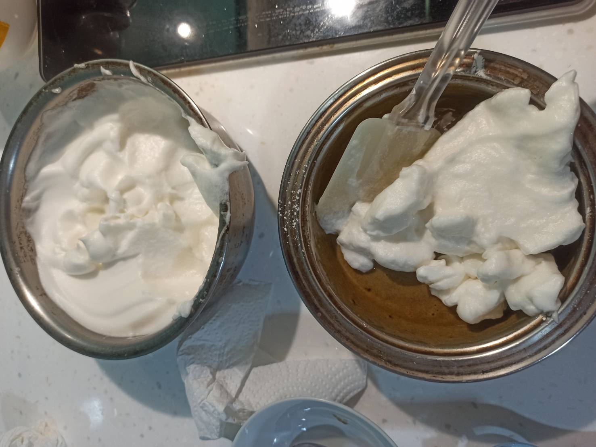

# oreo蛋糕
---
+ ## 組成
  1. 雞蛋+鮮奶+糖
  2. 麵粉
  3. oreo粉+油

+ ## 20210718(戚風蛋糕作法)
  + ### 材料
    1. 雞蛋 4顆
    2. 鮮奶 50g
    3. 砂糖 40g
    4. 低筋麵粉 60g
    5. oreo粉   20g
    6. 芥花油   50g
    7. 糖粉 隨意
  
  + ### 作法
    1. 準備調味
    2. 蛋黃+oreo粉+油
    3. 準備麵粉
    4. 過篩低筋麵粉
    5. 調味混合
    6. 蛋黃液跟麵粉混合攪拌均勻至柔順
    7. 準備打發
    8. 打發蛋白邊加糖至濕性發泡偏乾狀態
    9. 準備混合
    10. 先取1/3蛋白霜至調味裡面混合輕柔混合
    11. 最後全部倒進蛋白霜輕柔混勻
    12. 氣炸鍋 160度C 40分鐘
    13. 等放涼後
    14. 撒上假掰的糖粉即可
  
  + ### 過程與成品
    
    
    
    
    
    
  
  + ### 檢討
    1. 用烤箱烤的的確比蒸得味道香，基本上烤箱的溫度可以超過100度，但蒸的溫度上限就在那邊，水最高就是100度變成水蒸氣了，除非用壓力鍋之類的吧，用烘烤得溫度夠才會產生梅納反應，香脆好吃
    2. 這次失敗主因是我的料到進模具太多，我到了將近模具的9成滿了，我看有影片是建議戚風蛋糕的量為模具的6~7成滿，真的沒錯，因為，戚風蛋糕會膨發的比較高，所以，倒太滿很容易膨發碰到加熱棒而導致燒焦，因此，下次還是頂多到6成滿就好
    3. 戚風蛋糕在烤得過程會先往上膨發，再往回縮一點，所以，烤得時間太久會回縮太快，烤得時間太短，中心會還沒熟(除非用專用中空的模具)，烤得溫度太高會膨發裂的比較嚴重，烤得溫度太低會較為濕潤膨發也不會那麼好
  
  + ### 參考資料
    [免烤箱巧克力蛋糕](https://youtu.be/SeswNTiY-gs)
    [哪個溫度烤戚風最好](https://youtu.be/t6e-anMQYgc)