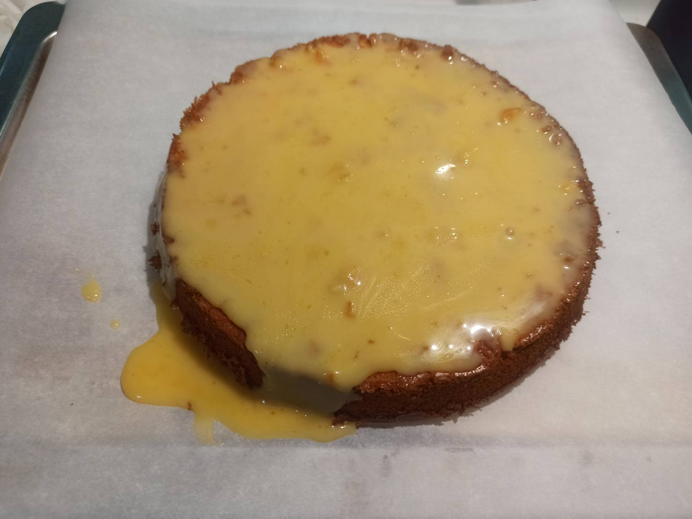

# 岩燒蜂蜜蛋糕
---
+ ## 組成
  1. 蜂蜜蛋糕
  2. 岩燒醬汁

+ ## 20210814
  + ### 材料
    1. 蛋黃 93.8g
    2. 蛋白 100g
    3. 砂糖 50g(蛋糕)+10g(醬汁)
    4. 蜂蜜 30g(蛋糕)+20g(蜂蜜)
    5. 高筋麵粉 80g 
    6. 鮮奶油  30g 
    7. 乳酪     2片
    8. 無鹽奶油 20g
    9. 溫水 20g
  
  + ### 作法
    1. 做蛋糕
    2. 打蛋白霜至偏乾的濕性發泡
    3. 打一下蛋黃，分次加入蛋白霜攪拌均勻
    4. 分次加入過篩麵粉攪拌均勻
    5. 蜂蜜+溫水變成蜂蜜水
    6. 1/3蛋霜加到蜂蜜水拌勻
    7. 接著到回蛋霜拌勻
    8. 預熱烤箱160度，烤35分
    9. 烤好倒扣放涼，之後再脫模冷藏
    10. 做醬汁
    11. 奶油跟乳酪隔水加熱融化攪拌均勻
    12. 再倒入鮮奶油攪拌均勻
    13. 拿出隔水加熱區倒入蜂蜜攪拌均勻
    14. 醬汁放到蛋糕頂端
    15. 230度10分鐘
  
  + ### 過程與成品
    
    
    
    
    
    
    
    
  
  + ### 檢討
    1. 用一般的烤箱好很多，就不會有不平的關係，但是，以為不沾烤盤還是沒用，下次還是要抹油或者烘培紙檔一下
    2. 本來想說用噴槍烤熔岩醬的，結果感覺很難控制，下次還是都用烤箱就好
  
  + ### 參考資料
    [岩燒蜂蜜蛋糕](https://youtu.be/WP8o4HBJyoE)

+ ## 20210724
  + ### 材料
    1. 蛋白     94.6g(約4顆雞蛋)
    2. 蛋黃     89.3g(約5顆雞蛋)
    3. 砂糖 50g(蛋糕)+10g(醬汁)
    4. 蜂蜜 30g(蛋糕)+20g(蜂蜜)
    5. 高筋麵粉 80g 
    6. 鮮奶油  30g 
    7. 乳酪     2片
    8. 無鹽奶油 20g
    9. 溫水 20g
  
  + ### 作法
    1. 做蛋糕
    2. 打蛋白霜至偏乾的濕性發泡
    3. 打一下蛋黃，分次加入蛋白霜攪拌均勻
    4. 分次加入過篩麵粉攪拌均勻
    5. 蜂蜜+溫水變成蜂蜜水
    6. 1/3蛋霜加到蜂蜜水拌勻
    7. 接著到回蛋霜拌勻
    8. 氣炸鍋烘烤150度40分鐘
    9. 烤好脫模放涼備用
    10. 做醬汁
    11. 奶油跟乳酪隔水加熱融化攪拌均勻
    12. 再倒入鮮奶油攪拌均勻
    13. 拿出隔水加熱區倒入蜂蜜攪拌均勻
    14. 醬汁放到蛋糕頂端
    15. 氣炸鍋烘烤200度5分鐘
  
  + ### 過程與成品
    
    
    
    
    
    
    
  
  + ### 檢討
    1. 整體來說還算不錯，醬汁好吃
    2. 蜂蜜香氣沒想像中的高，下次可能烤蛋糕溫度調高看看
    3. 烤出來的蛋糕頂部不平穩，大概是受熱不均吧
    4. 蛋白蛋黃部分就約1:1，蛋白比蛋黃多一點即可
  
  + ### 參考資料
    [岩燒蜂蜜蛋糕](https://youtu.be/WP8o4HBJyoE)