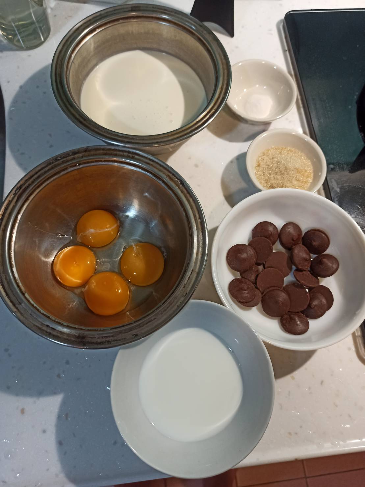
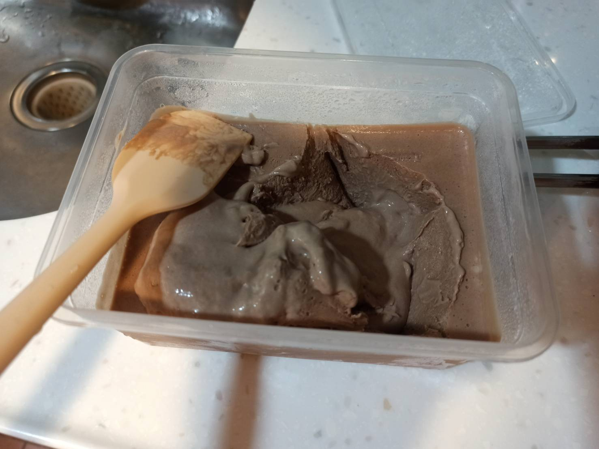
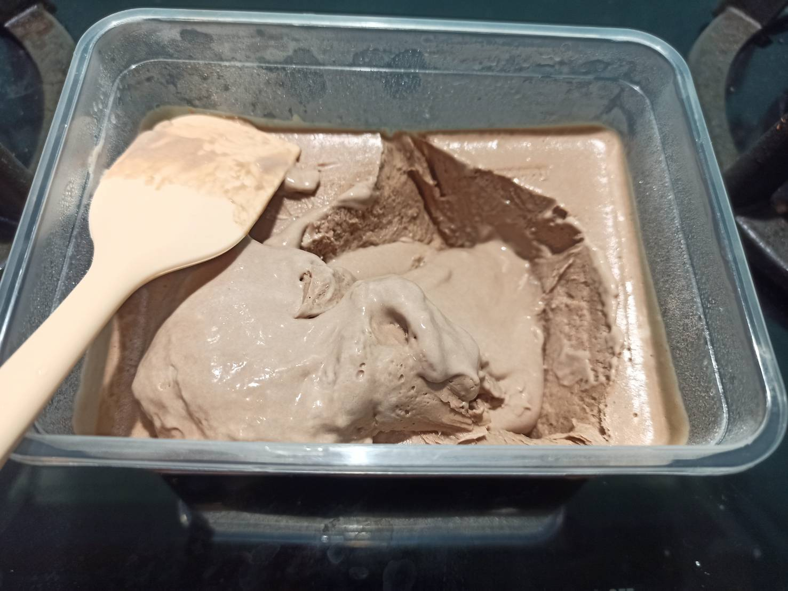
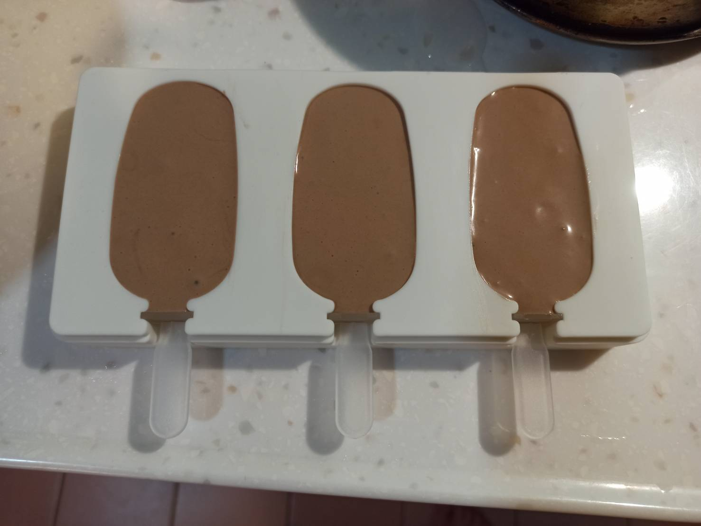
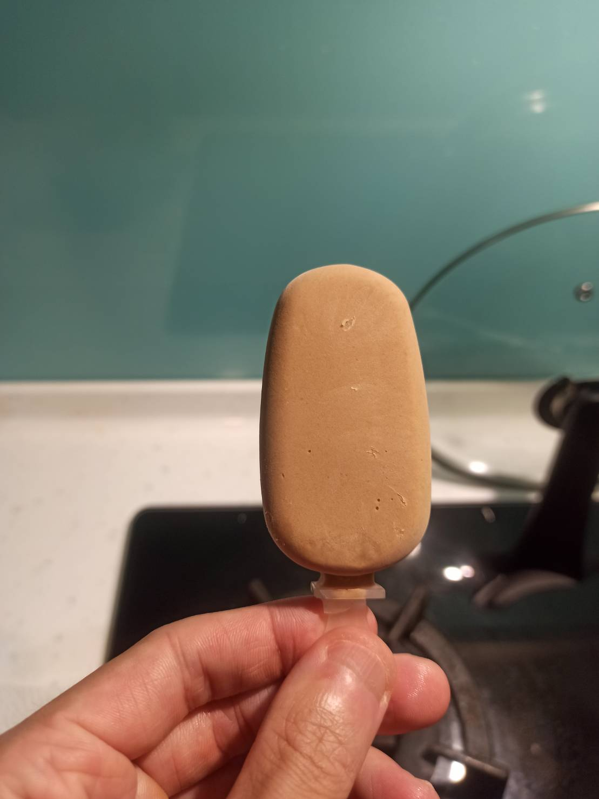
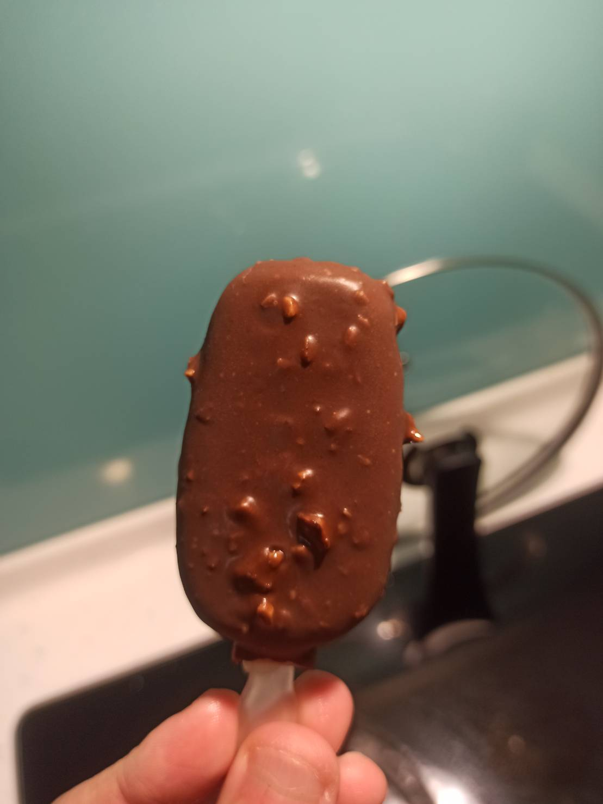
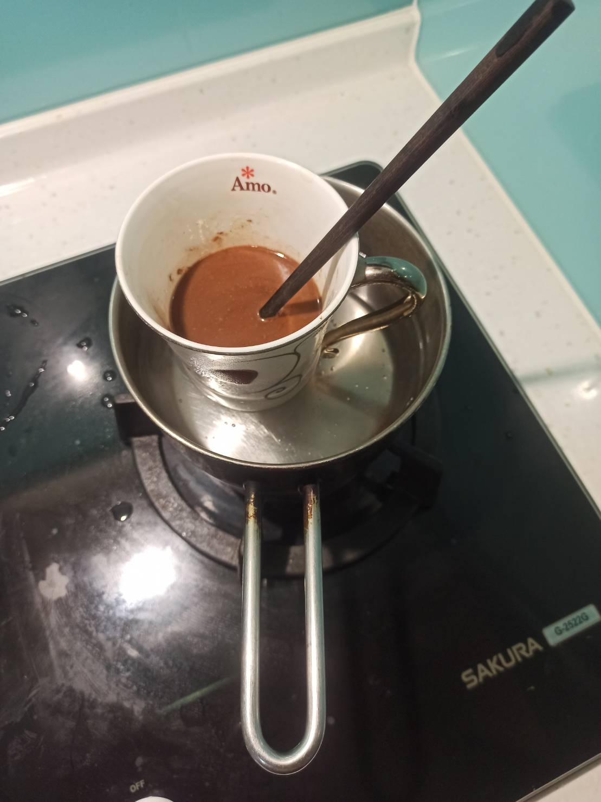

# 巧克力脆皮雪糕
---
+ ## 組成
  1. 雪糕體
  2. 巧克力脆皮

+ ## 20210912
  + ### 材料
    1. 蛋黃 3顆
    2. 砂糖 30g 
    3. 鮮奶 70g
    4. 鈕扣巧克力   70g(雪糕) + 130g(脆皮)
    5. 鮮奶油   250g
    6. 椰子油   40g
    7. 杏仁粒   20g
    8. 打發劑   1.25g
  
  + ### 作法
    1. 製作雪糕體
    2. 蛋黃+糖打發
    3. 加入鮮奶加熱至80度C
    4. 丟入巧克力攪拌均勻
    5. 打發鮮奶油+打發劑
    6. 巧克力液與打發鮮奶油攪拌均勻
    7. 直接冷凍3.5小時
    8. 拿出來電動打勻
    9. 再冰入冰箱12小時
    10. 製作巧克力脆皮
    11. 巧克力+椰子油+打碎的杏仁粒隔水融化
    12. 雪糕放下去裹上脆皮後用保鮮膜包住再冷凍至少15分
  
  + ### 過程與成品
    
    
    
    
    
    
  
  + ### 檢討
    1. 這次成功了不少，就是可能雪糕體要冰24小時比較保險點
  
  + ### 參考資料
    [自制巧克力脆皮雪糕](https://youtu.be/FImveZteK1s)
    [香草冰淇淋](https://youtu.be/IQ-t8eSSD3Y)

+ ## 20210821
  + ### 材料
    1. 蛋黃 3顆
    2. 砂糖 30g 
    3. 鮮奶 70g
    4. 鈕扣巧克力   70g(雪糕) + 130g(脆皮)
    5. 鮮奶油   250g
    6. 椰子油   40g
    7. 杏仁粒   20g
    8. 打發劑   1.25g
  
  + ### 作法
    1. 製作雪糕體
    2. 蛋黃+糖打發
    3. 加入鮮奶加熱至80度C
    4. 丟入巧克力攪拌均勻
    5. 打發鮮奶油
    6. 巧克力液與打發鮮奶油攪拌均勻
    7. 裝入模具冷凍6小時以上
    8. 製作巧克力脆皮
    9. 巧克力+椰子油+打碎的杏仁粒隔水融化
    10. 雪糕放下去裹上脆皮後用保鮮膜包住再冷凍至少15分
  
  + ### 過程與成品
    
    
    
    
    
    
    
  
  + ### 檢討
    1. 雪糕體冰了24小時了還是沒怎麼凝固耶，不知道是不是因為鮮奶油沒讓它凝固的關係
  
  + ### 參考資料
    [自制巧克力脆皮雪糕](https://youtu.be/FImveZteK1s)