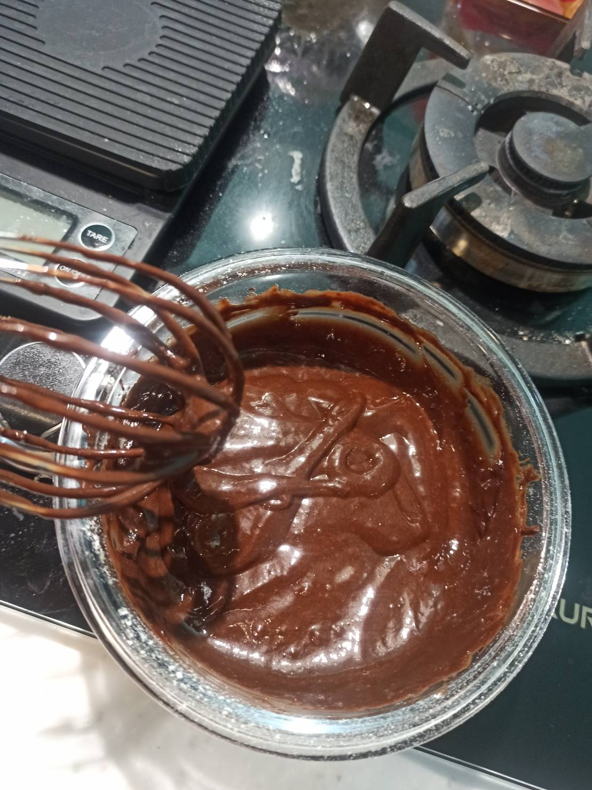

# 巧克力蛋糕
---
+ ## 組成
  1. 可可粉
  2. 雞蛋
  3. 低筋麵粉

+ ## 日期
  + ### 材料
    1. 可可粉   15g
    2. 雞蛋 3顆
    3. 低筋麵粉 50g
    4. 糖   50g
    5. 鮮奶 45g
    6. 鹽   1g
    7. 植物油   45g
    8. 糖粉 隨意
  
  + ### 作法
    1. 準備調味
    2. 蛋黃+可可粉+油
    3. 準備麵粉
    4. 過篩低筋麵粉+鹽
    5. 調味混合
    6. 蛋黃液跟麵粉混合攪拌均勻至柔順
    7. 準備打發
    8. 打發蛋白邊加糖至濕性發泡狀態
    9. 準備混合
    10. 先取1/3蛋白霜至調味裡面混合輕柔混合
    11. 最後全部倒進蛋白霜輕柔混勻
    12. 保鮮膜包住電鍋蒸50分鐘
    13. 等放涼後
    14. 撒上假掰的糖粉即可
  
  + ### 過程與成品
    
    
    
    
    
    
    
    
  
  + ### 檢討
    1. 彈性沒像影片中的那麼好，不知道是我蛋白霜沒打很好還是蒸煮的問題
    2. 下次調整一下麵粉比例好了
    3. 可可粉也過篩一下好惹XD
  
  + ### 參考資料
    [免烤箱巧克力蛋糕](https://youtu.be/SeswNTiY-gs)