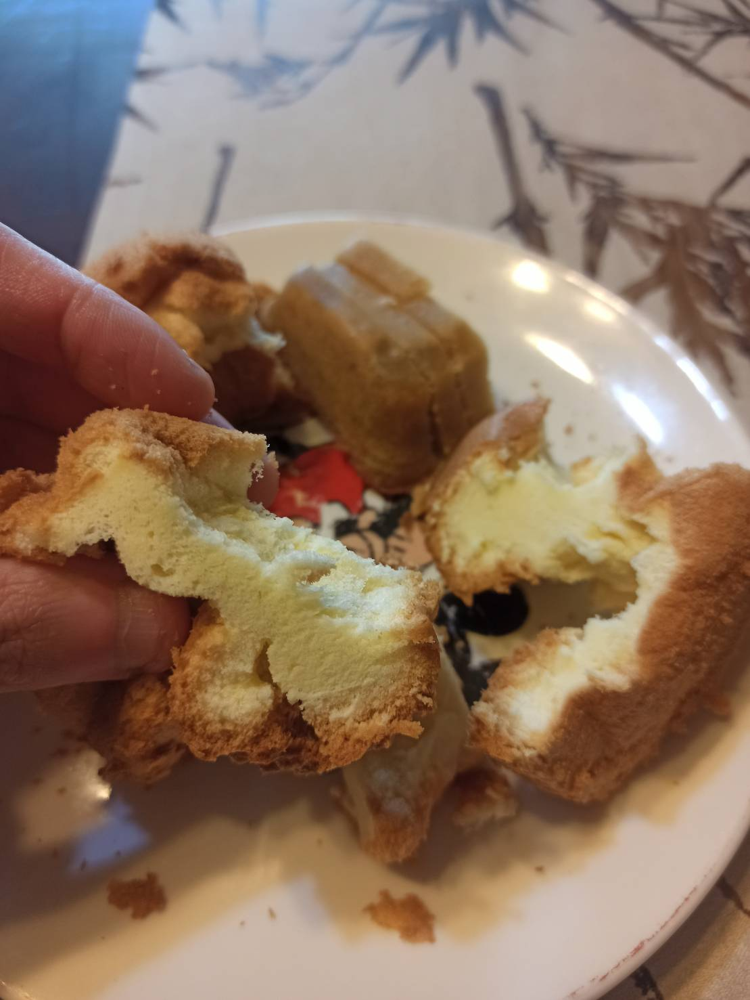

# 戚風蛋糕
---
+ ## 組成
  1. 蛋
  2. 奶
  3. 糖
  4. 麵粉
  5. 油

+ ## 確定配方(6吋) 
  1. 雞蛋 3顆
  2. 鮮奶 30g
  3. 植物油 30g
  4. 砂糖 45g
  5. 麵粉 50g
  6. 白醋 少許

+ ## 20210807
  + ### 材料
    1. 雞蛋 4顆
    2. 鮮奶 30g
    3. 砂糖 50g
    4. 低筋麵粉 50g
    5. 芥花油 30g
  
  + ### 作法
    1. 烤箱預熱至150度
    2. 製作蛋黃糊
    3. 油+粉攪拌均勻
    4. 再加入鮮奶與蛋黃
    5. 製作蛋白霜
    6. 打發蛋白至大氣泡
    7. 分多次加糖打發至乾性發泡
    8. 混合蛋糕糊
    9. 將1/3蛋白霜加入蛋黃糊拌勻
    10. 將1/3蛋白霜加入蛋黃糊拌勻
    11. 拌勻的蛋糕糊與最後蛋白霜混合拌勻
    12. 倒入模具震幾下震掉空氣
    13. 150度烘烤40分鐘
    14. 倒扣放涼
  
  + ### 過程與成品
    
    
    
    
    
    
    
  
  + ### 檢討
    1. 整體來說還算成功，比想像中軟的一些，但外型跟彈性也都OK，就是蛋可能真的只能3顆，相對糖也可以少一點
  
  + ### 參考資料
    [選出最好用的戚風配方](https://youtu.be/1AwtFwrUtDI)

+ ## 20210731
  + ### 材料
    1. 雞蛋 3顆
    2. 鮮奶 30g
    3. 砂糖 45g
    4. 低筋麵粉 50g
    5. 植物油   30g
    6. 白醋 少許
  
  + ### 作法
    1. 製作蛋黃糊
    2. 麵粉+油攪拌均勻
    3. 牛奶+蛋黃丟入攪拌均勻
    4. 製作蛋白霜
    5. 蛋白加入白醋打發
    6. 糖分次加入蛋白霜，打發至乾性發泡
    7. 將1/3蛋白霜加入蛋黃糊翻拌均勻
    8. 將1/3蛋白霜加入蛋黃糊翻拌均勻
    9. 將蛋黃糊全部加入剩餘的蛋白霜內翻拌均勻
    10. 倒入模具，震幾下震出空氣
    11. 氣炸鍋烤150度50分
  
  + ### 過程與成品
    
    
    
    
  
  + ### 檢討
    1. 失敗，烤出來比上次好，但是形狀螺旋狀，猜測是因為氣炸鍋風扇影響，導致受熱不均，下次用烤箱烤看看，嚴重塌陷，味道不錯，吃起來很像古早味蛋糕就是
    2. 整體來說，粉油法感覺蠻好的，比較不會起筋，操作上也蠻簡單的，下次再用烤箱搭配溫度計玩看看
  
  + ### 參考資料
    [選出最好用的戚風配方](https://youtu.be/1AwtFwrUtDI)