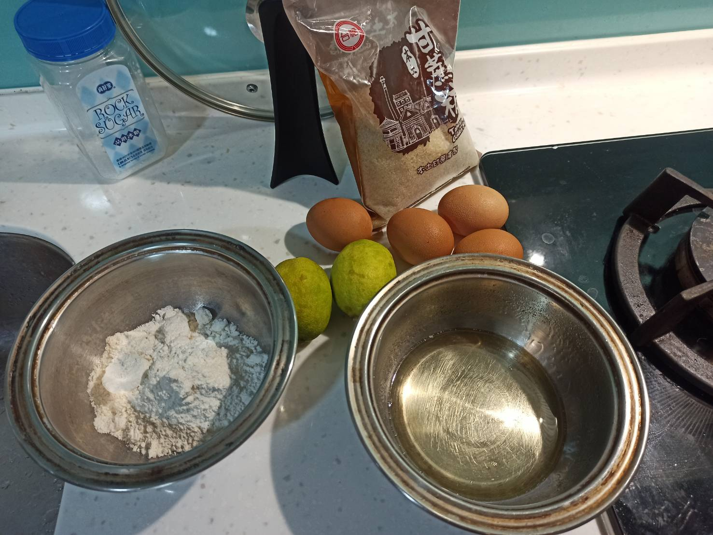
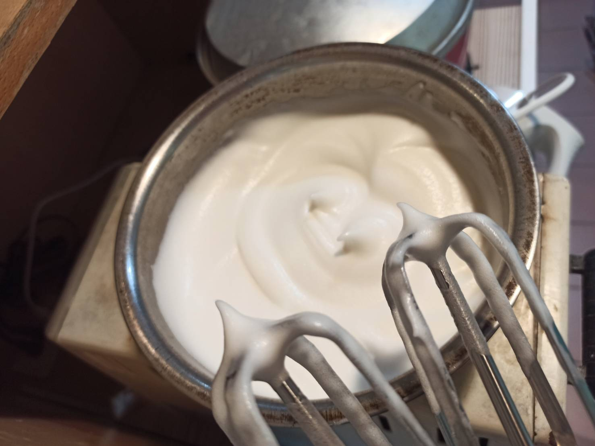
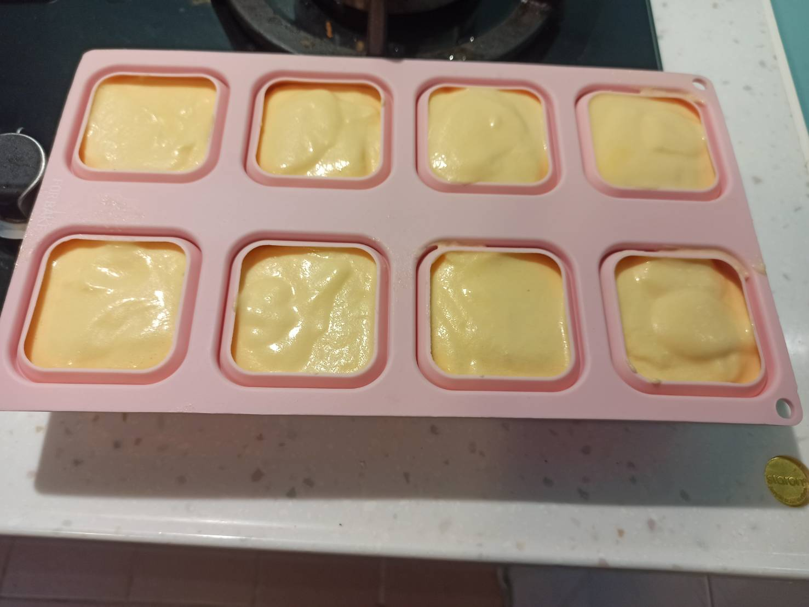
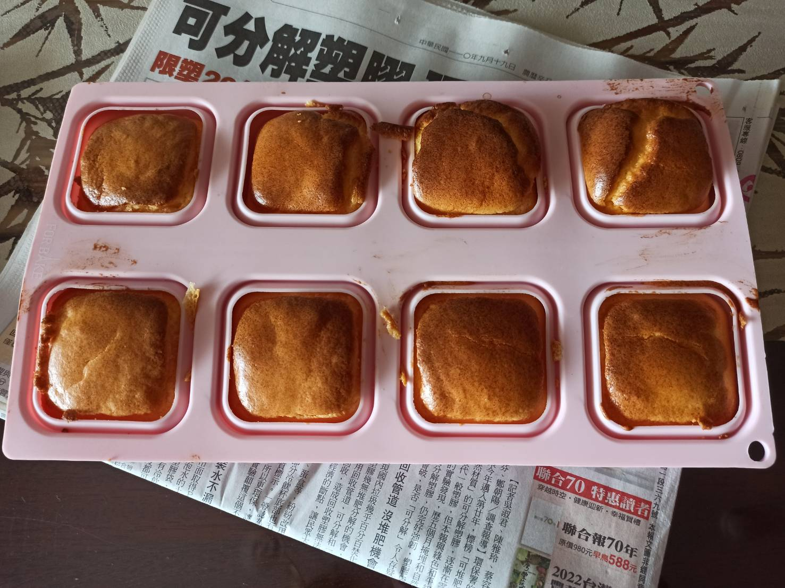
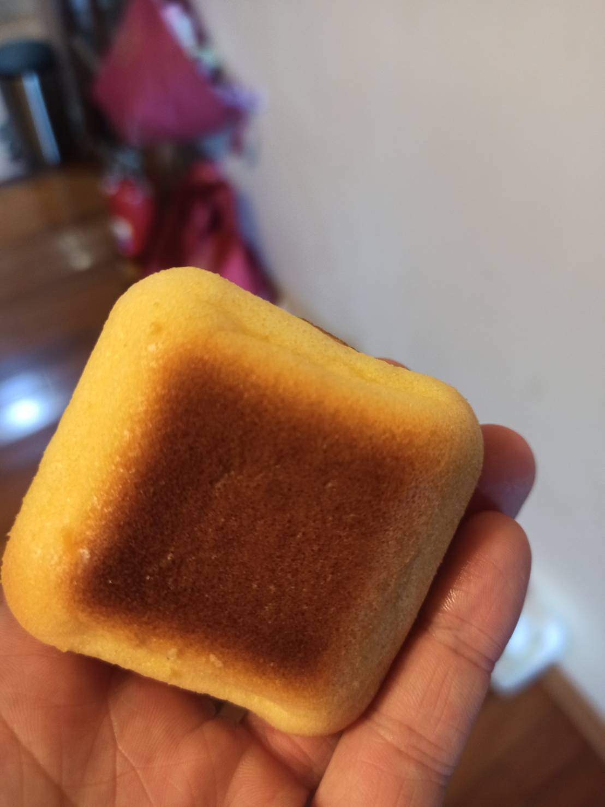

# 檸檬蛋糕
---
+ ## 組成
  1. 檸檬
  2. 麵粉
  3. 雞蛋
  4. 糖
  5. 油

+ ## 20210918
  + ### 材料
    1. 雞蛋 4顆
    2. 檸檬 1顆
    3. 砂糖 30g
    4. 低筋麵粉 70g
    5. 蛋白打發粉  0.7g
    6. 植物油   60g
  
  + ### 作法
    1. 將油+40g檸檬汁混合乳化
    2. 乳化後再加入麵粉Z字形攪拌
    3. 再加入蛋黃Z字形攪拌
    4. 蛋白加入打發粉與分次加入糖打到乾性發泡
    5. 將1/3蛋白霜加入蛋黃液翻拌法攪拌
    6. 再加入剩下的2/3蛋白霜翻拌法攪拌
    7. 倒入模具
    8. 烤箱預熱120度烤60分
    9. 再轉至150度烤4分
  
  + ### 過程與成品
    
    
    
    
    
  
  + ### 檢討
    1. 就是糖我減少太多了，導致蛋糕吃起來偏酸，但整體來說還算成功，但溫度可能要再降低以免開裂
  
  + ### 參考資料
    [柠檬杯子蛋糕](https://youtu.be/fGfhiApHUcA)