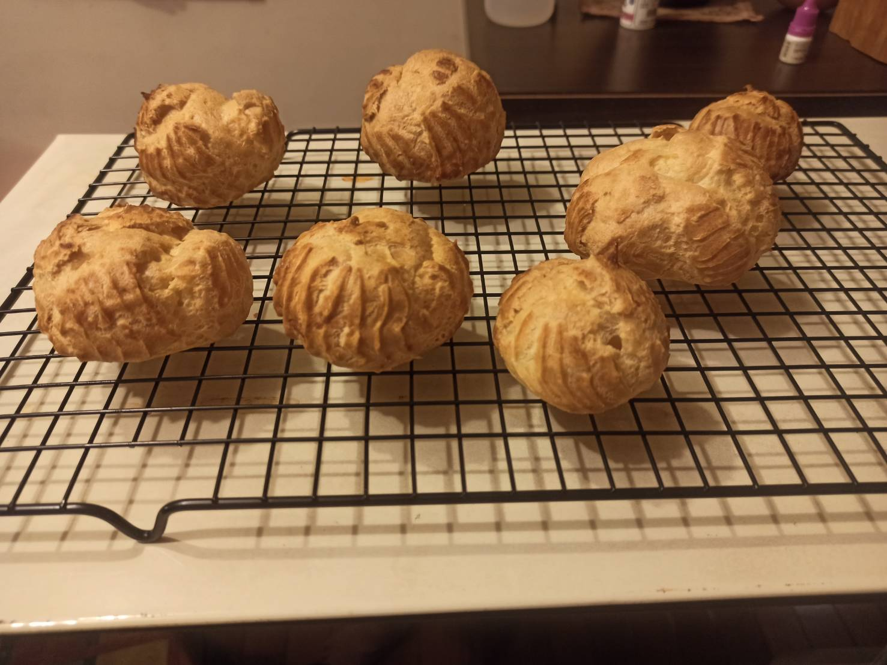
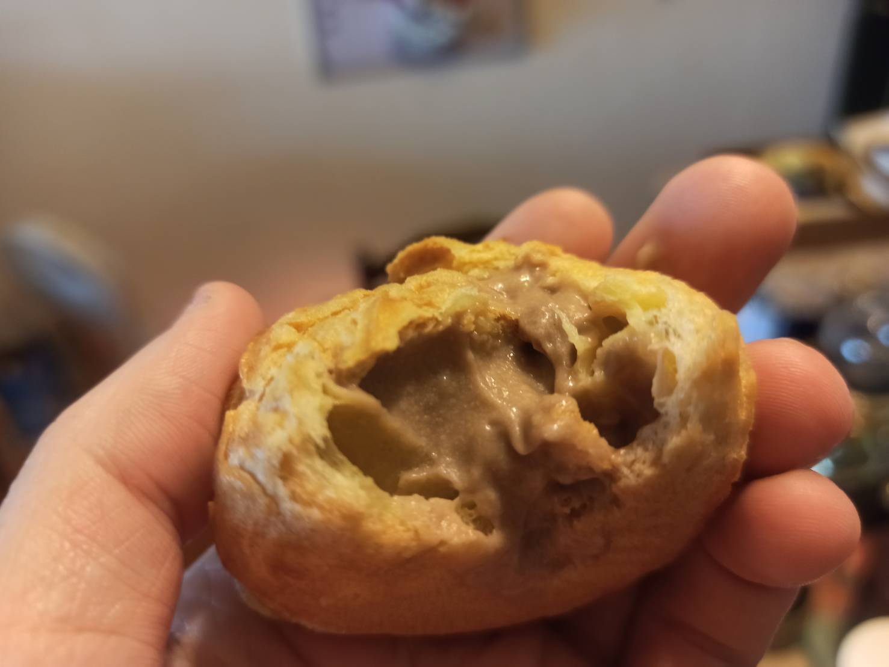

# 泡芙
---
+ ## 組成
  1. 奶油
  2. 液體
  3. 麵粉
  4. 調味

+ ## 20210821
  + ### 材料
    + #### 泡芙
    1. 奶油 80g
    2. 水 100g
    3. 過篩低筋麵粉 100g
    4. 雞蛋 140g
    5. 鹽巴 2g

    + #### 卡士達醬
    1. 蛋黃 35g
    2. 砂糖 40g
    3. 玉米澱粉 15g
    4. 鮮奶 200g
    5. 鮮奶油 50g + 107g(打發)
    6. 鈕扣巧克力 30g
    7. 打發劑 0.6g

  
  + ### 作法
    1. 製作泡芙
    2. 水+奶油攪拌煮滾後轉小火
    3. 丟入麵粉攪拌至一整陀後離火
    4. 分次加入蛋液攪拌
    5. 加入鹽巴
    6. 裝入擠花袋擠出
    7. 烤箱預熱 210度 30分
    8. 製作卡士達醬
    9. 蛋黃+砂糖+玉米澱粉攪拌均勻
    10. 鮮奶+鮮奶油一邊攪拌一邊煮至80度C
    11. 將鮮奶倒入蛋黃液攪拌均勻
    12. 開火邊煮邊攪拌，等它收成濃稠滾一下後就關火
    13. 加入巧克力攪拌
    14. 冷藏至少4小時
    15. 加入打發的鮮奶油攪拌均勻即可
    16. 將卡士達醬加入至泡芙裡面
  
  + ### 過程與成品
    
    
    
    
    
    
    
    
    
    
    
    
    
    
  
  + ### 檢討
    1. 照這個配方第一次弄就失敗了，完全沒膨起，再照之前的情況判斷，應該是泡芙液太固態了，後來我用剩下的泡芙液再加入一顆雞蛋後，再烤一次就可以了，溫度還是建議190度就好
    2. 卡士達醬是不錯，但下次可能玉米澱粉的比例下降一些，不然後面收起來冷藏以後，有點太固態了，會導致跟打發的鮮奶油混合時不好拌勻
    3. 下次鹽的部分再少一些
  
  + ### 參考資料
    [參考影片](https://youtu.be/ooAZ9xNIU7E)
    [參考影片](https://youtu.be/TPejpuVSPn0)
    [參考影片](https://youtu.be/qd2WVwPRwi4)

+ ## 20210808
  + ### 材料
    1. 奶油
    2. 鮮奶
    3. 高筋麵粉
    4. 砂糖
    5. 鹽
  
  + ### 作法
    1. 將鮮奶、奶油、砂糖、鹽蹈入鍋子中加熱拌勻
    2. 加熱到冒泡煮開關火，倒入過篩麵粉攪拌均勻
    3. 開小火拌炒至鍋底有白色黏稠
    4. 倒入容器放涼備用
    5. 打散雞蛋
    6. 先倒入一些雞蛋液至奶油糊攪拌觀察狀態
    7. 觀察到手指畫下去痕跡不會消失即可
    8. 將泡芙糊倒入擠花袋中
    9. 擠出至烘培紙上
    10. 烤箱預熱至190度左右
    11. 烤33分鐘
  
  + ### 過程與成品
    
    
    
    
    
    
    
  
  + ### 檢討
    1. 成功，膨脹起來，裡面有空的洞，口感也可以
    2. 這次使用高筋麵粉，忘記烤的時候下糖粉了
    3. 下次再製作內餡加進去
  
  + ### 參考資料
    [參考影片](https://www.youtube.com/watch?v=qd2WVwPRwi4)
    [參考影片](https://www.youtube.com/watch?v=djKuXrVevzQ)