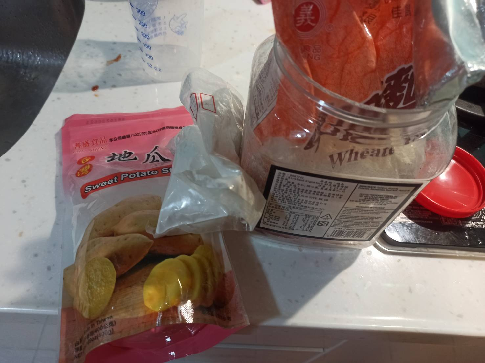
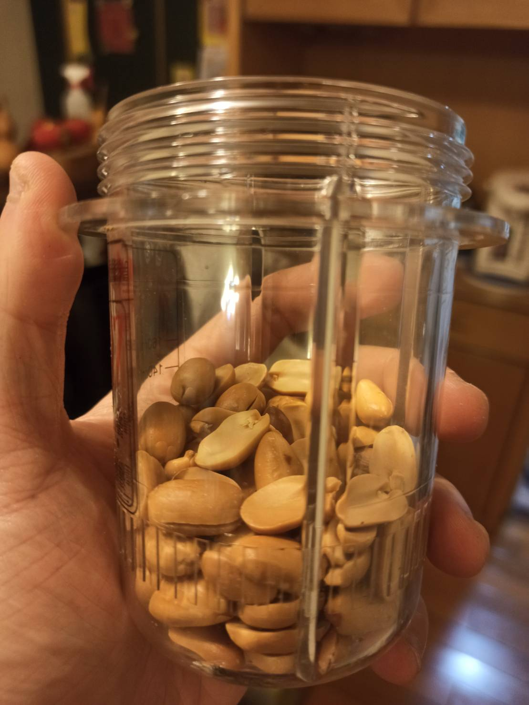
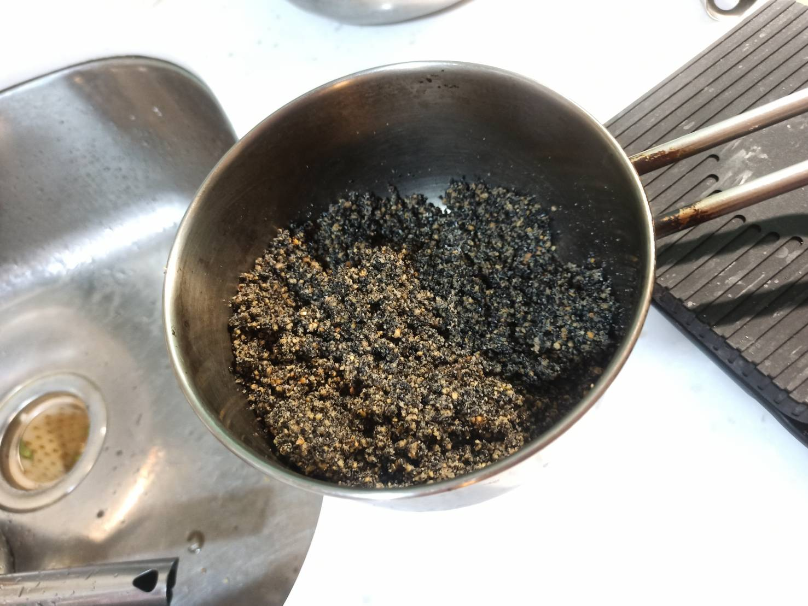
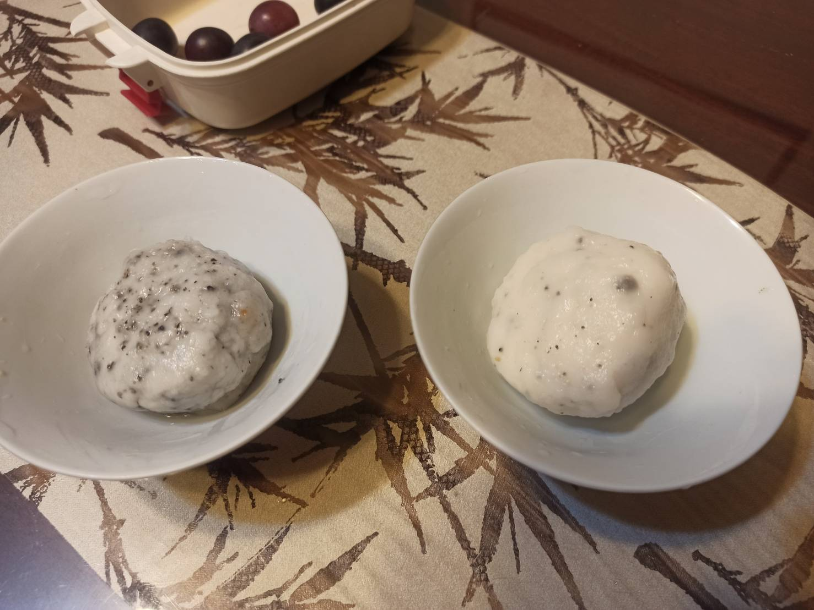

# 湯圓
---
+ ## 組成
  1. 餡料
  2. 糯米粉

+ ## 20210717
  + ### 材料
    1. 糯米粉   隨意
    2. 花生     隨意
    3. 芝麻粉   隨意
    4. 芝麻油   隨意
  
  + ### 作法
    1. 做餡料
    2. 將花生打成粉
    3. 將花生粉與芝麻粉加入食用油混合在一起
    4. 塑形
    5. 過水滾糯米粉 動作重複N次
    6. 煮湯圓
    7. 水滾丟下
    8. 再滾丟冷水 2次
  
  + ### 過程與成品
    
    
    
    
  
  + ### 檢討
    1. 失敗，首先，按照影片的做法會滾到很大，再來，可能是油加不夠，導致塑形困難
    2. 直接再參考其他作法好了
  
  + ### 參考資料
    [參考影片](https://youtu.be/09uGUe7Eh4E)