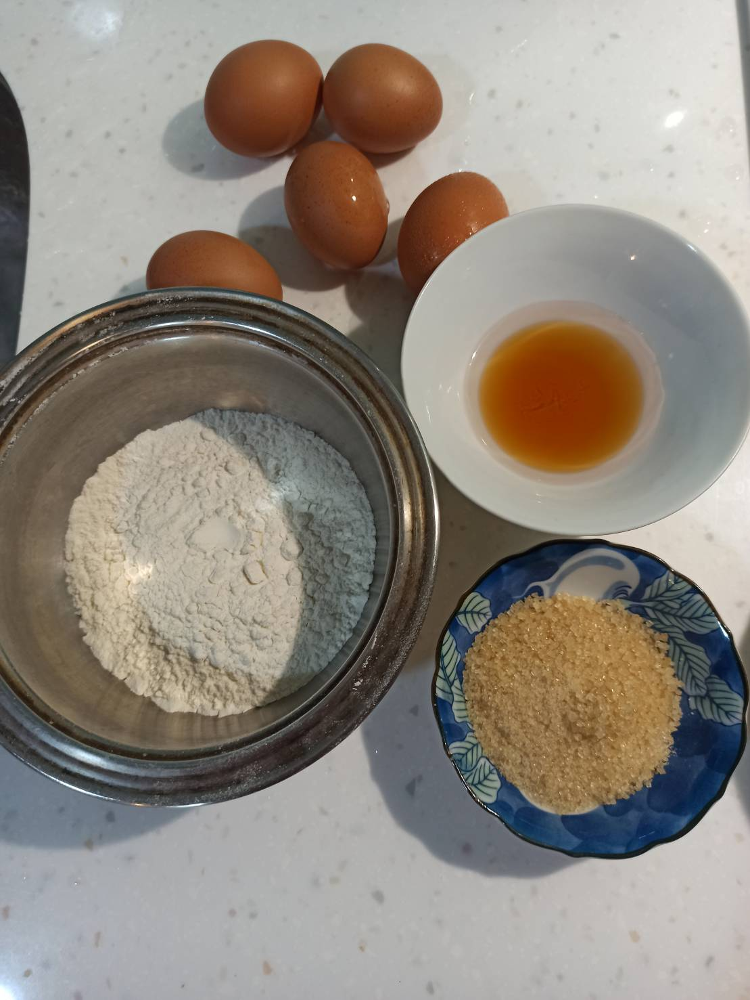
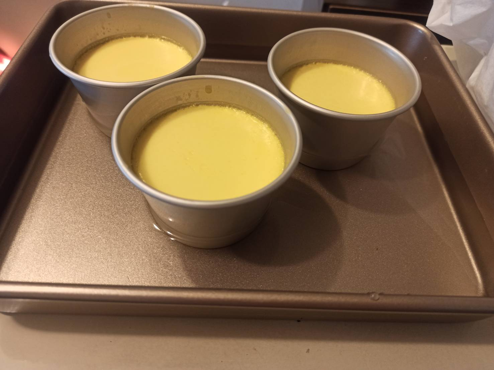
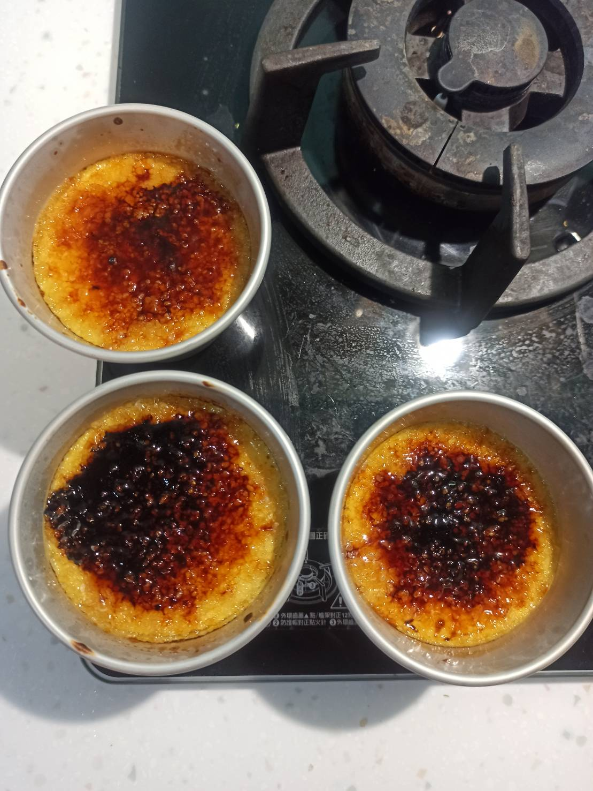

# 烤布蕾
---
+ ## 組成
  1. 雞蛋
  2. 鮮奶
  3. 砂糖

+ ## 20210815
  + ### 材料
    1. 蛋黃 4顆
    2. 鮮奶 200g
    3. 砂糖 35g(布丁液) + 隨意(焦糖)
    4. 鮮奶油   200g
    5. 香草精   10g
  
  + ### 作法
    1. 將鮮奶+鮮奶油+砂糖混合攪拌加熱
    2. 接著再倒入香草精攪拌加熱
    3. 加熱至冒泡關火
    4. 蓋上保鮮膜悶10~15分
    5. 用電動攪拌器打蛋黃至濃稠
    6. 將鮮奶液緩緩倒入一邊攪拌中的蛋黃液裡
    7. 過篩兩次
    8. 撈掉氣泡
    9. 蓋上烘培紙用(熱)水浴法
    10. 烤箱預熱160度烤25分
    11. 取出後，上面鋪上砂糖用噴槍烤至焦糖狀
  
  + ### 過程與成品
    
    
    
    
  
  + ### 檢討
    1. 整體來說還算可以啦
  
  + ### 參考資料
    [參考影片](https://youtu.be/I4Hzp5gqtqg)