# 焦糖布丁
---
+ ## 組成
  1. 鮮奶
  2. 雞蛋
  3. 砂糖

+ ## 20210801
  + ### 材料
    1. 蛋黃 2顆
    2. 鮮奶 200g
    3. 砂糖 40g(焦糖)+30g(蛋黃液)
    4. 香草精 10g 
    5. 鮮奶油 140g
    6. 清水 前水10g+後水20g
  
  + ### 作法
    1. 煮焦糖
    2. 砂糖+前水，開中小火
    3. 煮到琥珀色，關火，加後水
    4. 等泡泡消完後，倒入模具，進冰箱冷藏備用
    5. 製作布丁液
    6. 鮮奶+砂糖+鮮奶油+香草精，加熱拌勻至80度左右
    7. 關火，蓋保鮮膜降溫至60度左右
    8. 蛋黃打散緩慢倒入鮮奶液，邊攪拌邊緩慢倒入
    9. 過篩布丁液
    10. 取出模具，布丁液倒入模具，並蓋上鋁箔紙
    11. 送進烤箱
    12. 100度1小時+悶10分
    13. 降溫後再拿去冷藏至少4小時
  
  + ### 過程與成品
    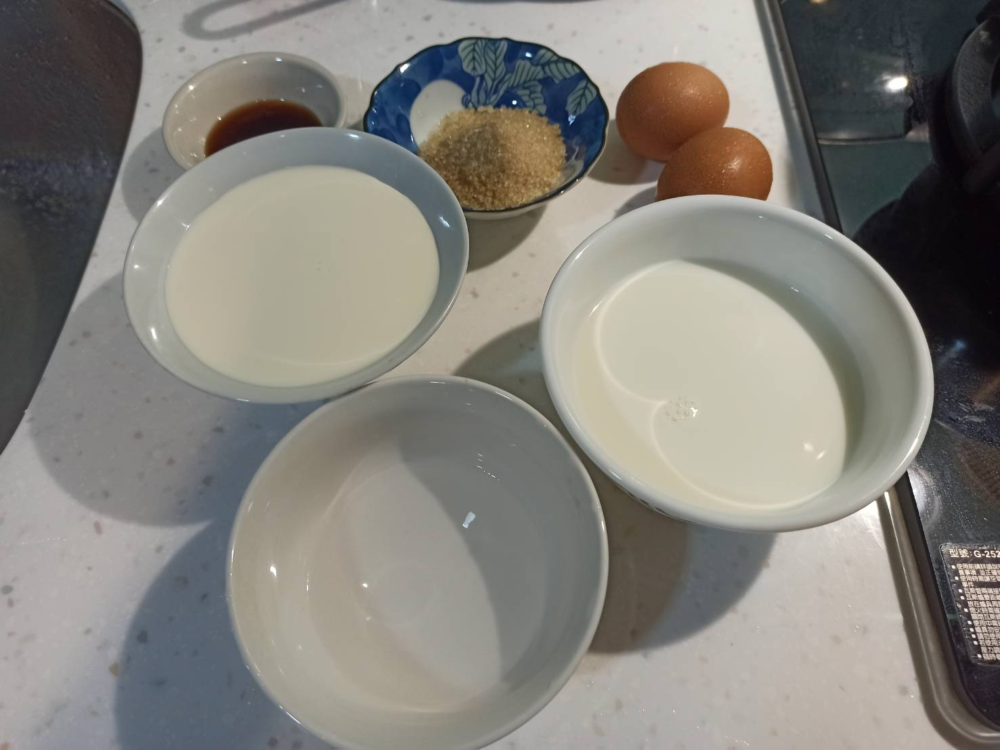
    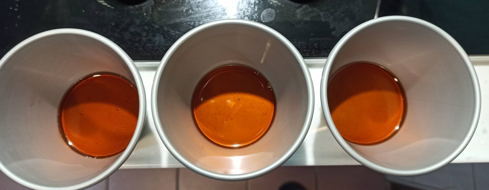
    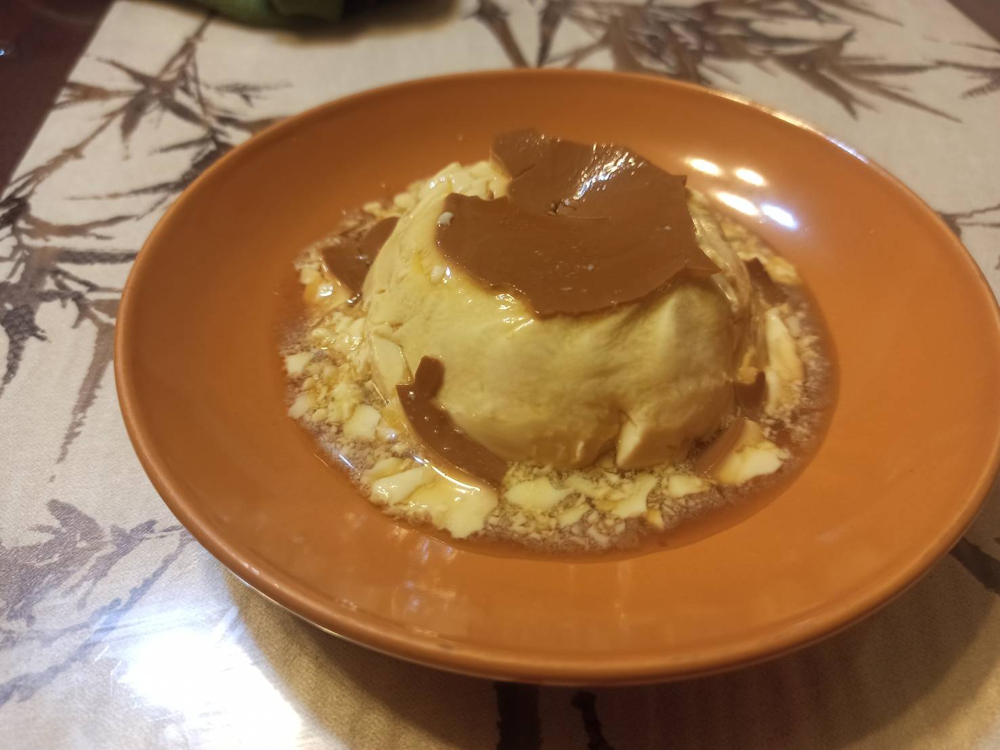
    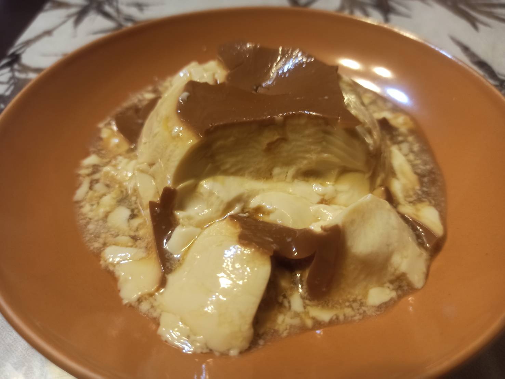
  
  + ### 檢討
    1. 整體來說，味道還算不錯，裡面也沒啥洞，就是支撐力有點不足，不確定是不是該蒸久一點或是沒蛋白的關係，因為這次是全部都蛋黃
  
  + ### 參考資料
    [參考影片](https://youtu.be/hBYQqVavND4)
    [參考影片](https://youtu.be/G6HJXL_xK80)

+ ## 20210725
  + ### 材料
    1. 雞蛋   1全蛋+3蛋黃
    2. 鮮奶   400g
    3. 砂糖   40g(焦糖)+50g(蛋黃液)
    4. 香草精 20g
    5. 鮮奶油 280g
    6. 清水   30g(初始焦糖液)+30g(後期焦糖液)
  
  + ### 作法
    1. 製作布丁液
    2. 鮮奶+砂糖+鮮奶油+香草精
    3. 用65度左右的溫熱水隔水加熱攪拌均勻
    4. 雞蛋攪勻緩慢倒入鮮奶液攪拌
    5. 製作焦糖
    6. 清水水+砂糖開火煮
    7. 煮至變色關火瞬間倒入清水
    8. 等泡泡變小後，將焦糖液倒入容器中
    9. 把布丁液過篩兩次倒入容器中
    10. 拿去80度烤40分
  
  + ### 過程與成品
    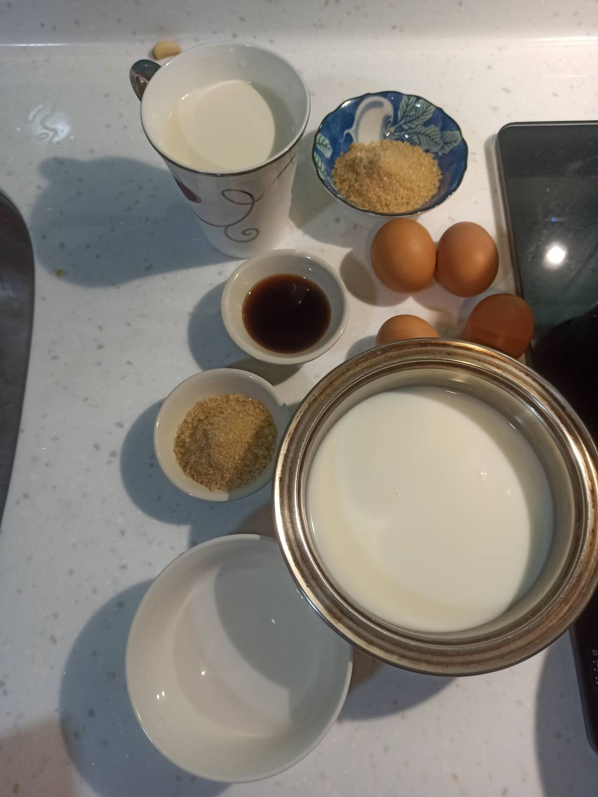
    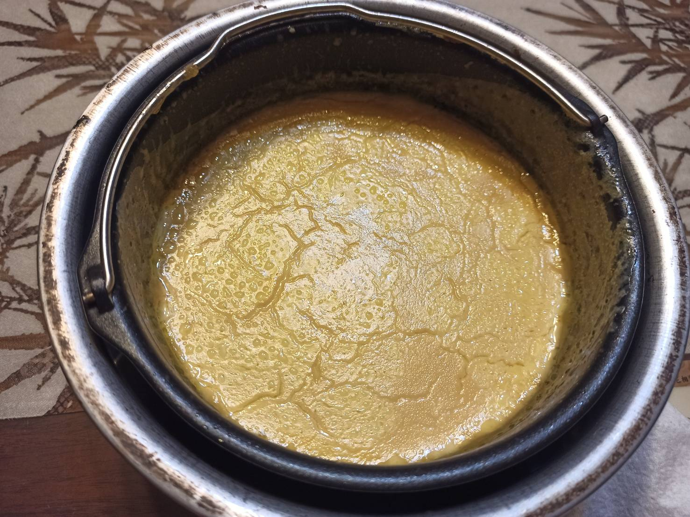
  
  + ### 檢討
    1. 這次很奇怪，我看資料說雞蛋80度C會全熟，我用氣炸鍋用了80度烤了30分後，頂部還是液態狀，再用90度烤25度後也是，再用100度烤30分後還是，生氣之後最後拿去蒸，但又怕溫度太高會有洞，所以就鍋蓋留縫隙，結果40分鐘後還是沒很凝固，搞了很久才稍微凝固一點，配方跟上次基本上沒差多少，不知道是不是因為我太怕溫度過高而導致實際溫度不夠
    2. 用氣炸鍋的話一定，一定，一定要用鋁箔紙包住容器，不然布丁液會亂噴，噴到加熱棒會冒煙，我一開始就是沒有蓋，沒2分鐘就瞬間冒煙了，嚇死我
  
  + ### 參考資料
    [參考影片](https://youtu.be/hBYQqVavND4)
    [參考影片](https://youtu.be/G6HJXL_xK80)

+ ## 20210717
  + ### 材料
    1. 雞蛋     1全蛋+3蛋黃
    2. 鮮奶     400g
    3. 砂糖     50g(焦糖)+50g(打發)
    4. 香草精   1湯匙
    5. 鮮奶油   280g
  
  + ### 作法
    1. 做焦糖
    2. 把砂糖直接丟入鍋裡煮，不用翻動，煮到液體狀，倒出倒烘培紙上，等冷凍
    3. 做布丁液
    4. 鮮奶油+鮮奶+糖+香草精
    5. 加熱至80度(微微冒泡)
    6. 蓋住悶到60度
    7. 將全蛋+蛋黃混合均勻
    8. 將鮮奶液緩慢分次倒入一直攪拌的蛋液裡
    9. 過篩
    10. 撈泡
    11. 材料融合
    12. 將焦糖片丟入容器底部
    13. 將布丁液倒在上面
    14. 拿去蒸20分鐘
  
  + ### 過程與成品
    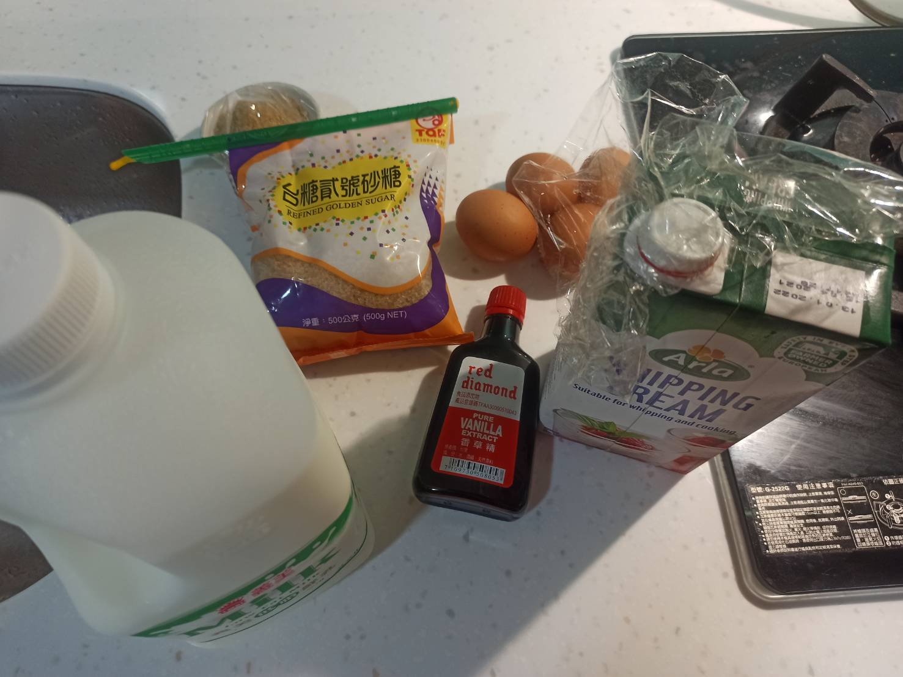
    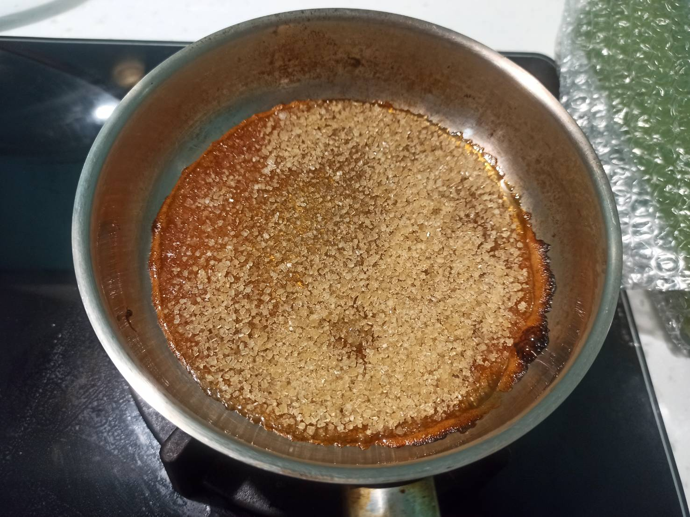
    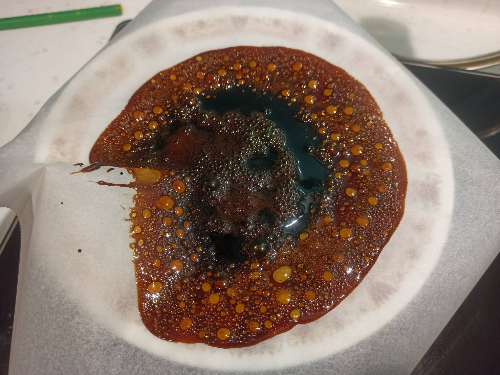
    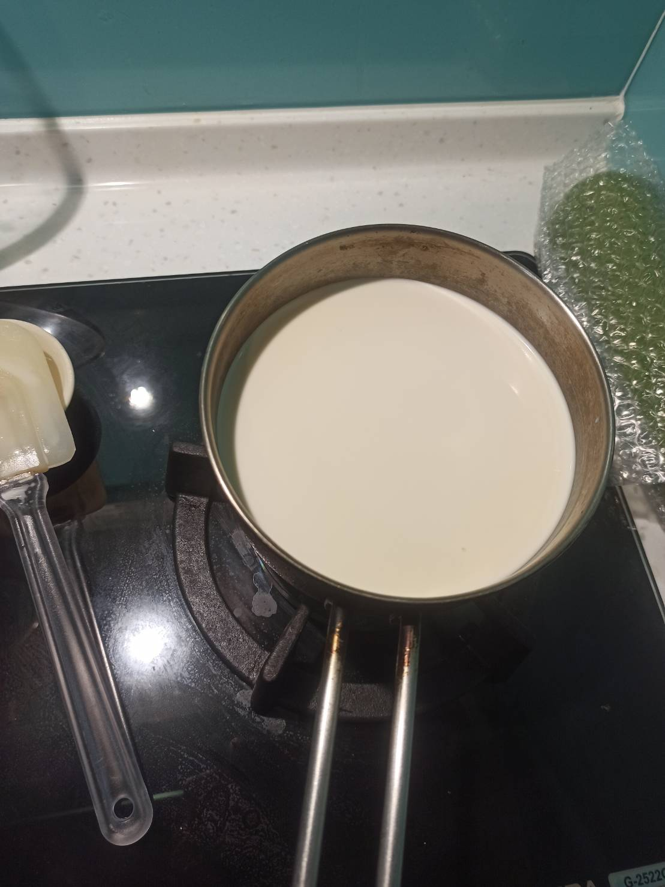
    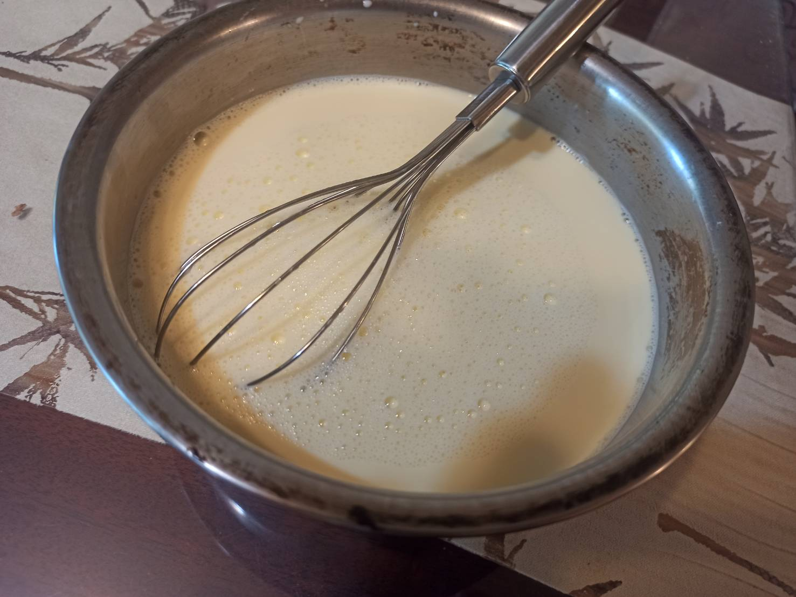
    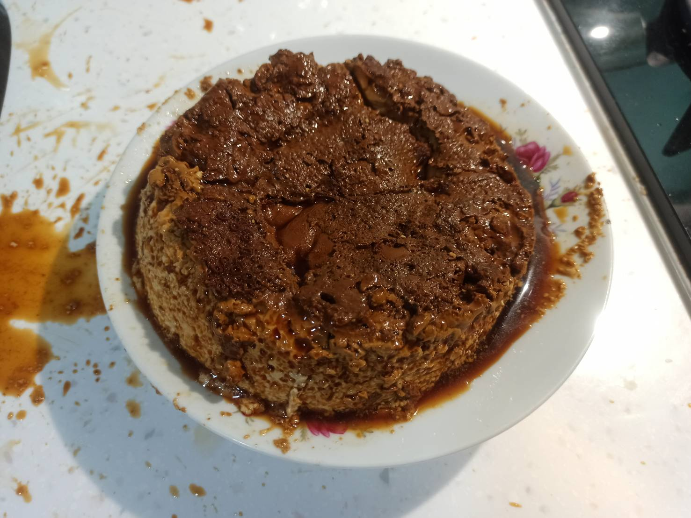
  
  + ### 檢討
    1. 失敗品，過甜
    2. 焦糖製作還是用加水的方式好了，然後糖量可以少一點
    3. 這次的氣泡有點多，判斷是焦糖做爛了，外加蒸煮時間過久了
    4. 下次用鍋子蒸煮好了
  
  + ### 參考資料
    [參考影片](https://youtu.be/hBYQqVavND4)
    [參考影片](https://youtu.be/G6HJXL_xK80)