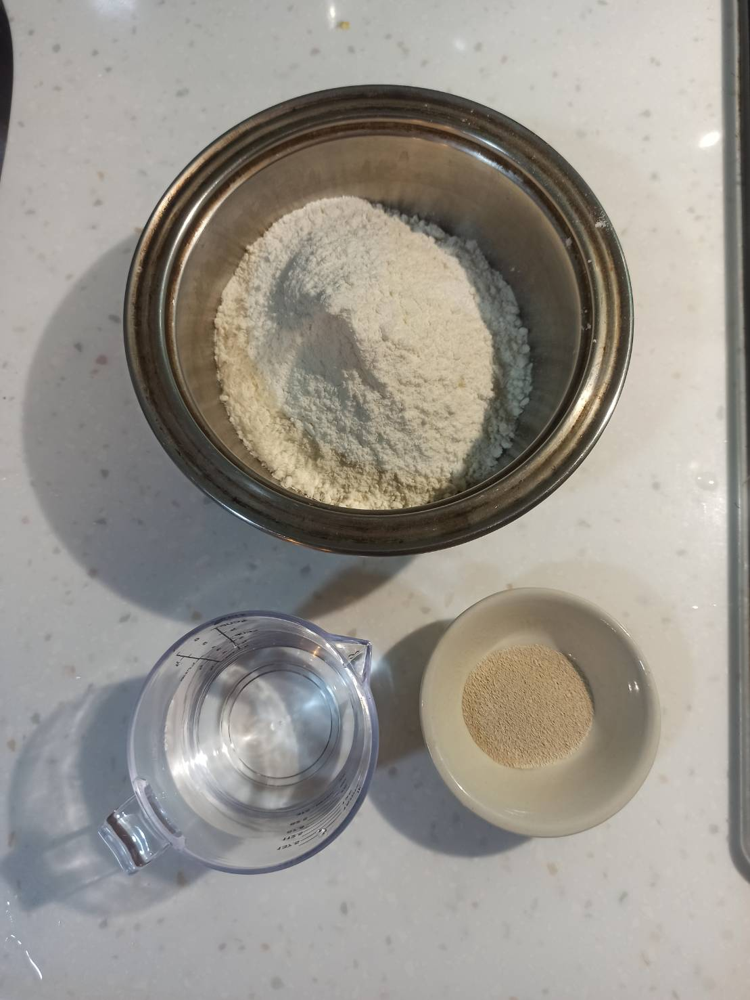
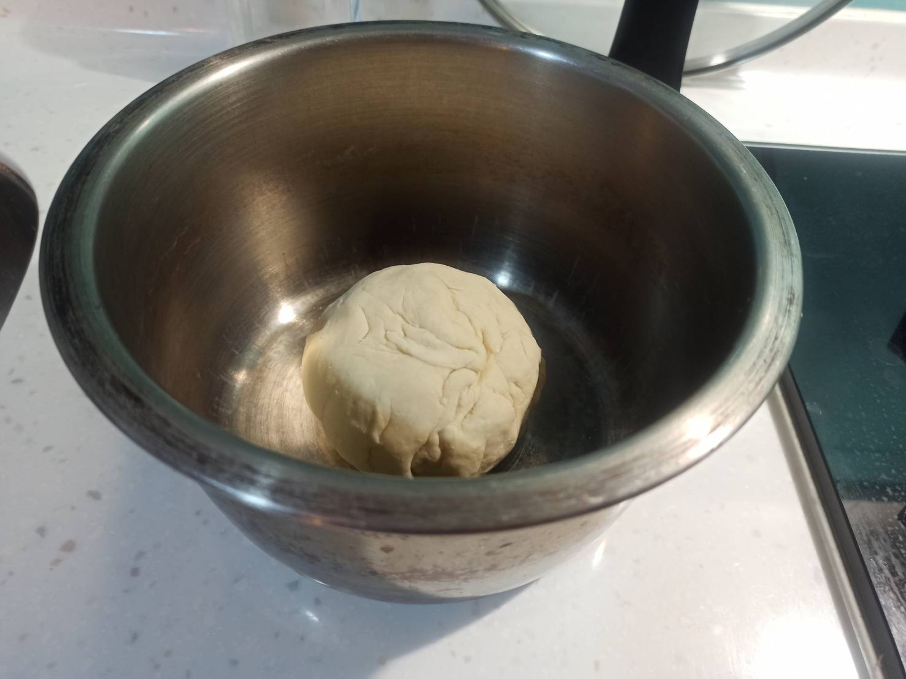
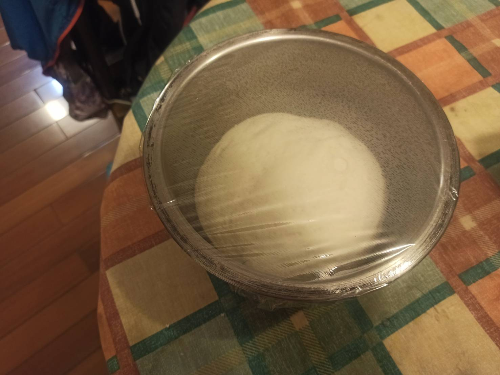
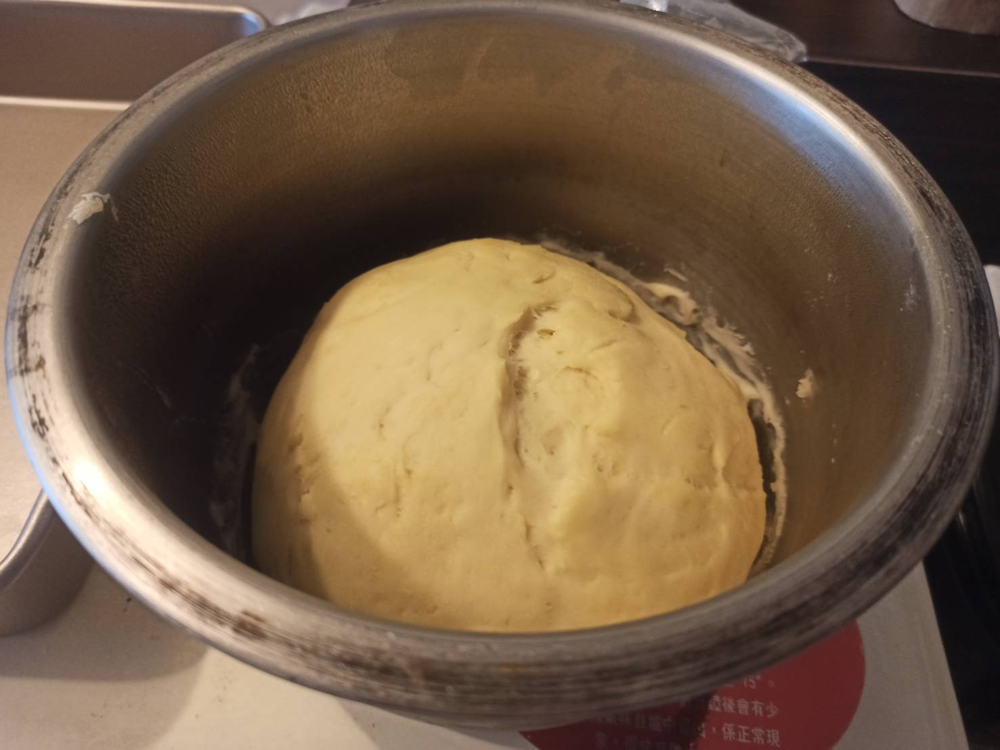
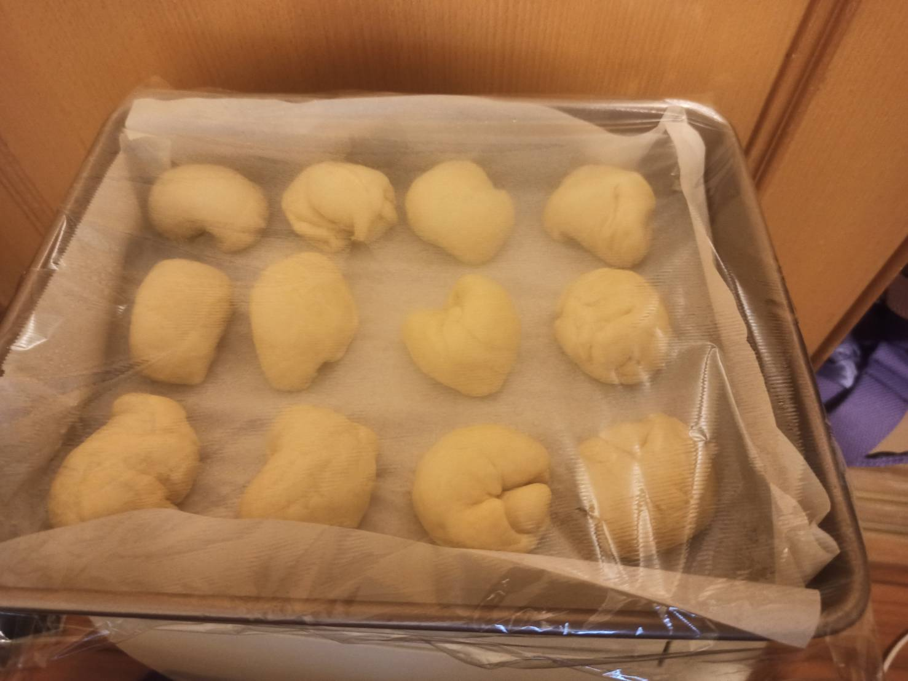
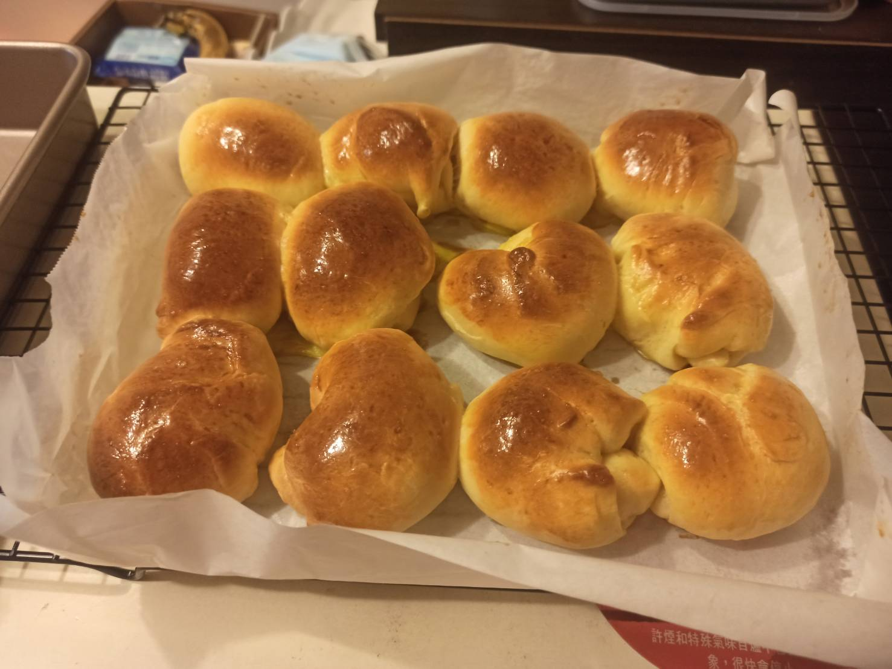
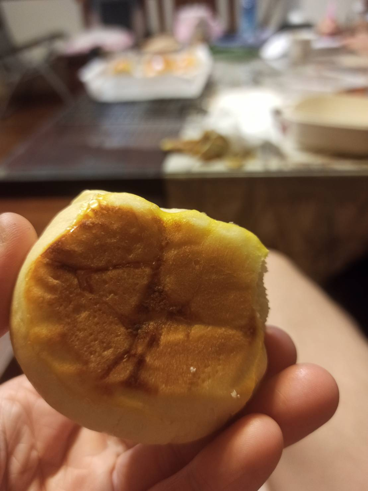
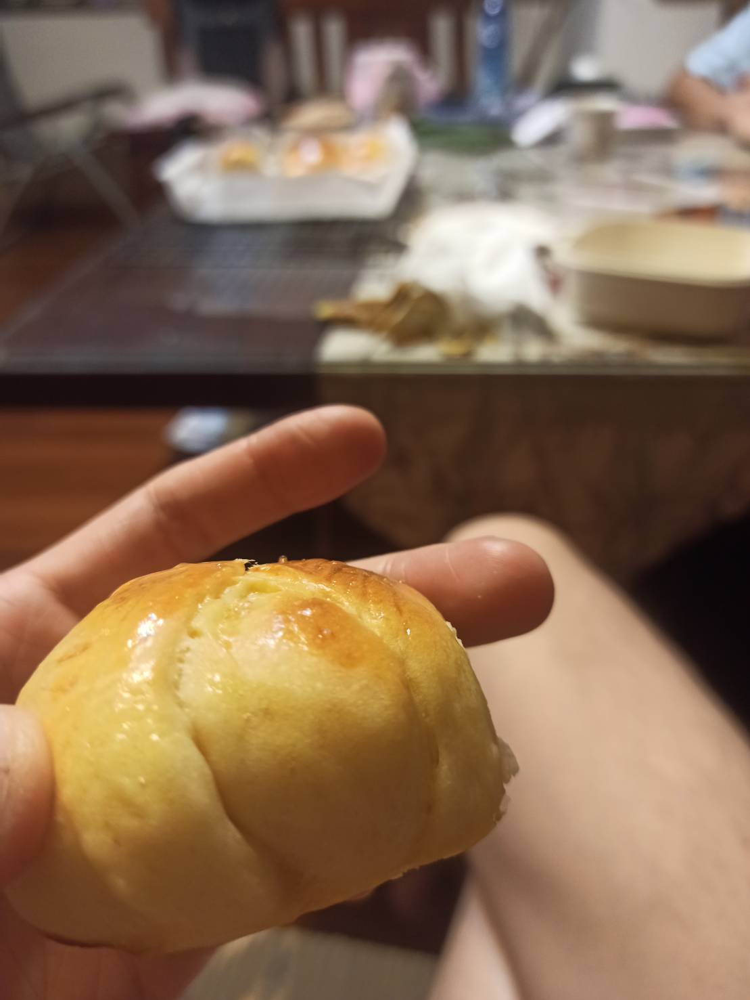
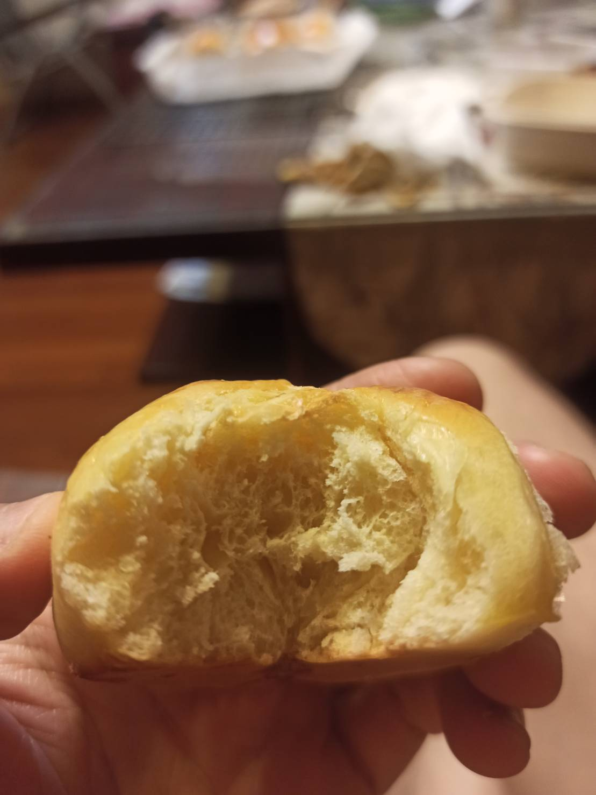

# 煉乳小餐包
---
+ ## 組成
  1. 麵粉
  2. 煉乳
  3. 奶油
  4. 糖

+ ## 20210828
  + ### 材料
    1. 中種麵糰
       1. 高筋麵粉 180g
       2. 溫水(不超過40度C)    108g
       3. 即發酵母  4g
    2. 主麵糰
       1. 高筋麵粉  130g
       2. 煉乳  50g
       3. 雞蛋  1顆(主麵糰) + 1顆(刷蛋液)
       4. 鮮奶  35g
       5. 奶油  35g
       6. 鹽    5g
       7. 糖    10g
       8. 中種麵糰
  
  + ### 作法
    1. 製作中種麵糰
    2. 先將酵母與水混合
    3. 再倒入麵粉裡，攪拌搓揉
    4. 蓋上保鮮膜放置一小時後，放入冰箱冷藏
    5. 製作主麵糰
    6. 麵粉+糖+鹽+雞蛋液+煉乳+鮮奶+撕碎的中種麵糰
    7. 揉成團手揉
    8. 再加入奶油，繼續揉8分鐘
    9. 蓋上保鮮膜靜置至少45分鐘
    10. 分成16份，揉圓，放進墊好烘培紙的深烤盤
    11. 噴水、蓋上保鮮膜等發酵大概30分
    12. 烤箱預熱至180度
    13. 刷上蛋液，烤17分鐘
  
  + ### 過程與成品
    
    
    
    
    
    
    
    
    
  
  + ### 檢討
    1. 烤得時間跟溫度不錯，顏色出來不錯，就是裡面口感不膨鬆，不向小餐包，比較像再吃饅頭XD，可能是我高筋麵粉加太多了，因為手揉很容易揉不成團，我猜是因為家裡溫度太高了啦，可能要在冷氣房操作比較好
  
  + ### 參考資料
    [手揉炼乳小餐包](https://youtu.be/7nnf2sk85Cw)