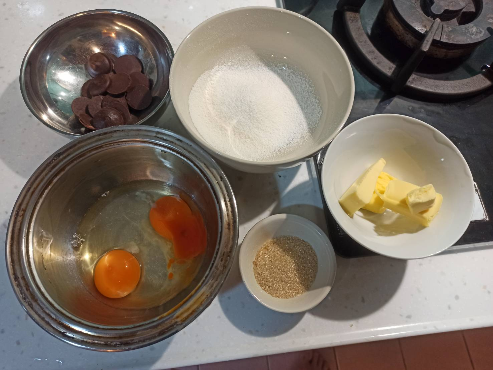
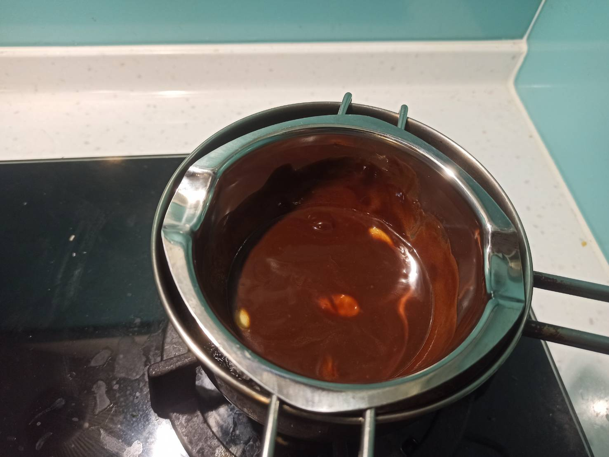
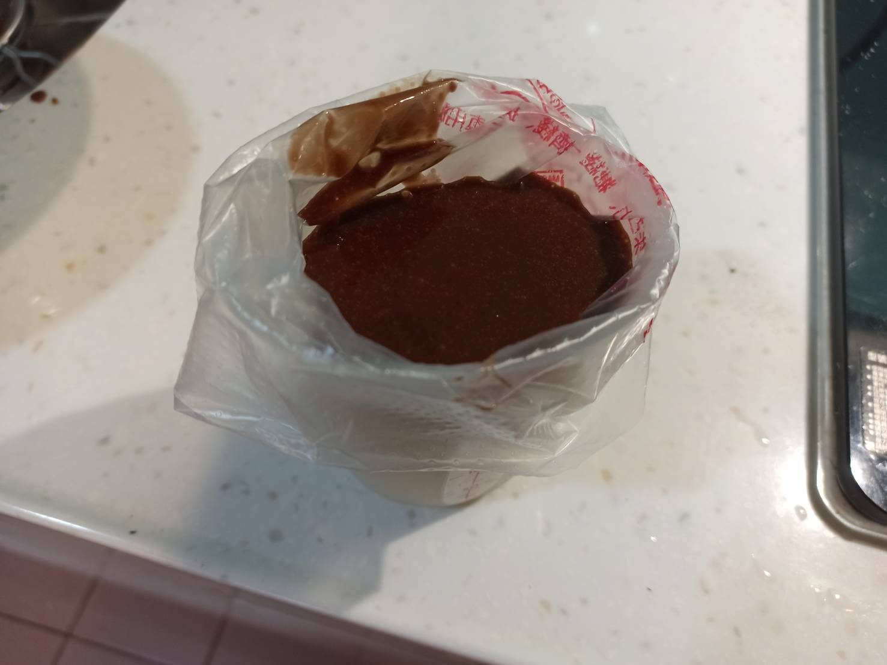
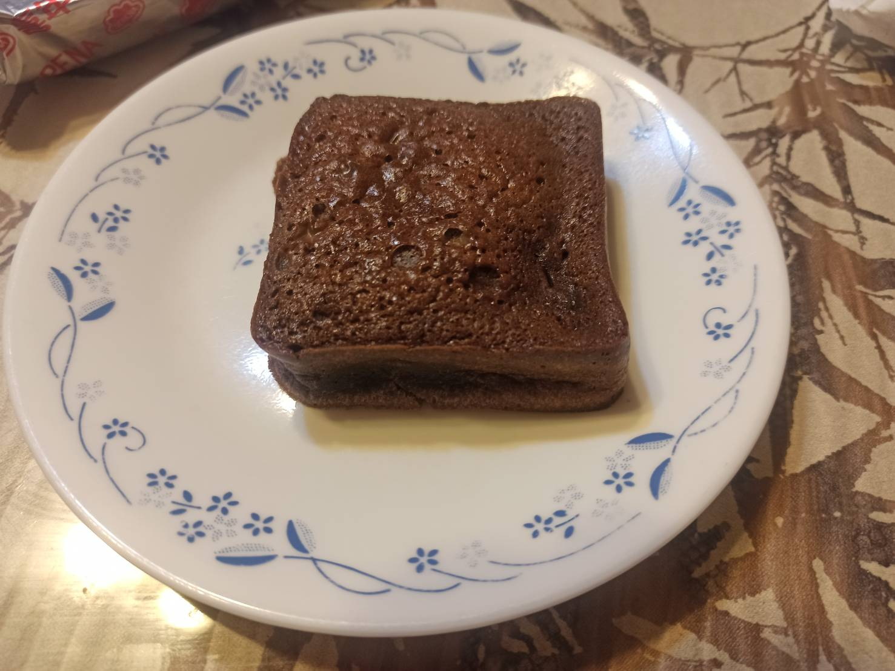
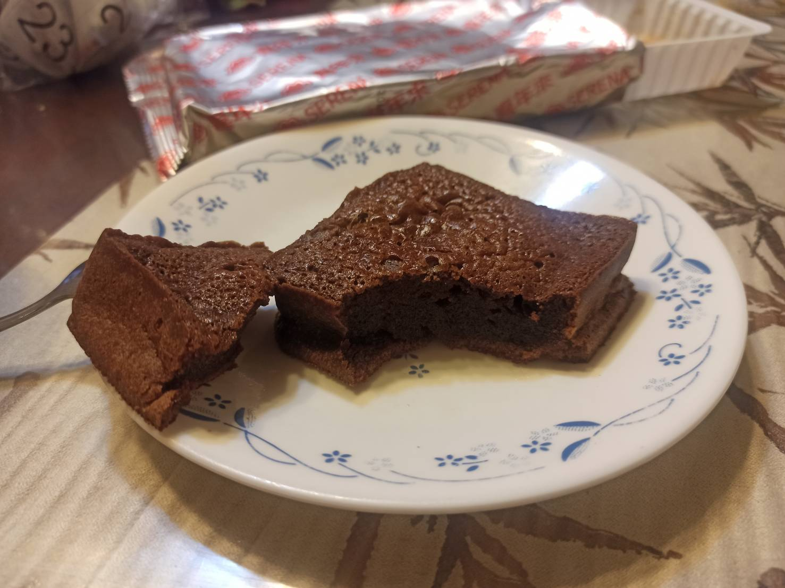

# 熔岩巧克力蛋糕
---
+ ## 組成
  1. 蛋
  2. 糖
  3. 麵粉
  4. 油
  5. 調味

+ ## 20211023
  + ### 材料
    1. 雞蛋 80g
    2. 巧克力 50g
    3. 奶油 40g
    4. 砂糖 20g
    5. 低麵 20g
  
  + ### 作法
    1. 巧克力+奶油隔水加熱融化
    2. 雞蛋+糖攪拌均勻
    3. 分兩次將巧克力液加入蛋液中攪拌均勻
    4. 加入麵粉翻拌均勻
    5. 冷藏至少4小時
    6. 放入180度的烤箱烤21分
  
  + ### 過程與成品
    
    
    
    
    
  
  + ### 檢討
    1. 失敗了，沒有流出來，烤過惹，至於為啥烤那麼久，因為一開始最上面不是固體，只好再烤，結果連中間都烤過了，味道是不錯吃啦
  
  + ### 參考資料
    [熔岩巧克力蛋糕](https://youtu.be/cWcm-58rPYY)