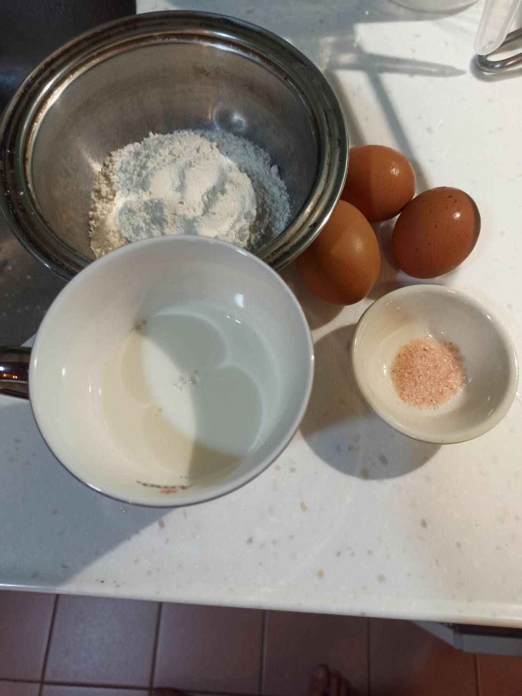

# 約克郡布丁
---
+ ## 組成
  1. 雞蛋
  2. 鮮奶
  4. 麵粉
  5. 鹽

+ ## 20210918
  + ### 材料
    1. 雞蛋 3顆
    2. 鮮奶 200g
    4. 高筋麵粉 100g
    5. 鹽   3/4茶匙
    6. 植物油   適量
  
  + ### 作法
    1. 將雞蛋+過篩麵粉+鹽用打蛋器混合均勻
    2. 一邊混合一邊加入牛奶混合
    3. 過濾後放入冰箱放置一個晚上
    4. 拿出來稍微在混合一下
    5. 將油適量的倒入模具中
    6. 把含油模具丟入烤箱一起預熱至190度
    7. 拿出來倒入雞蛋液
    8. 再放入烤箱190度烤25分
  
  + ### 過程與成品
    
    
    
  
  + ### 檢討
    1. 做起來有87%成功，內部是軟嫩的，外殼不夠酥，可能下次後面溫度調高一些烤外皮
  
  + ### 參考資料
    [這個布丁只能配肉汁](https://youtu.be/aeYahbKndwM)
    [英國300年曆史的約克郡布](https://youtu.be/oxprPnZMlSI)