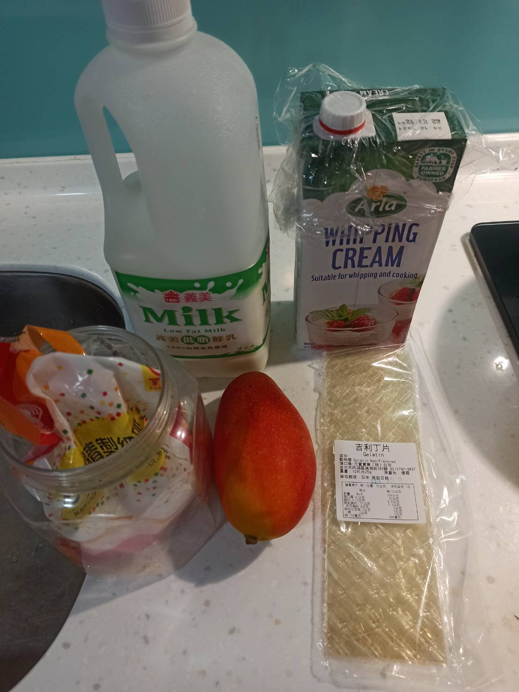
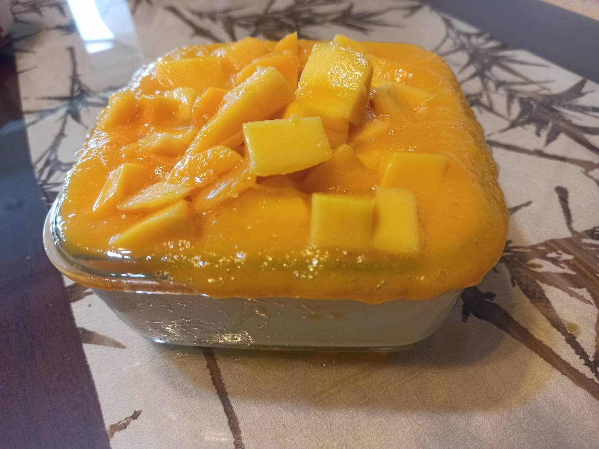

# 芒果奶酪
---
+ ## 組成
    1. 奶酪+芒果+芒果泥
    2. 奶酪=泡軟的吉利丁片+加了糖的鮮奶跟鮮奶油

+ ## 20210713
    1. 芒果 3顆
    2. 鮮奶 500g
    3. 鮮奶油   500g
    4. 吉利丁片 16g
    5. 糖   80g 

   + ### 作法
    1. 將吉利丁片泡冰水至軟
    2. 將鮮奶油及鮮奶1:1混合加熱
    3. 丟進糖融化
    4. 將泡軟的吉利丁片丟進溶化後的奶裡面
    5. 冰冷藏待凝固
    6. 切芒果塊
    7. 部分用攪拌棒打成芒果泥鋪在上面
    8. 最上面鋪芒果塊

+ ## 20210710
  + ### 材料
    1. 芒果 隨意
    2. 鮮奶 250g
    3. 鮮奶油   250g
    4. 吉利丁片 8g
    5. 糖   40g
  
  + ### 作法
    1. 將吉利丁片泡冰水至軟
    2. 將鮮奶油及鮮奶1:1混合加熱
    3. 丟進糖融化
    4. 將泡軟的吉利丁片丟進溶化後的奶裡面
    5. 冰冷藏或冷凍待凝固
    6. 切芒果塊
    7. 部分用攪拌棒打成芒果泥鋪在上面
    8. 最上面鋪芒果塊
  
  + ### 過程與成品
    
    
  
  + ### 檢討
    1. 整體來說簡單方便又不錯，不太會失敗
  
  + ### 參考資料
    [參考影片](https://youtu.be/0eDk-qSlQrw)