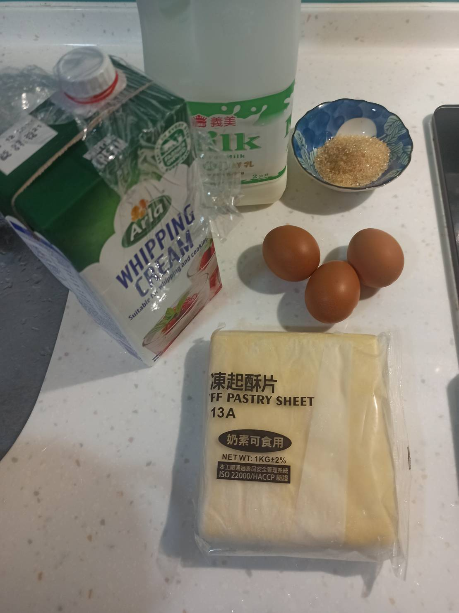
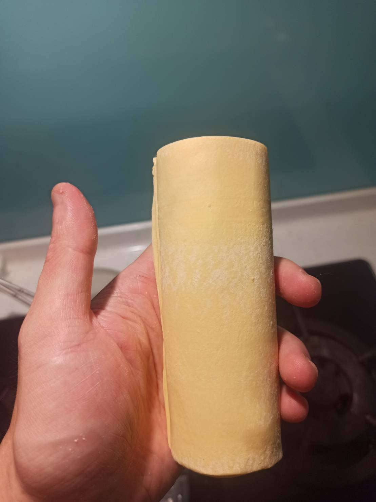
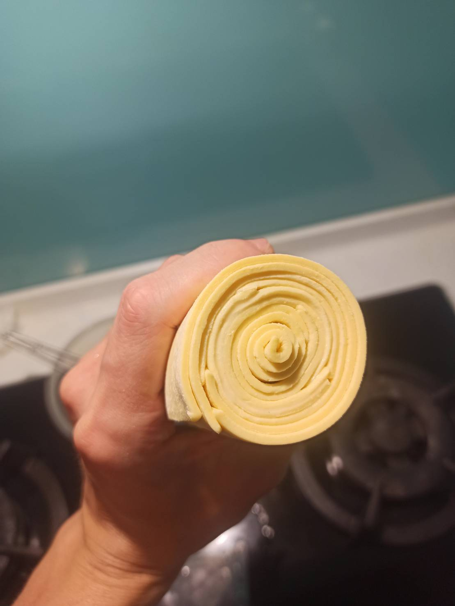
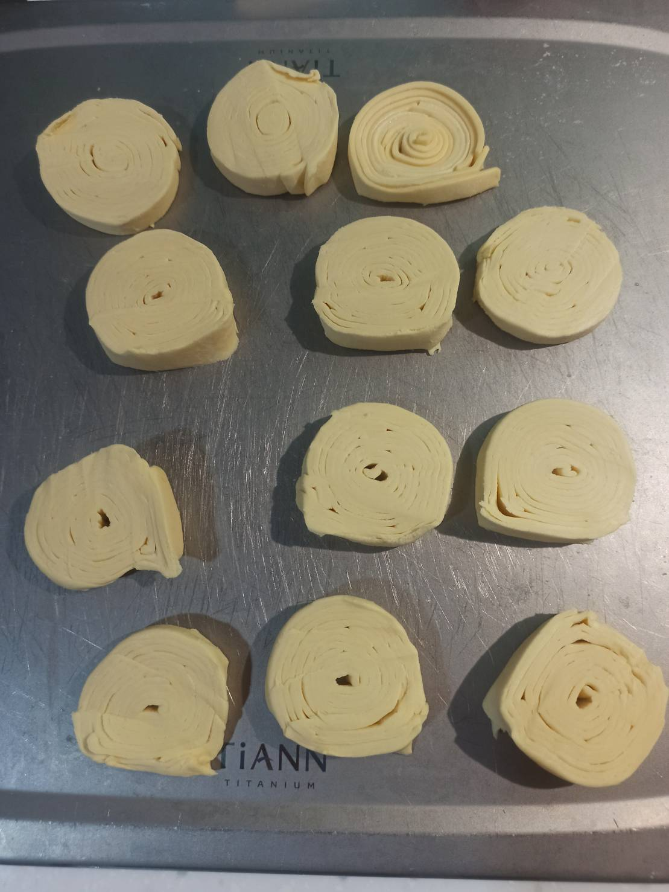
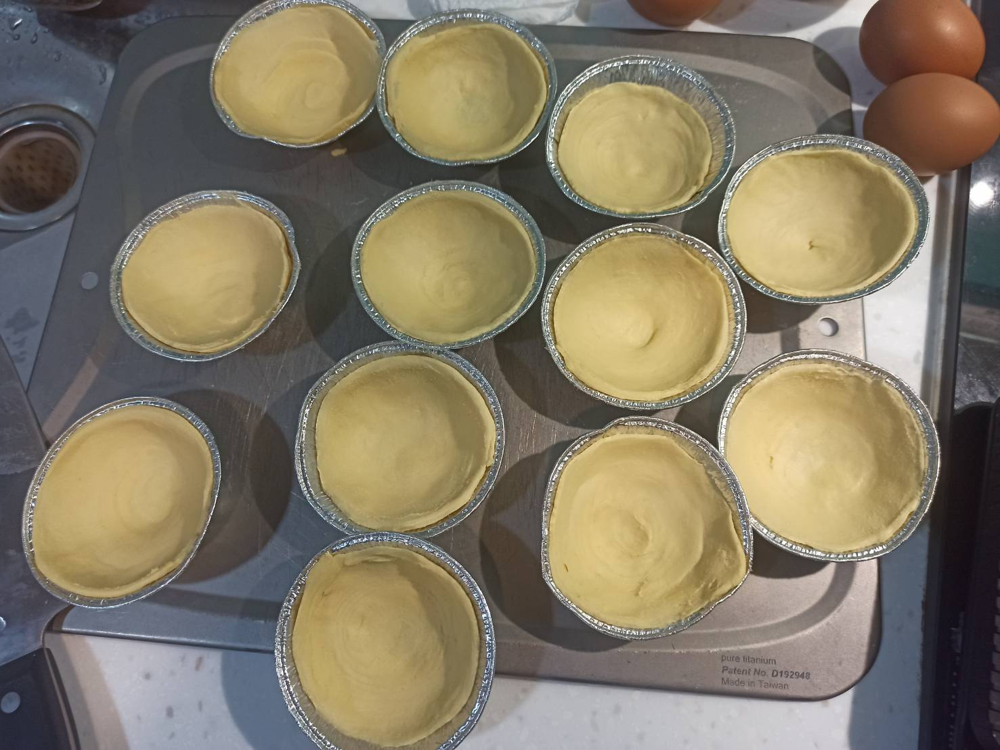
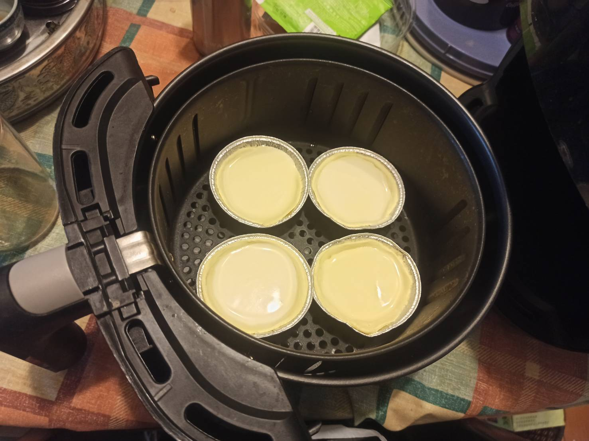
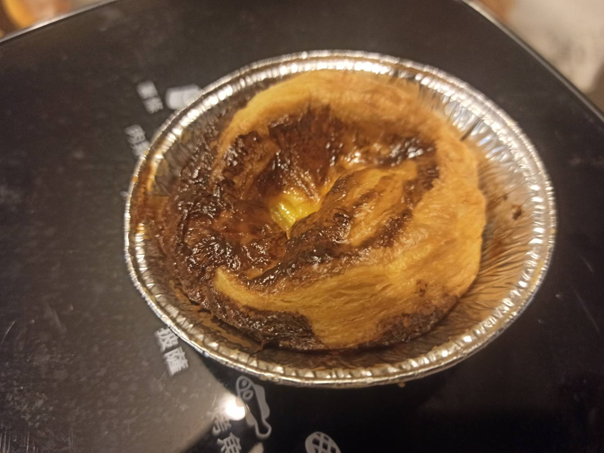
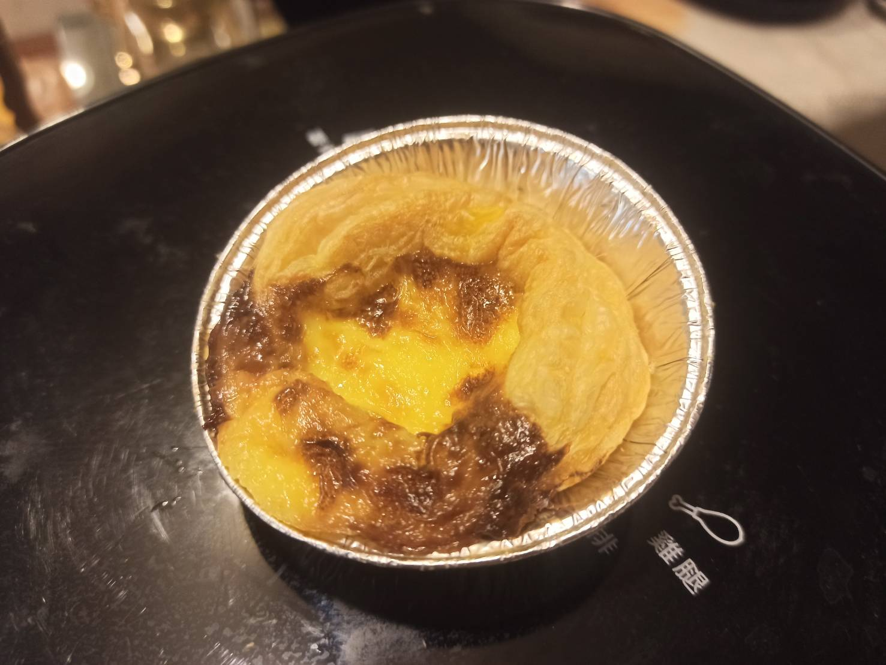

# 葡式蛋塔
---
+ ## 組成
  1. **蛋黃 + 鮮奶 + 鮮奶油 + 糖(選購)**
  2. **派皮**

+ ## 20210703
  + ### 材料
    1. 酥皮派皮
    2. 鮮奶油 100g
    3. 鮮奶 50g
    4. 蛋黃 3顆
    5. 糖 25g
  
  + ### 作法
    1. 派皮6張交疊捲起來，交疊處約0.5cm
    2. 切塊1公分多
    3. 每塊先往內擠，讓其密集，然後按壓中心，繞著一個方向拓展模具
    4. 拿去冰冷凍至少30分鐘
    5. 將材料2~4全部混再一起打一打
    6. 蛋液做好過篩倒入蛋塔皮中
    7. 氣炸鍋200度5分+180度5分

  
  + ### 過程與成品
    
    
    
    
    
    
    
    
   
  
  + ### 檢討
    1. 覺得派皮切太薄了，可能下次至少切2cm以上的厚度，因為我的模具比較大一點，照理說派皮要比模具還高才是
    2. 派皮放進模具的方法可能還是要參考其他影片看看，畢竟感覺沒有很均勻
    3. 氣炸鍋一開始照影片建議200度15分鐘會烤太焦，後來我用200度5分+180度5分差不多，再試試180度10分看看
  
  + ### 參考資料
    [參考影片](https://youtu.be/yga1PhgZenU)