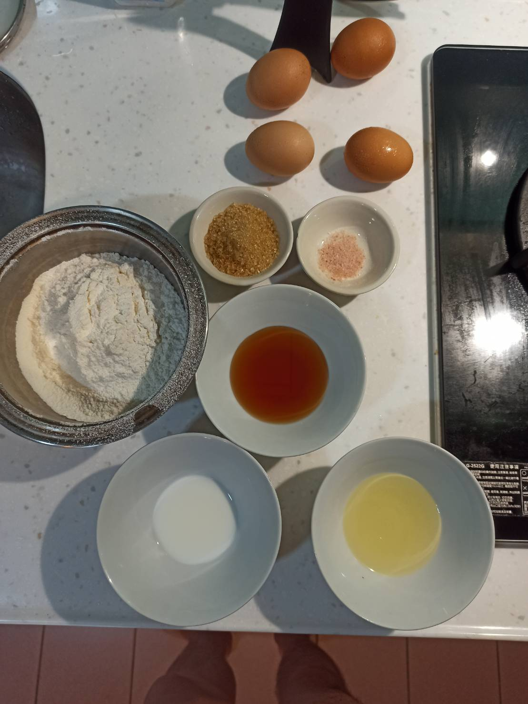
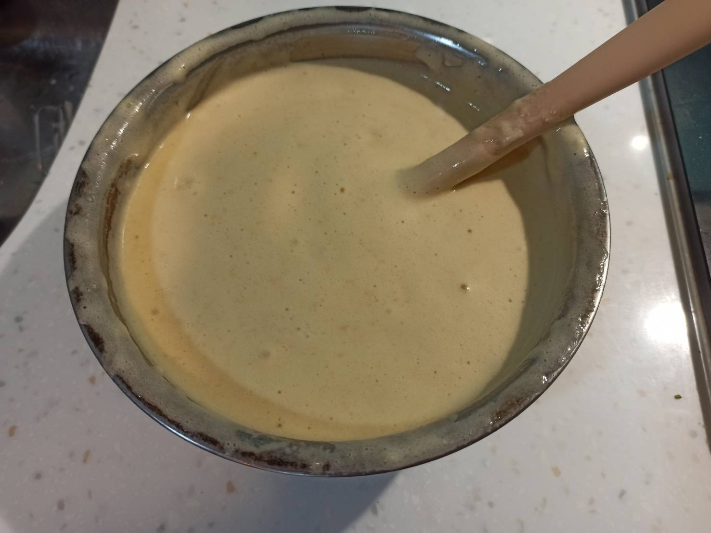
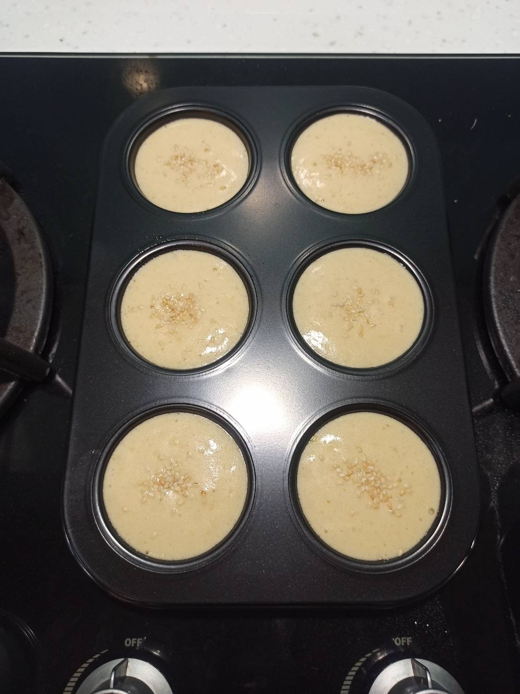
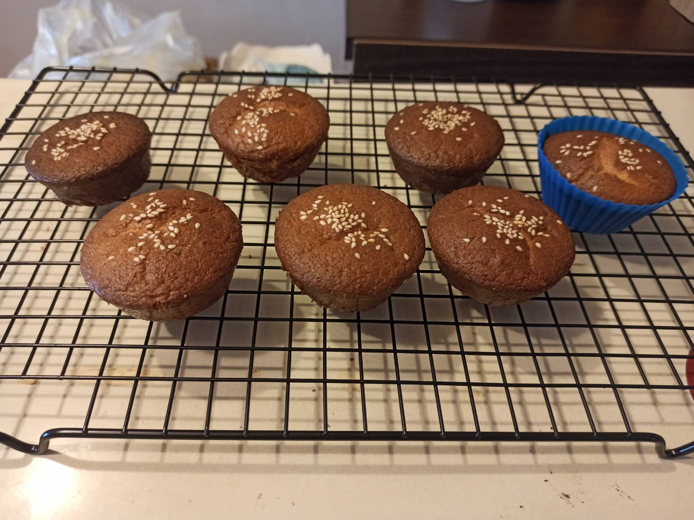
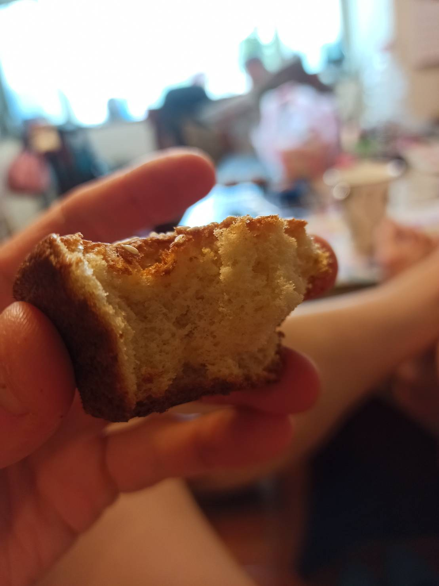

# 蜂蜜小蛋糕
---
+ ## 組成
  1. 蜂蜜
  2. 小蛋糕

+ ## 20210904
  + ### 材料
    1. 蜂蜜 60g
    2. 鹽   1g
    3. 雞蛋 4顆
    4. 砂糖 35g
    5. 低筋麵粉 130g
    6. 鮮奶 15g
    7. 芥花油   30g
    8. 白芝麻   隨意
  
  + ### 作法
    1. 先將蛋+鹽+糖+蜂蜜混合，用電動攪拌器打發至畫8不易消失的狀態
    2. 分次加入過篩後的低筋麵粉攪拌均勻
    3. 將油與奶混合乳化
    4. 將雞蛋糊部分加入乳化後的奶液混合
    5. 最後全部混合再一起
    6. 倒入模具，撒上點白芝麻
    7. 烤箱預熱至180度
    8. 烤15分
  
  + ### 過程與成品
    
    
    
    
    
  
  + ### 檢討
    1. 有點太甜了，把糖減15g
    2. 整體來說感覺有點乾就是，可能奶加多一些
  
  + ### 參考資料
    [參考影片](https://youtu.be/cTadsjCXU4k?list=PLX68FYjdqHLGUFDO_HvesmzMgCDJIkgMs)