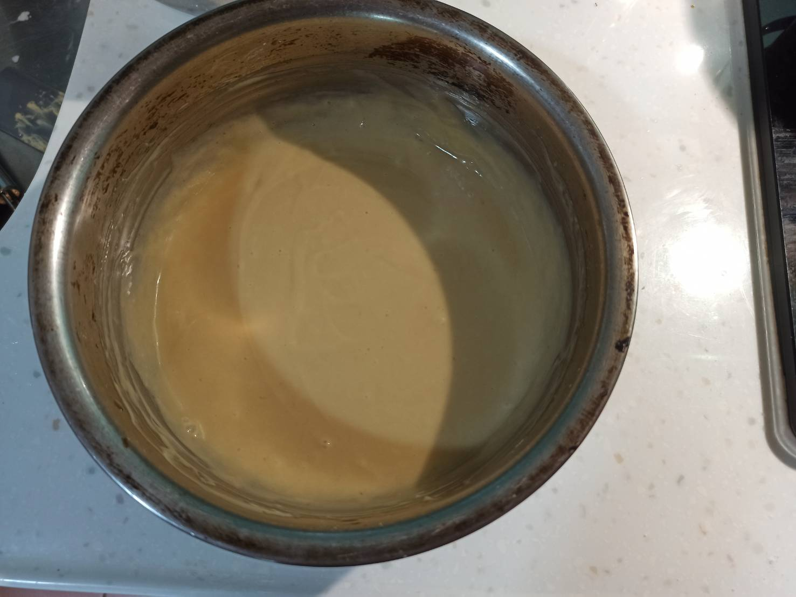

# 貓舌頭餅乾
---
+ ## 組成
  1. 奶油
  2. 蛋清
  3. 麵粉
  4. 糖

+ ## 20210801
  + ### 材料
    1. 奶油 40g
    2. 蛋清 2顆
    3. 低筋麵粉 40g
    4. 砂糖 40g
    5. 鹽   少量
    6. 香草精   20g
  
  + ### 作法
    1. 奶油放置融化
    2. 分次加入糖攪拌均勻
    3. 1/2蛋白加入攪拌均勻
    4. 加鹽、香草精攪拌均勻
    5. 1/2過篩麵粉攪拌均勻
    6. 1/2蛋白加入攪拌均勻
    7. 1/2過篩麵粉攪拌均勻
    8. 將奶油糊倒入容器
    9. 烤箱烤約12~13分170度
  
  + ### 過程與成品
    
    
    
    
    
    
   
  
  + ### 檢討
    1. 同樣配方在做一次，換用烤箱烤，有比較接近餅乾了，但還是失敗，首先，我做出來的奶油糊，其實濃稠度不夠，所以擠花袋根本不用擠，直接流出來，奶油糊直接會流動而沒辦法往上擠堆疊，而且很甜膩就是，香草精下次減半放，然後下次可能還是用細砂糖貨糖粉之類的，畢竟二砂其實顆粒蠻大的，不好溶解，再多參考食譜吧
  
  + ### 參考資料
    [參考影片](https://youtu.be/8VkWNc2O9VA)
    

+ ## 20210731
  + ### 材料
    1. 奶油 40g
    2. 蛋清 2顆
    3. 低筋麵粉 40g
    4. 砂糖 40g
    5. 鹽   少量
    6. 香草精   20g
  
  + ### 作法
    1. 奶油放置融化
    2. 分次加入糖攪拌均勻
    3. 打散蛋白加入攪拌均勻
    4. 加鹽、香草精攪拌均勻
    5. 加入過篩麵粉攪拌均勻
    6. 將奶油糊倒入容器
    7. 氣炸鍋170度6分+190度7分+200度2分
  
  + ### 過程與成品
    
    
    
    
  
  + ### 檢討
    1. 大失敗，做出來很像發糕，沒有餅乾的脆度，不知道是不是容量太多的關係，而且吃起來蠻甜的就是
  
  + ### 參考資料
    [參考影片](https://youtu.be/8VkWNc2O9VA)