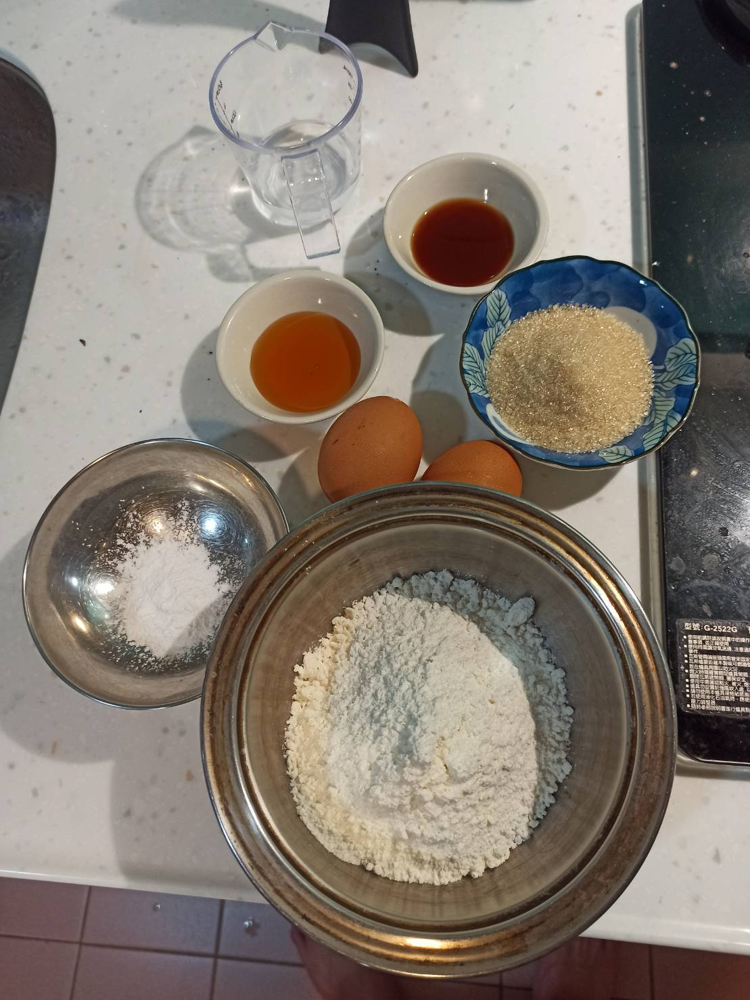

# 銅鑼燒
---
+ ## 組成
  1. 麵皮
  2. 紅豆泥

+ ## 20210926
  + ### 材料
    1. 紅豆泥
       1. 紅豆  200g
       2. 糖    70g
       3. 鹽    1g
    2. 麵皮
       1. 雞蛋  2顆
       2. 砂糖  60g
       3. 蜂蜜  20g
       4. 開水  30g
       5. 低筋麵粉  130g
       6. 泡打粉    3g
       7. 香草精    10g
  
  + ### 作法
    1. 先製作紅豆泥
    2. 紅豆泡水煮滾5分鐘
    3. 撈起紅豆放入容器丟進電鍋
    4. (外鍋2杯水+內鍋1杯水) * 4
    5. 拿出來+砂糖、鹽
    6. 開小火煮，煮到想要的稠度即可，別煮太乾
    7. 製作外皮
    8. 雞蛋+砂糖攪拌均勻
    9. 加入蜂蜜、香草精、開水
    10. 低筋麵粉+泡打粉過篩後分次加入攪拌均勻
    11. 冷藏至少30分以上
    12. 煎外皮
    13. 熱鍋上油煎完即可
  
  + ### 過程與成品
    
    
    
    
    
    
    
    
    
    
    
    
  
  + ### 檢討
    1. 其實整體而言還算成功，就是紅豆泥別煮太乾，萬一真的太乾了就加點牛奶吧，還有外皮也有點乾
    2. 下次紅豆泥煮的時候多加鮮奶吧
    3. 下次外皮也加點鮮奶吧
  
  + ### 參考資料
    [參考影片](https://youtu.be/rhQO0DfvN9E)