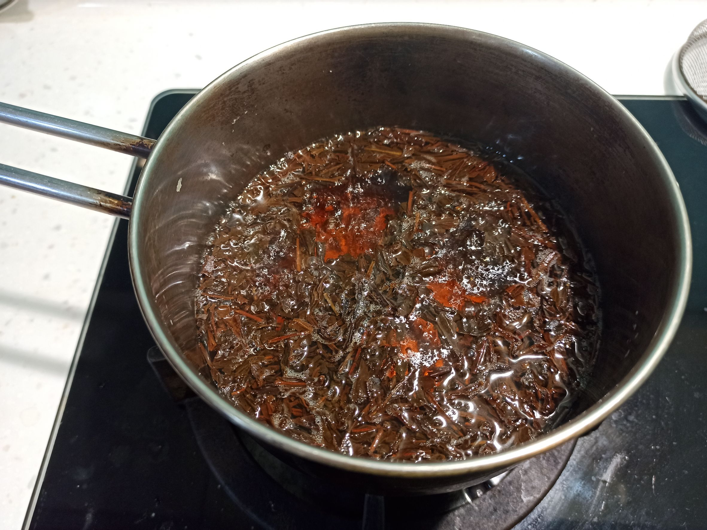

# 鍋煮奶茶
---
+ ## 組成
  1. 紅茶
  2. 牛奶

+ ## 20230407
  + ### 材料
    1. 錫蘭紅茶葉 6g
    2. 奶粉 4湯匙
    3. 泡奶粉的水 200cc
    4. 煮紅茶的水 350cc
    5. 蜂蜜 1小湯匙
  
  + ### 作法
    1. 先煮紅茶要用的水，將其煮開
    2. 煮的期間可將奶粉+水泡成牛奶
    3. 待紅茶水煮開後轉成小火丟入茶葉，煮5分鐘(不需攪拌)
    4. 煮5分後，倒入牛奶+蜂蜜(攪拌)，再煮1分鐘關火
    5. 最後過濾掉茶葉即可
  
  + ### 過程與成品
    
    
    
    
    
  
  + ### 檢討
    1. 可能蜂蜜放太少，沒啥感覺蜂蜜味，看來下次要嘛別放要嘛增加
    2. 香味跟滑順度是有，整體來說還蠻滿意的
    3. 下次想說奶粉用建議泡奶粉的55度c的水去泡，然後加入紅茶後再煮30秒就好
  
  + ### 參考資料
    [锅煮奶茶](https://www.bilibili.com/video/BV1bb41187hg?t=172.5)