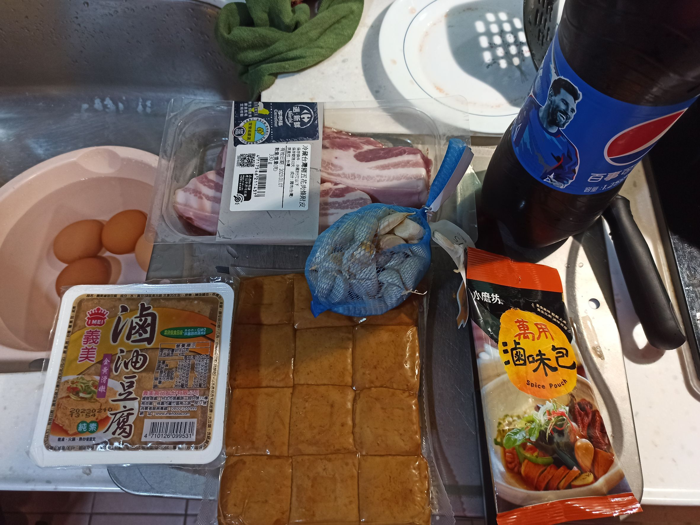
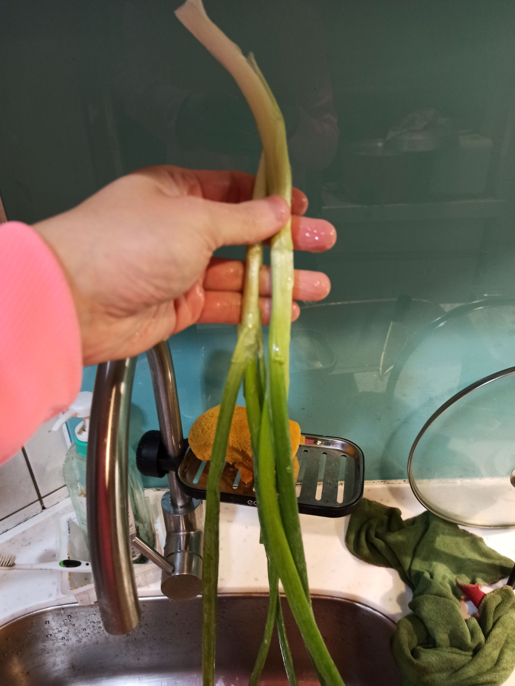
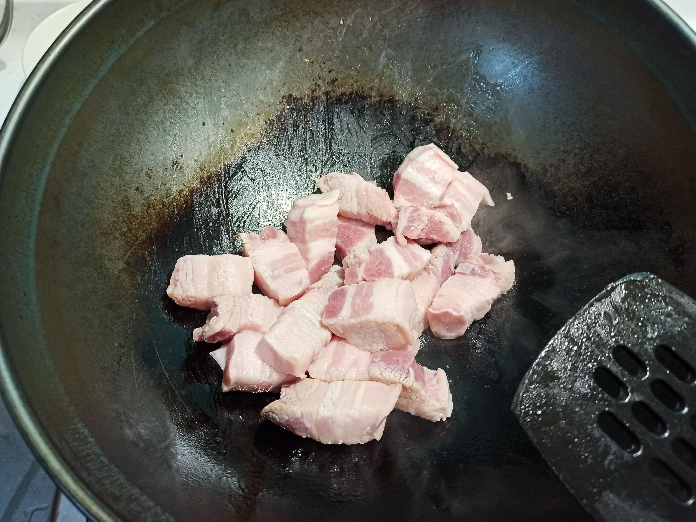
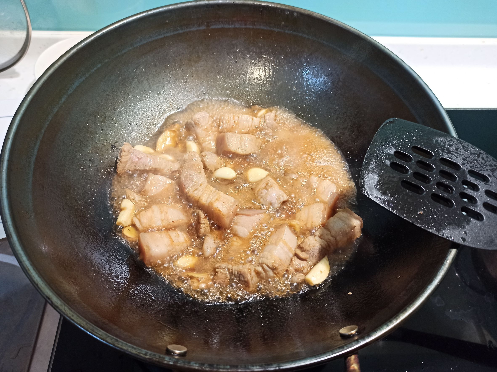
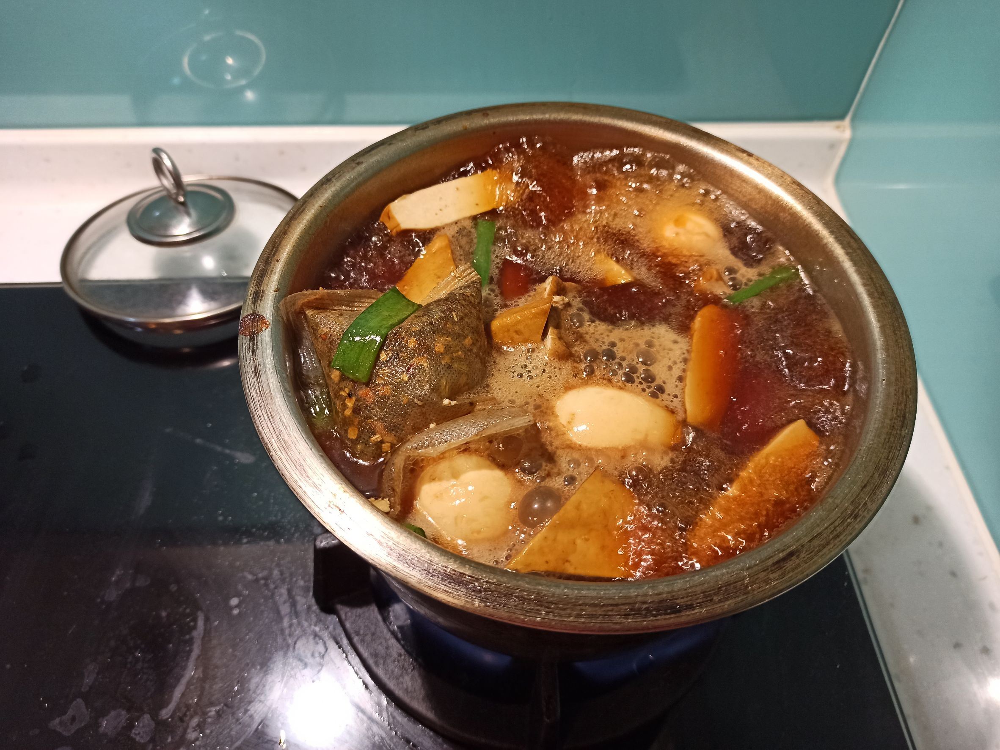
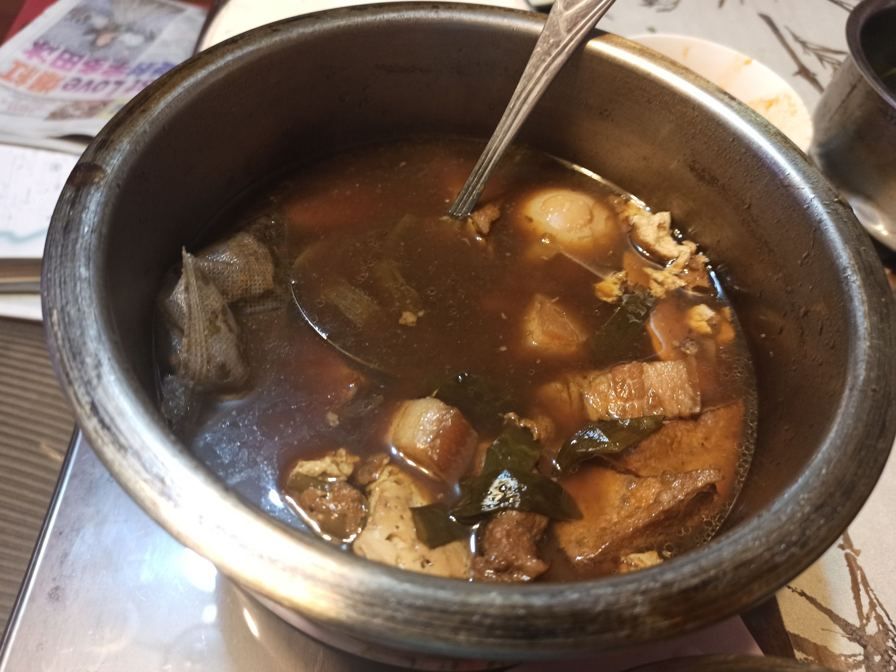

# 可樂燉肉
---
+ ## 組成
  1. 可樂
  2. 五花肉帶皮

+ ## 20230103
  + ### 材料
    1. 可樂 適量
    2. 五花肉帶皮 一盒
    3. 大蒜 適量
    4. 青蔥 適量
    5. 薑片 適量
    6. 醬油 適量
    7. 米酒 適量
    8. 滷包 一包
    9. 雞蛋 4顆
    10. 油豆腐 一盒
    11. 豆干  適量
  
  + ### 作法
    1. 將材料都洗好切好
    2. 煮好白煮蛋，先沾醬油上色一下
    3. 熱鍋不加油，中小火丟入五花肉逼豬油
    4. 等煎到有點顏色後，丟入大蒜、薑片拌炒
    5. 炒出香味後，放入一些醬油、米酒、可樂稍微煮一下
    6. 煮個幾分鐘就可以放入其他鍋了
    7. 再放入青蔥、雞蛋、豆干、油豆腐、醬油、可樂、滷包
    8. 再加水淹過食材，開大火煮滾後轉小火蓋上蓋子，煮約40分以上即可
  
  + ### 過程與成品
    
    
    
    
    
    
  
  + ### 檢討
    1. 還是要加點鹽，不然可樂有點甜
    2. 豆腐跟豆干也可以學雞蛋事先用醬油上色上味
  
  + ### 參考資料
    [可樂紅燒肉](https://youtu.be/IYTPwlHZLPU)