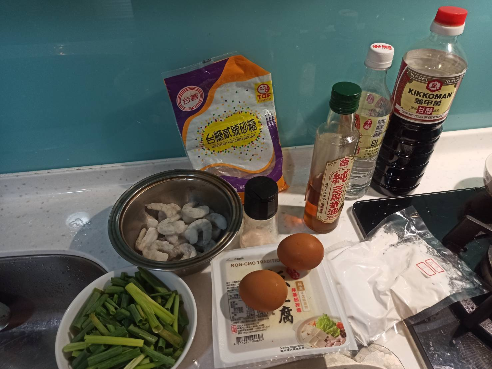
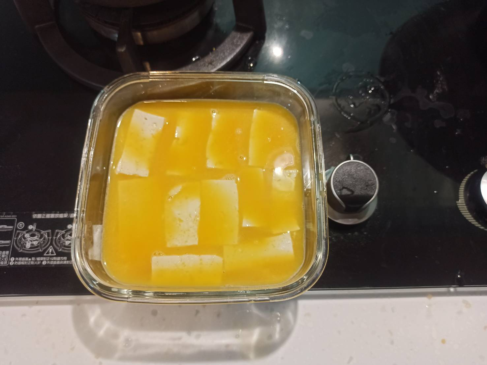
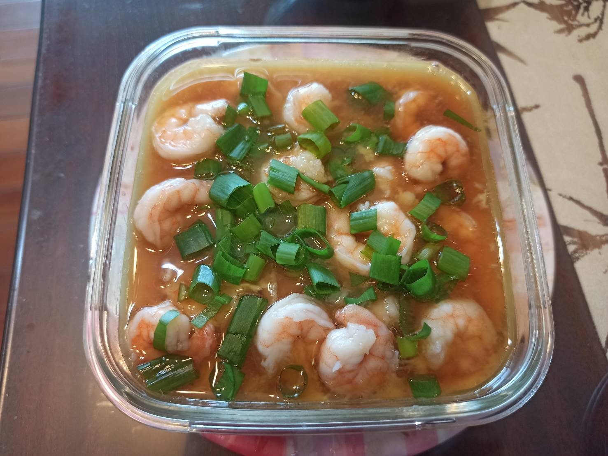

# 太史豆腐
---
+ ## 組成
    1. 豆腐
    2. 蝦子
    3. 雞蛋
    4. 調味料

+ ## 20210710
  + ### 材料
    1. 豆腐 3/4塊
    2. 蝦子 數隻
    3. 雞蛋 4顆
    4. 青蔥 少許
    5. 米酒 少許
    6. 糖   少許
    7. 鹽   少許
    8. 醬油 隨意
    9.  香油    隨意
    10. 太白粉  少許
    11. 雞粉    少許
    12. 清水 少許
  
  + ### 作法
    1. 蝦仁+調味料(糖+鹽+米酒)抓勻
    2. 接著+太白粉(再次抓勻)醃製15分
    3. 熱開水燙豆腐去除豆腥味
    4. 雞蛋+等重的高湯(雞粉+水)+醬油
    5. 接著過篩
    6. 豆腐放容器+蛋液包上保鮮膜
    7. 電鍋蒸10分鐘
    8. 拿掉保鮮膜，蝦仁放上去再蒸4分鐘
    9. 調醬汁(芝麻油+醬油+米酒+清水)攪拌均勻
    10. 倒上去+灑蔥花再悶2分鐘

  
  + ### 過程與成品
    
    
    
  
  + ### 檢討
    1. 不能用板豆腐，一定要用嫩豆腐，不然味道會進不去
    2. 由於電鍋蒸火力沒那麼猛，照影片蒸進度會落後，所以時間要長些
  
  + ### 參考資料
    [參考影片](https://youtu.be/sxYW2XP3ASs?t=208)