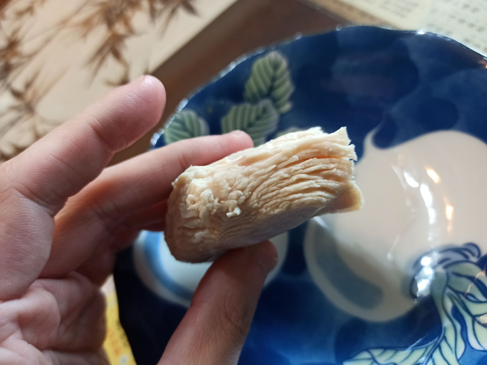
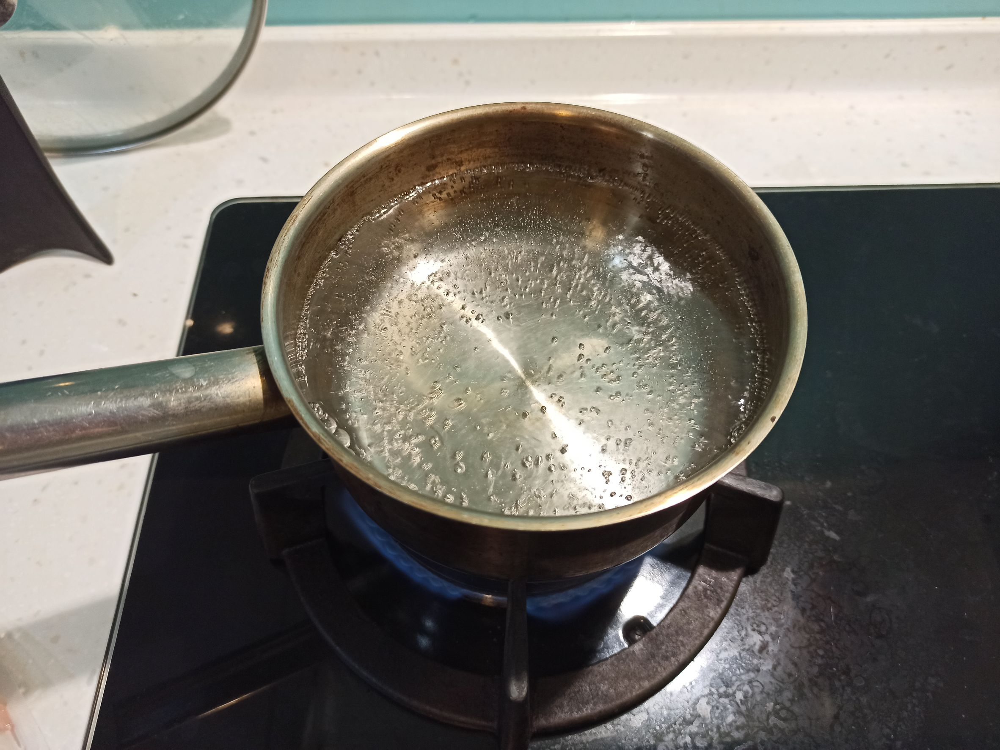
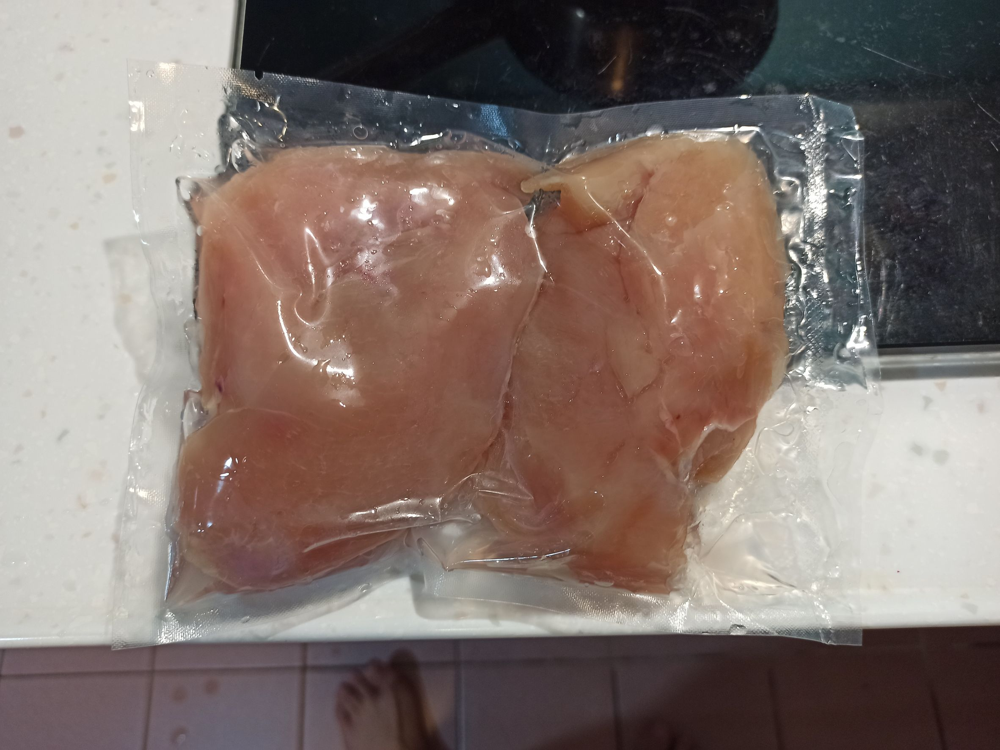
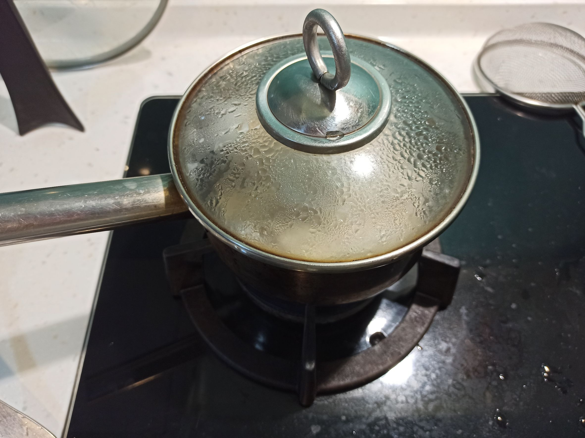
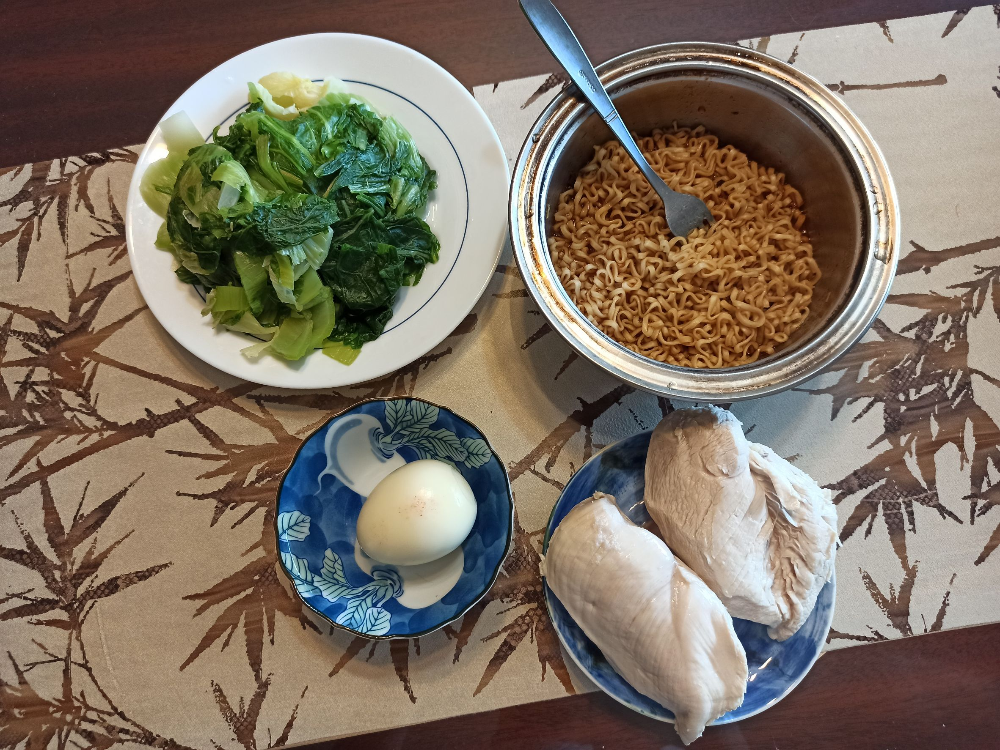

# 水煮雞胸
---
+ ## 組成
  1. 雞胸肉

+ ## 20230322
  + ### 材料
    1. 雞胸肉 1塊
    2. 米酒 1杯蓋
    3. 鹽 雞胸肉重量的3%公克數
  
  + ### 作法
    1. 先將雞胸肉用鹽醃個3~5分鐘
    2. 大火燒滾水，把雞胸肉丟入滾水煮11秒
    3. 蓋上鍋蓋關火，悶20分即可
  
  + ### 過程與成品
    
  
  + ### 檢討
    1. 效果很好，不過這次用的雞胸肉是比較小也比較薄的，下次再試試看，看是否有一樣的效果，吃起來，雖然外面確實開始乾了，但裡面保水度還是有的，而且這方法很簡單
  
  + ### 參考資料
    **F:\生活\做菜\超赞的三种鸡胸肉做法！.mp4**

+ ## 20221113
  + ### 材料
    1. 雞胸肉 隨意
    2. 米酒 少許
    3. 鹽 適量
  
  + ### 作法
    1. 先燒水至滾
    2. 大火滾水後丟入雞胸肉
    3. 再丟入鹽與米酒
    4. 待大火水二次滾後，關火蓋上蓋子
    5. 依雞胸肉大小悶10~15分
  
  + ### 過程與成品
    
    
    
    
  
  + ### 檢討
    1. 雞胸肉大小會決定悶的時間，最好的情況當然就是悶熟就好，因為悶越久一定越乾
  
  + ### 參考資料
    [水煮雞胸肉](https://youtu.be/N_DAbJ9vGuA)