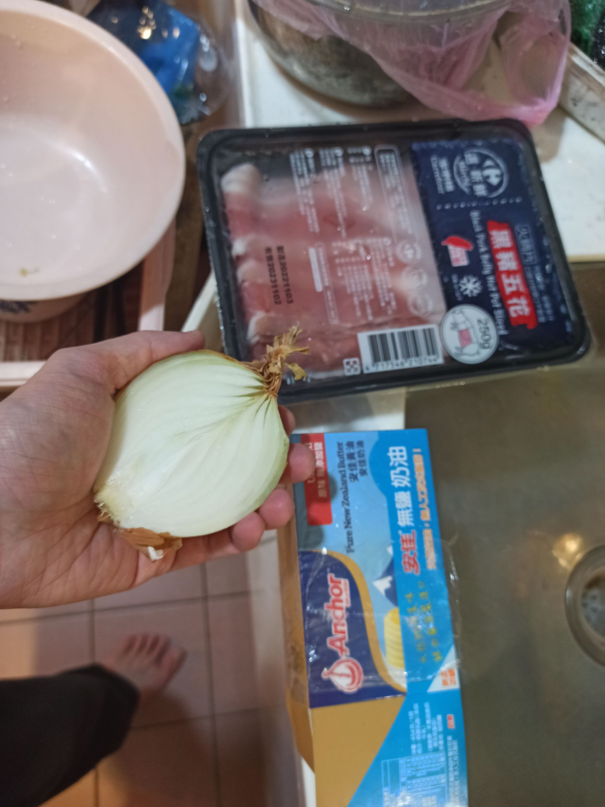
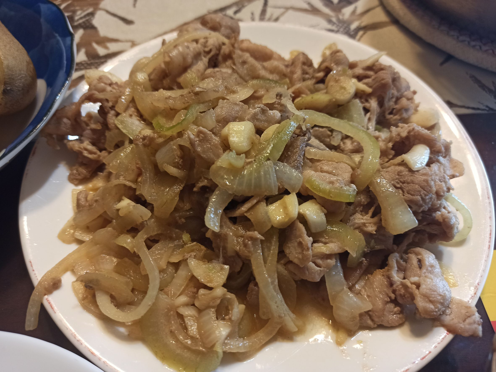

# 洋蔥炒肉片
---
+ ## 組成
  1. 洋蔥
  2. 肉片

+ ## 20221211
  + ### 材料
    1. 洋蔥 半顆
    2. 肉片 1盒(250g)
    3. 蒜末 適量
    4. 鹽 適量
    5. 米酒 1杯蓋
    6. 醬油 適量
    7. 奶油 1小塊
  
  + ### 作法
    1. 大火燒鍋至乾，冷油下鍋轉中小火
    2. 丟入洋蔥炒一下至顏色稍變
    3. 丟入肉片、蒜末拌炒一下
    4. 丟入鹽、米酒、醬油轉中大火拌炒
    5. 最後轉回中火丟入奶油，炒至奶油融化
  
  + ### 過程與成品
    
    
  
  + ### 檢討
    1. 這次感覺奶油丟太多，下次奶油丟少點，不然感覺油膩感會較高
  
  + ### 參考資料
    [一鍋搞定真簡單](https://youtu.be/NOLvArHk8qI)