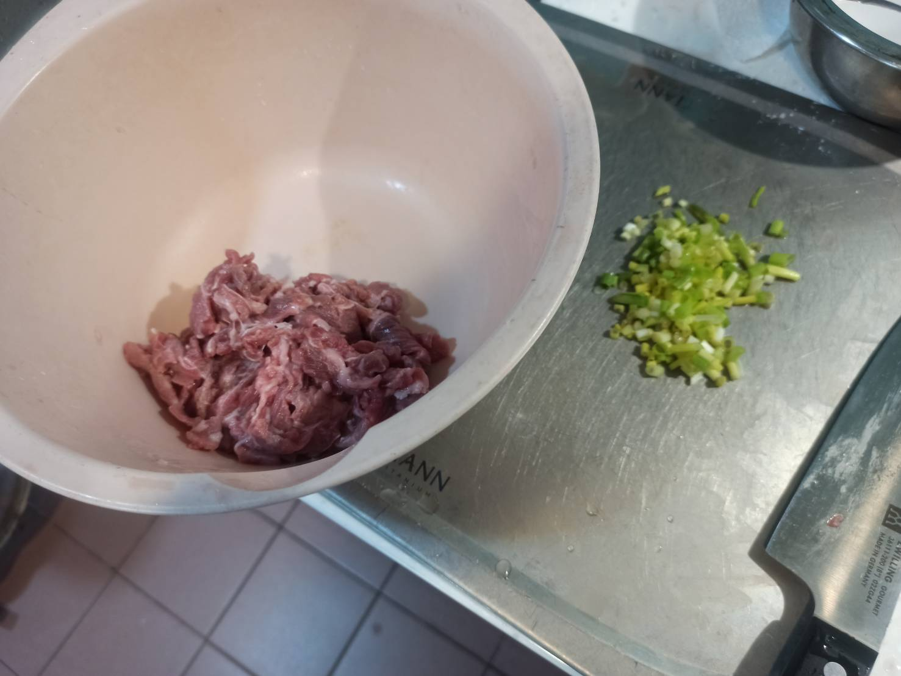
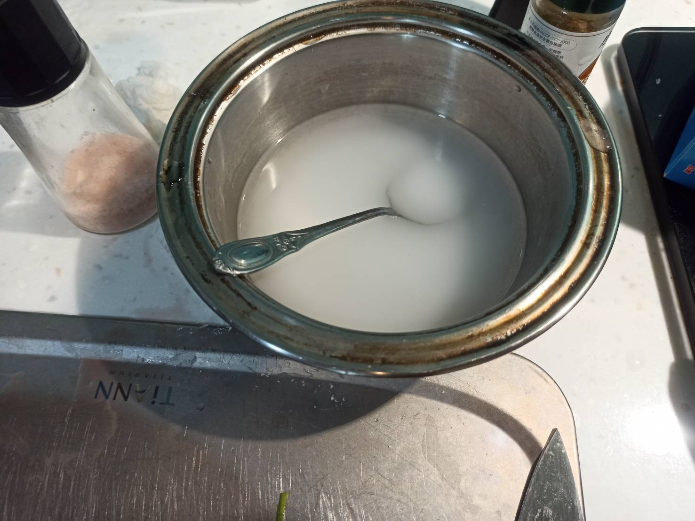
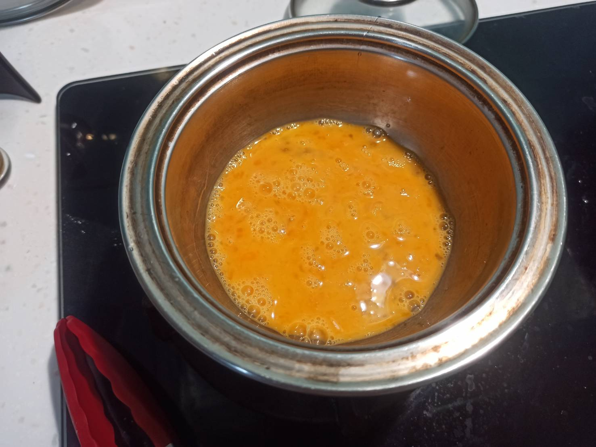
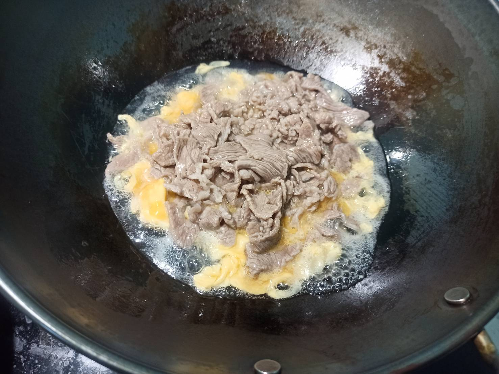
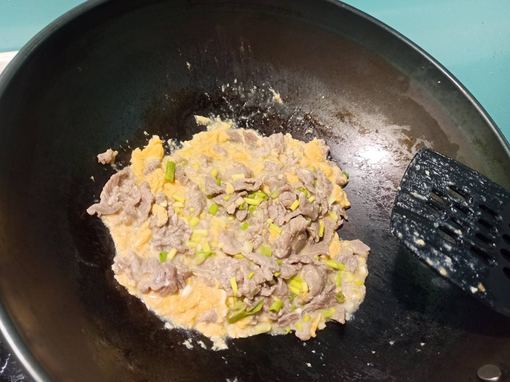
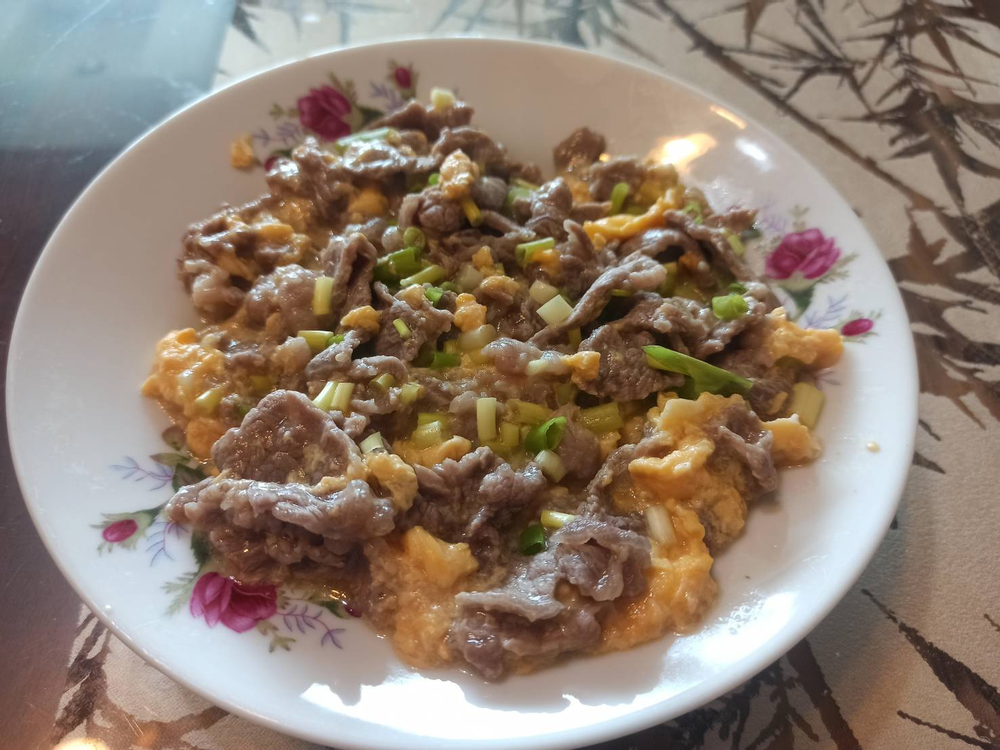

# 滑蛋牛肉
---
+ ## 組成
  1. 雞蛋
  2. 牛肉

+ ## 20211017
  + ### 材料
    1. 雞蛋 2顆
    2. 牛肉 適量
    3. 鹽   適量
    4. 太白粉   適量
    5. 蔥   適量
    6. 油   適量
  
  + ### 作法
    1. 將牛肉切小塊，清洗後加入鹽與太白粉抓醃
    2. 雞蛋加入鹽攪拌均勻
    3. 太白粉+水+油攪拌均勻
    4. 先用水把牛肉燙一燙後撈起，水倒掉
    5. 將太白粉水下鍋再倒入蛋液
    6. 再將牛肉丟下去滑熟
    7. 最後撒上蔥花即可
  
  + ### 過程與成品
    
    
    
    
    
    
  
  + ### 檢討
    1. 鹽下太少，調味不足
    2. 下次可能抓醃的時候下點醬油再多點香料
  
  + ### 參考資料
    [滑蛋牛肉](https://youtu.be/x9oRFjOxK78)