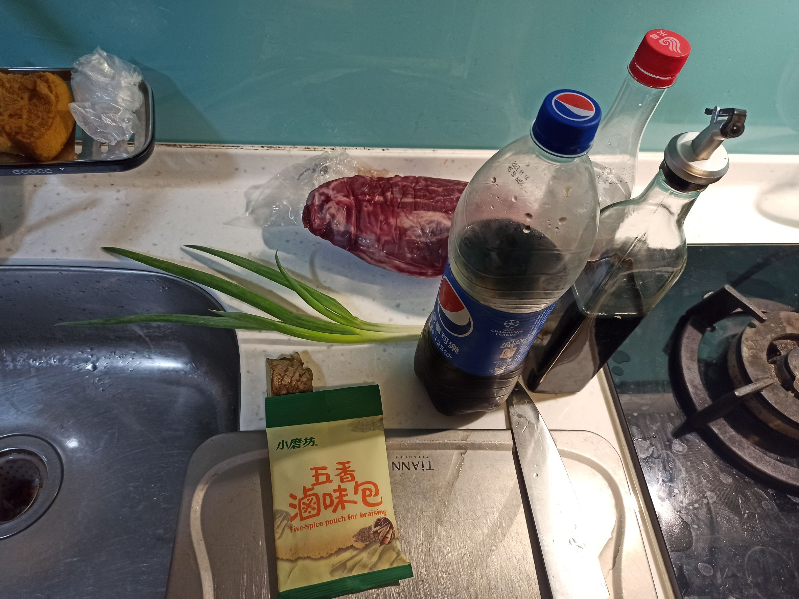
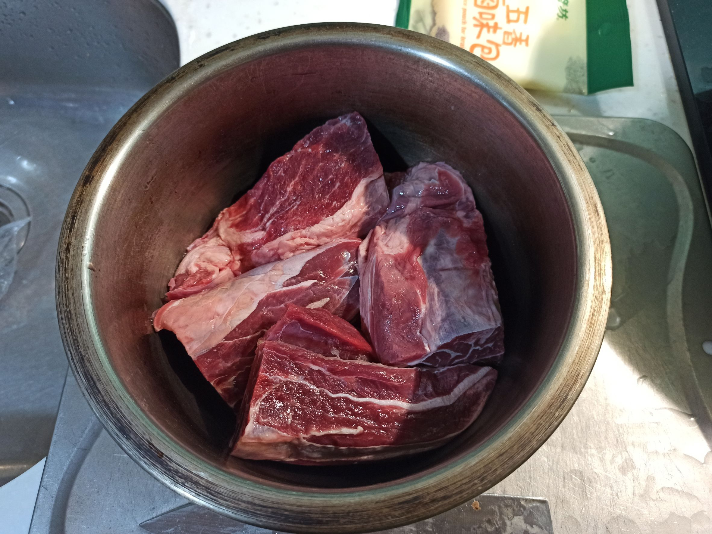
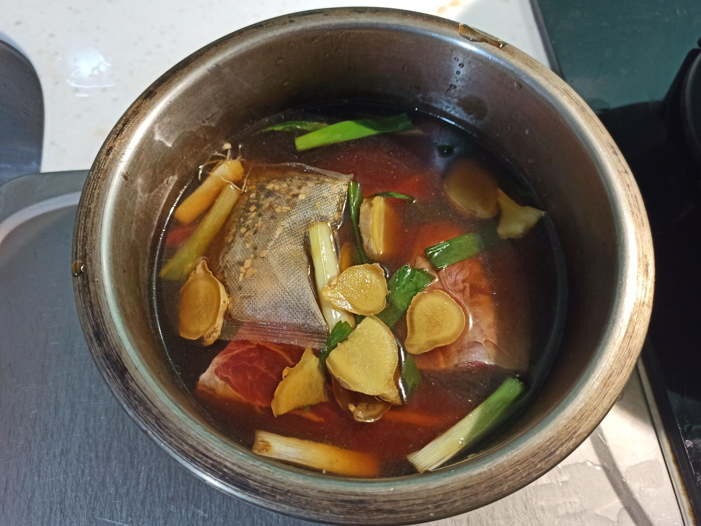
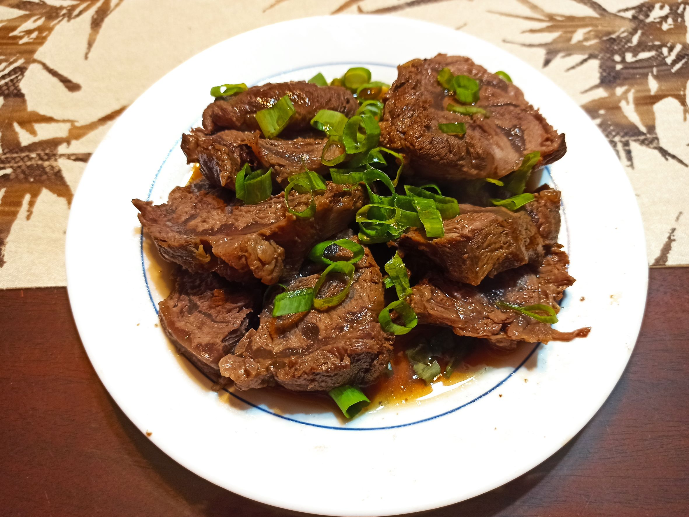

# 滷牛腱
---
+ ## 組成
  1. 牛腱

+ ## 20230226
  + ### 材料
    1. 牛腱 適量
    2. 青蔥 適量
    3. 薑片 適量
    4. 可樂 適量
    5. 醬油 適量
    6. 滷包 1包
    7. 米酒 適量
  
  + ### 作法
    1. 先將薑片、青蔥段，熱鍋下油拌炒，炒出香味
    2. 加入適量的可樂、米酒及醬油(醬油可以多一點)
    3. 將牛腱丟入另一個鍋子內，並丟上滷包
    4. 將炒好的醬汁倒進去，然後補上清水剛好淹過牛腱就好
    5. 外鍋4杯水
    6. 蒸90分鐘即可
    7. 拿牛腱出來切切
    8. 在弄幾個蔥花
    9. 醬汁:滷汁+蠔油+芝麻香油
    10. 將醬汁撒上去即可
  
  + ### 過程與成品
    
    
    
    
  
  + ### 檢討
    1. 影片用的是冰糖來炒顏色，我原本也想用冰糖，但看到家裡還有剩很多可樂就拿來用了
    2. 影片中醬汁是用醬油膏，但我找不到，只好拿蠔油來用
    3. 整體來說還是很不錯的啦，不會很難
  
  + ### 參考資料
    [百吃不膩](https://youtu.be/ZDZA1Msz_0Y)